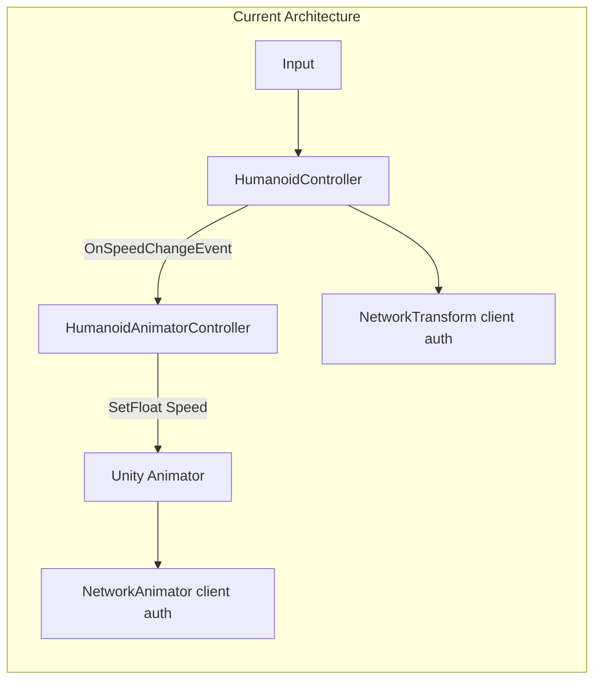
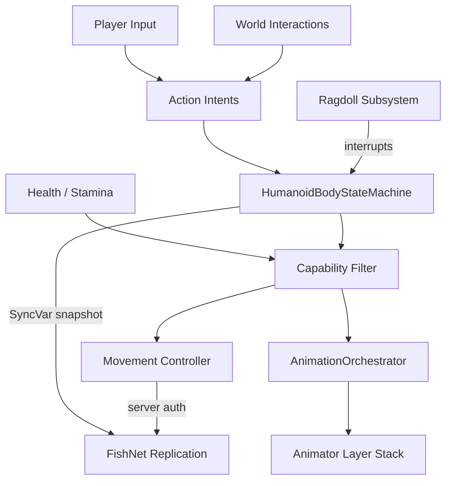
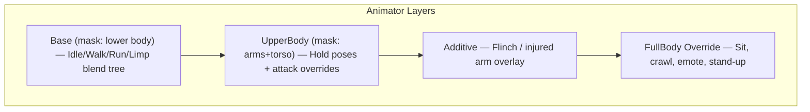

# Future Animation System Design

## Context

### Where we are today

The animation stack is **minimal and fragmented**:

| Area | Current state |
|------|---------------|
| Locomotion | Single `Speed` float (0 = idle, 0.3 = walk, 1.0 = run) in [`HumanoidAnimatorController.cs`](Assets/Scripts/SS3D/Systems/Entities/Humanoid/HumanoidAnimatorController.cs) |
| Parameters | Only `Speed` in [`Animations.cs`](Assets/Scripts/SS3D/Systems/Entities/Data/Animations.cs) |
| Networking | FishNet `NetworkAnimator` (client-authoritative) + `NetworkTransform` |
| Ragdoll | Custom state machine in [`Ragdoll.cs`](Assets/Scripts/SS3D/Systems/Entities/Humanoid/Ragdoll.cs) — the most mature animation-adjacent code |
| Items in hands | Transform parenting via [`ContainerItemDisplay.cs`](Assets/Scripts/SS3D/Systems/Inventory/Containers/ContainerItemDisplay.cs) — **no arm pose blending** |
| Combat / interact | No attack, throw, sit, crawl, limp, or emote animations |
| Rig | Human prefab has **no Avatar assigned** (`m_Avatar: {fileID: 0}`) |
| Borg | [`EngineerBorgAnimatorController`](Assets/Scripts/SS3D/Systems/Entities/Silicon/EngineerBorgAnimatorController.cs) sets `Speed`/`Power` but controller asset has **zero parameters** |



### What the roadmap and issues require

| Source | Requirements |
|--------|-------------|
| [Roadmap 0.0.8](https://ss3d.gitbook.io/dev-guide/roadmap) | New character rig; walk/run/fall/stand/ragdoll/sit; **server-authoritative movement** |
| [#1333](https://github.com/RE-SS3D/SS3D/issues/1333) | Locomotion blending (incl. limp L/R), crawl, sit, injured arms, throw, 1H hit, 2+ arm holds, 1 emote; works while sitting |
| [#1060](https://github.com/RE-SS3D/SS3D/issues/1060) | **Design first**: whole-body vs partial-body anims; player control vs system takeover; seat buckling edge cases; combat stagger/knockback; ragdoll interrupts |
| [#1246](https://github.com/RE-SS3D/SS3D/issues/1246) | Combat mode strafe, torso follows mouse, swing/pierce animations, networked hit timing |
| [#937](https://github.com/RE-SS3D/SS3D/issues/937) | Ragdoll get-up research, IK for world interaction |
| [Melee combat design](https://ss3d.gitbook.io/design/entities/combat/melee-combat) | Strafe in combat; aim independent of body facing; hit timing vs animation start |
| [foundation_meta_plan.md](.cursor/plans/foundation_meta_plan.md) | Animation deferred to **Wave 3** (after lifecycle + interactions stable) |

**Consensus from #1060 discussion:** no AI pathfinding to seats; player stays in control; sitting only when very close to chair front.

---

## Design thesis

Issue #1060 is correct: this is less an "animation system" and more a **Player Body System** — animation is the visual output of **body state + capabilities + intents**.



**Principles:**

1. **State drives animation, not the reverse** — gameplay code requests intents (`Attack`, `Sit`, `Throw`); the orchestrator picks clips/layers.
2. **Capabilities, not booleans everywhere** — each body state exposes flags (`CanMove`, `CanRotate`, `CanUseHands`, `CanBeInterrupted`).
3. **Ragdoll is a universal interrupt** — any state yields to `Ragdoll` via existing [`Ragdoll.cs`](Assets/Scripts/SS3D/Systems/Entities/Humanoid/Ragdoll.cs) SyncVar path.
4. **Network intents, not raw animator params** — replicate a compact `BodyAnimationSnapshot` instead of syncing every float/bool through `NetworkAnimator`.
5. **Upper/lower body split** — locomotion on legs; hands/combat/interact on masked upper-body layer (required by #1333 and #1246).
6. **No AI locomotion for interactions** — proximity + snap anchors only (#1060 comments).

---

## Recommended design decisions (#1060 open questions)

| Question | Recommendation | Rationale |
|----------|----------------|-----------|
| Seat entry | **Proximity gate + snap to seat anchor** when player is within ~0.5m and facing seat front (~45° cone) | Matches stilnat/cosmiccoincidence; no pathfinding |
| Seat exit | Try exit offsets in order: front → left → right → back; if all blocked, **snap to seat top** and restore normal locomotion | SS13-style escape hatch; avoids soft-lock |
| Seat animation | **Short sit-down / stand-up clips** synced to anchor snap (root motion optional, prefer programmatic snap + upper-body sit pose) | Visual polish without blocking on multi-directional anims in v1 |
| Seat interrupt | **Yes** — hit/ragdoll cancels seated state, runs unbuckle + exit attempt | Keeps combat readable |
| Combat stagger | **Brief flinch** (0.2–0.4s): blocks new attacks, **does not** block movement unless weapon specifies knockback | Avoids feel-bad full control loss in fast combat |
| Knockback | **Server-applied CharacterController impulse** on heavy hits; optional per-weapon | Keeps physics authoritative |
| Hit timing (v1) | **Instant damage** (per #1246) but **animation must start before hit VFX**; add animation-event hits in v2 | Unblocks combat while animation matures |
| Get-up blocked overhead | **Crawl/get-up-low variant** if headroom check fails; else remain prone until space clears | Extends existing face-up/face-down stand-up in ragdoll |
| Table climbing | **Defer to Alpha 0.2 movement expansion**; design hooks only (`CanClimb` capability, height check utility) | Roadmap lists crouch/combat movement later |
| Floating (ghost) | Wire existing `Floating` bool in `HumanCharacterAnimator.controller` from ghost controller | Already in controller, never set |

Document these in GitBook as part of #1333 deliverable.

---

## Architecture components

### 1. `HumanoidBodyStateMachine` (new)

Central authority for what the player body is doing. Lives on the human prefab alongside [`HumanoidLivingController`](Assets/Scripts/SS3D/Systems/Entities/Humanoid/HumanoidLivingController.cs).

```csharp
// Conceptual — not final API
enum BodyState { Locomotion, Seated, Crawling, Staggered, Ragdoll, Dead, Unconscious }
enum LocomotionMode { Idle, Walk, Run, LimpLeft, LimpRight, Floating }
enum CombatMode { Peaceful, Combat }

struct BodyCapabilities {
    bool CanMove, CanRotate, CanRun, CanUseHands, CanInteract, CanBeInterrupted;
}
```

- **Server owns state transitions** (sit request validated server-side; stagger applied on hit RPC).
- **Client predicts** locomotion locally until server-authoritative movement lands (0.0.8).
- Publishes events consumed by movement, animation, and input subsystems.
- Integrates with [`Ragdoll`](Assets/Scripts/SS3D/Systems/Entities/Humanoid/Ragdoll.cs): `Ragdoll` preempts all states; on recovery, restore previous state or default to locomotion.

### 2. `AnimationOrchestrator` (replaces/extends `HumanoidAnimatorController`)

Single writer to the Unity `Animator` for humanoids. Subscribes to body state + health + inventory events.

**Responsibilities:**
- Map body state → animator layer weights and parameters
- Select arm hold pose from [`Hands`](Assets/Scripts/SS3D/Systems/Inventory/Containers/Hands.cs) / item traits
- Drive injured-arm overlay from health body-part damage (hooks into [`FootBodyPart`](Assets/Scripts/SS3D/Systems/Health/BodyParts/FootBodyPart.cs) limp intent and future arm injury)
- Fire/consume animation events (`OnHitFrame`, `OnThrowRelease`, `OnSitComplete`)
- Apply **Avatar masks**: lower body = locomotion; upper body = holds/attacks/emotes

**Parameter registry** — expand [`Animations.cs`](Assets/Scripts/SS3D/Systems/Entities/Data/Animations.cs):

| Group | Parameters |
|-------|-----------|
| Locomotion | `Speed`, `LimpSide` (enum/int), `IsCrawling`, `Floating` |
| Upper body | `ArmHold` (int: default, item, weapon, etc.), `InjuredArmL/R` (float 0–1) |
| Actions | triggers: `AttackSwing`, `AttackStab`, `Throw`, `Emote`; bools: `IsSeated` |
| Combat | `CombatMode`, `AimYaw` (for torso/strafe blend) |

### 3. Animator controller structure (content)

Replace monolithic [`HumanCharacterAnimator.controller`](Assets/Content/WorldObjects/Entities/Humanoids/Human/HumanCharacterAnimator.controller) with layered controller:



- **Blend tree locomotion**: idle @ 0, walk @ 0.3, run @ 1 (keep current thresholds from [`HumanoidController`](Assets/Scripts/SS3D/Systems/Entities/Humanoid/HumanoidController.cs)); add limp variants driven by `FeetController` / foot damage asymmetry.
- **Upper body**: at least 2 hold poses (#1333 reference art); weapon type selects swing vs stab override.
- **Full-body override**: sitting, crawling, ragdoll recovery clips (reuse `GettingUpFaceUp/Down`).

### 4. Rig prerequisites (0.0.8 blocker)

Before animation work (#1333):

- **New humanoid rig** with Unity Humanoid Avatar configured and assigned on prefab
- Standard bone naming for retargeting (Mixamo-compatible pipeline per #1333)
- Hand attachment bones (`Hand_R`, `Hand_L`) referenced by inventory display points — reduce hackiness in [`ContainerItemDisplay`](Assets/Scripts/SS3D/Systems/Inventory/Containers/ContainerItemDisplay.cs)
- Separate rig profile for Engineering Borg (fix parameter mismatch)

### 5. Networking model

**Phase A (ship with #1333, client movement still authoritative):**

```csharp
struct BodyAnimationSnapshot {
    BodyState State;
    LocomotionMode Locomotion;
    byte ArmHold;
    byte ActiveTrigger; // one-shot id
    float AimYaw;
    // bitflags for injured limbs, seated, combat mode
}
```

- `[SyncVar] BodyAnimationSnapshot` on server; clients apply to local orchestrator
- **Reduce reliance on `NetworkAnimator`** for humanoids — keep it only for simple props (doors, bike horn) where bool/trigger sync is sufficient
- Owner sends **animation intents** via `[ServerRpc]`; server validates and updates snapshot

**Phase B (with server-authoritative movement, 0.0.8):**

- FishNet prediction/reconcile pattern (see FishNet demo `CharacterControllerPrediction.cs`)
- Locomotion derived from server-simulated position delta on observers
- Animation snapshot becomes authoritative on server tick

**Ragdoll:** keep existing custom path (bone `NetworkTransform` sync); ragdoll entry/exit updates `BodyAnimationSnapshot.State = Ragdoll`.

### 6. Integration points

| System | Integration |
|--------|-------------|
| **Movement** | [`HumanoidLivingController`](Assets/Scripts/SS3D/Systems/Entities/Humanoid/HumanoidLivingController.cs) reads `BodyCapabilities`; combat mode adds strafe + decouple torso rotation from feet |
| **Health** | `FootBodyPart` → limp mode; future arm damage → `InjuredArm` floats; stagger on hit |
| **Inventory / Hands** | Item pickup changes `ArmHold`; throw/hit interactions fire orchestrator triggers |
| **Interactions** | Seat interaction validates proximity, calls `BodyStateMachine.TrySit(anchor)`; open/close anims stay on [`NetworkedOpenable`](Assets/Scripts/SS3D/Systems/Inventory/Containers/NetworkedOpenable.cs) pattern |
| **Combat (#1246)** | Combat mode toggle → `CombatMode` + strafe; attack intent → upper-body override + optional stagger on target |
| **Clothing (future)** | Skinned mesh + optional animator layer for jumpsuit/belt constraints; hook via body state, not direct Animator calls |
| **IK (later, #937)** | Unity Animation Rigging: look-at mouse in combat mode, foot IK for slopes; run in `AnimationOrchestrator.LateUpdate` / `OnAnimatorIK` |

---

## Phased delivery (maps to roadmap + issues)

### Phase 0 — Rig & movement foundation (milestone 0.0.8)

- New rig + Avatar on Human prefab
- Server-authoritative movement spike (FishNet prediction)
- `HumanoidBodyStateMachine` skeleton + `BodyAnimationSnapshot` SyncVar
- Port existing locomotion to orchestrator (parity with current Speed behavior)
- Wire ghost `Floating` state
- Fix Engineering Borg controller/parameters

**Exit:** walk/run/idle/ragdoll behave as today but through new architecture; movement server-owned.

### Phase 1 — Core body animations ([#1333](https://github.com/RE-SS3D/SS3D/issues/1333))

- Locomotion blend tree + limp L/R (driven by foot health asymmetry)
- 2+ arm hold poses; inventory switches hold
- Upper-body layer: throw, 1H swing, 1H stab triggers
- 1 emote
- Sitting: proximity snap + sit/stand clips + capability lock
- GitBook dev-guide page: "Player Body & Animation"

**Exit:** #1333 checklist complete with rough Mixamo clips.

### Phase 2 — Combat integration ([#1246](https://github.com/RE-SS3D/SS3D/issues/1246))

- Combat/peaceful mode toggle
- Strafe movement; torso/aim yaw parameter
- Attack animations per weapon class
- Stagger/flinch on hit; optional knockback
- Hit timing v2: animation event → damage frame (optional upgrade from instant)

**Exit:** first melee iteration playable with readable animations.

### Phase 3 — Advanced movement & polish (Alpha 0.2 roadmap)

- Crawling
- Drag animation overlay
- Crawl/get-up when headroom blocked
- IK: combat look-at, basic foot placement
- Clothing animation hooks
- Observer polish: remote interpolation of upper-body actions

---

## What stays unchanged (for now)

- **Prop animations** (doors, toolboxes, bike horn): keep `NetworkAnimator` + bool/trigger pattern — it works and is low complexity
- **Ragdoll core logic** in [`Ragdoll.cs`](Assets/Scripts/SS3D/Systems/Entities/Humanoid/Ragdoll.cs): refactor to emit body-state events, not rewrite physics
- **Item attachment parenting**: keep [`ContainerItemDisplay`](Assets/Scripts/SS3D/Systems/Inventory/Containers/ContainerItemDisplay.cs) but target hand bones on new rig; arm hold pose handles visual alignment

---

## Risks and mitigations

| Risk | Mitigation |
|------|------------|
| Re-architecting twice (client then server movement) | Introduce `BodyAnimationSnapshot` and orchestrator **before** movement migration; movement plugs into existing state machine |
| Animator parameter explosion | Central registry in `Animations.cs`; codegen or unit test that controller params match registry |
| Seat edge-case complexity | v1: front-only sit + ordered exit offsets; document blocked behavior; defer multi-direction sit anims |
| Network bandwidth | Snapshot ~1–2 bytes + occasional triggers; avoid syncing blend tree floats per bone |
| Borg/human divergence | Shared `IAnimationOrchestrator` interface; species-specific controller assets |

---

## Suggested issue breakdown (after design approval)

1. **#1060** — Close with this design doc linked on GitBook
2. **New: Rig + Avatar** — 0.0.8 prerequisite
3. **New: BodyStateMachine + AnimationOrchestrator scaffold** — no new clips yet
4. **#1333** — Phase 1 content (clips + controller layers)
5. **#1246** — Phase 2 combat (depends on Phase 1 upper-body layer)
6. **#937** — IK research spike (parallel, feeds Phase 3)

---

## Key files to create/modify

| Action | Path |
|--------|------|
| New | `Assets/Scripts/SS3D/Systems/Entities/Humanoid/Body/HumanoidBodyStateMachine.cs` |
| New | `Assets/Scripts/SS3D/Systems/Entities/Humanoid/Body/BodyAnimationSnapshot.cs` |
| New | `Assets/Scripts/SS3D/Systems/Entities/Humanoid/Body/AnimationOrchestrator.cs` |
| Extend | [`Animations.cs`](Assets/Scripts/SS3D/Systems/Entities/Data/Animations.cs) |
| Refactor | [`HumanoidAnimatorController.cs`](Assets/Scripts/SS3D/Systems/Entities/Humanoid/HumanoidAnimatorController.cs) → orchestrator |
| Integrate | [`Ragdoll.cs`](Assets/Scripts/SS3D/Systems/Entities/Humanoid/Ragdoll.cs), [`HumanoidLivingController.cs`](Assets/Scripts/SS3D/Systems/Entities/Humanoid/HumanoidLivingController.cs) |
| Content | New layered `HumanCharacterAnimator.controller` + Mixamo clip set |
| Docs | GitBook: `dev-guide/systems/player-body-animation` |
