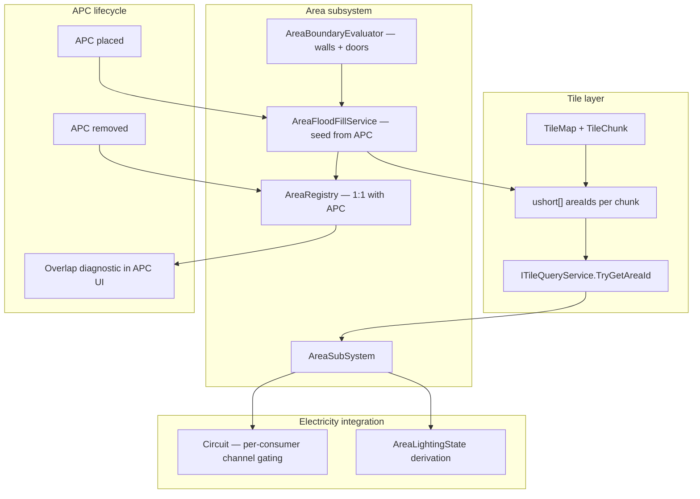

# Areas Implementation Plan

## Context

**Design specs (read-only):**

- [Documents/design/area.md](Documents/design/area.md) — data model, flood-fill authoring, consumer systems
- [Documents/design/rendering-lighting.md](Documents/design/rendering-lighting.md) — Area lighting states (foundation only here)

**Related plans:**

- [urp_lighting_look_plan_d42c32f5.plan.md](/home/rutger/.cursor/plans/urp_lighting_look_plan_d42c32f5.plan.md) — Phase 3 (Area lighting states) is blocked on this work; we ship the data contract it needs
- [dynamic_tile_state_doors_3d083894.plan.md](/home/rutger/.cursor/plans/dynamic_tile_state_doors_3d083894.plan.md) — door open/closed for vision/occlusion; **not required for Area boundaries** (see Phase 0 note below)

**Current codebase:** No Area subsystem exists. Tilemap stores placed objects per `TileLayer`, not scalar metadata ([tile.md](Documents/architecture/systems/tile.md)). Electricity uses cable-adjacency circuits with circuit-wide APC channel OR ([electricity.md](Documents/architecture/systems/electricity.md)); devices have no area/APC derivation.

**Confirmed scope:**

- Full power vertical slice (area.md prompt 2)
- **APC-seeded flood fill** — APC is the origin of its area (fork deviation from area.md §3 generic auto-detection)
- Unclaimed tiles → `AreaId.None` (no fallback unnamed areas)
- APC overlap → first APC wins (deterministic order); APC interface warns when multiple APCs share a region
- Live boundary recompute **deferred** (map-load + APC place/remove only)
- Lighting/rendering **not implemented** — data contract + events only
- Editor merge/split/rename UI **out of scope** (area.md §8); server-side rename/parent-tag API only

---

## Core model — APC as area origin

Unlike area.md §3's generic "flood from any unvisited walkable tile," this pass uses **APC-seeded flood fill**:

1. Each `ApcController` owns exactly one `AreaRecord` (1:1).
2. On APC placement or map load, BFS outward from the APC's tile, assigning `area-id` to all reachable walkable tiles.
3. Expansion stops at **Turf walls** and **Turf doors** (always — door open/closed irrelevant).
4. Expansion stops at tiles already claimed by a prior APC (deterministic first-wins order: sort APCs by tile coord X, then Z).
5. Tiles never reached by any APC remain `AreaId.None` — no area consumers apply there.
6. Door tiles: post-pass assigns `area-id` from first cardinal neighbor (N, E, S, W) that has one.




---

## Phase 0 — Boundary evaluator

Walls and doors always block APC flood-fill expansion. Door open/closed does **not** affect areas (SS13-aligned: the seam sits at the door regardless of state).

New `AreaBoundaryEvaluator` (no `IDynamicTileOccupant` dependency):

```csharp
bool BlocksAreaExpansion(TileCoord from, TileCoord to, ITileQueryService query)
{
    // Turf wall on either cell → block
    // Any Turf door on either cell → block crossing (always the seam)
    // Target tile already claimed by another area → block (first-wins)
    // Walkable: occupancy.HasPlenum && !IsTurfWall
}
```

Use [BuildChecker](Assets/Scripts/SS3D/Systems/Tile/BuildChecker.cs) Turf-wall pattern (`GenericType.Wall` on `TileLayer.Turf`).

**Door tile post-pass:** after all APC floods, assign each door tile the `AreaId` of its first cardinal neighbor (N, E, S, W) that has one.

---

## Phase 1 — Data contract and per-tile storage

### Area record

New types under `Assets/Scripts/SS3D/Systems/Area/`:

```csharp
public readonly struct AreaId : IEquatable<AreaId>
{
    public const ushort None = 0;
    public ushort Value { get; }
}

public sealed class AreaRecord
{
    public AreaId Id;
    public string DisplayName;       // default from APC title or "Unnamed Area"
    public string ParentTag;         // optional, organizational only
    public ApcController Apc;        // required — 1:1, APC is the area origin
    // Future consumer hooks (populated later, not wired now):
    public string AmbienceTrackId;
}
```

`AreaRegistry` — server-side `Dictionary<ushort, AreaRecord>` + `Dictionary<ApcController, AreaId>` reverse lookup. Area created when APC spawns; deleted when APC is destroyed.

### Per-tile area-id layer

Add parallel scalar storage on [TileChunk.cs](Assets/Scripts/SS3D/Systems/Tile/TileChunk.cs):

- `ushort[] _areaIds` (256 elements, lazy-init; `0` = `AreaId.None`)
- `GetAreaId(localX, localY)` / `SetAreaId(localX, localY, ushort id)`
- Bulk `SetAreaIds(ushort[] ids)` for flood-fill writes

Expose through [TileMap.cs](Assets/Scripts/SS3D/Systems/Tile/TileMap.cs):

- `TryGetAreaId(TileCoord coord, out ushort areaId)` — no chunk creation
- `TrySetAreaId(TileCoord coord, ushort areaId)` — creates chunk if needed (server only)

Extend [ITileQueryService.cs](Assets/Scripts/SS3D/Systems/Tile/ITileQueryService.cs) / [TileQueryService.cs](Assets/Scripts/SS3D/Systems/Tile/TileQueryService.cs):

```csharp
bool TryGetAreaId(TileCoord coord, out AreaId areaId);
```

### Save format

Extend [SavedTileChunk.cs](Assets/Scripts/SS3D/Systems/Tile/SavedObjects/SavedTileChunk.cs):

```csharp
public ushort[] areaIds; // null = all zero; length 256 when present
```

Wire save/load in `TileChunk.Save()` / `Load()`. Add separate `SavedAreaMap` (or section in [SavedTileMap.cs](Assets/Scripts/SS3D/Systems/Tile/SavedObjects/SavedTileMap.cs)) for `AreaRecord` metadata (id, displayName, parentTag, apc world position reference).

### AreaSubSystem

New `AreaSubSystem : NetworkSubSystem, ITileMutationObserver` under `Assets/Scripts/SS3D/Systems/Area/`:

- Register on scene actor (same pattern as [ElectricitySubSystem.cs](Assets/Scripts/SS3D/Systems/Electricity/ElectricitySubSystem.cs))
- Server: `RegisterTileMutationObserver(this)` via [TileSubSystem.cs](Assets/Scripts/SS3D/Systems/Tile/TileSubSystem.cs)
- Public API:
  - `bool TryGetAreaForTile(TileCoord, out AreaRecord)`
  - `bool TryGetAreaApc(AreaId, out IApcChannelSource)`
  - `IReadOnlyList<AreaRecord> GetAllAreas()` (for future security console, debug)
  - `void RebuildAllAreasFromApcs()` — clear all area ids, flood from every APC in deterministic order
  - `void RebuildAreaFromApc(ApcController apc)` — re-flood single APC's area (clears its old tiles first)

**APC lifecycle hooks** (via `AreaSubSystem` or `ApcController` callback):

- `ApcController.OnStartServer` → register with `AreaSubSystem`, create `AreaRecord`, run flood fill
- `ApcController` destroyed → clear tiles with that area id, remove `AreaRecord`

**Deliverable gate:** APC flood-fill assigns tiles correctly; unclaimed tiles are `None`; edit-mode tests pass **before** power wiring.

---

## Phase 2 — APC-seeded flood fill

New `AreaFloodFillService` (server-only):

```csharp
void FloodFromApc(ApcController apc, AreaId areaId, HashSet<TileCoord> claimedTiles)
{
    // BFS from apc.TileObject origin
    // Skip tiles in claimedTiles (first-wins)
    // Stop at AreaBoundaryEvaluator walls/doors
    // Write areaId to each reached tile; add to claimedTiles
}
```

**`RebuildAllAreasFromApcs()` algorithm:**

1. Clear all per-tile `area-id` values and `AreaRegistry` entries
2. Collect all `ApcController` instances in scene; sort by tile coord `(x, z)` ascending
3. For each APC: allocate `AreaId`, create `AreaRecord` (display name from APC `_title`), call `FloodFromApc`
4. Door-tile post-pass (assign from first claimed neighbor)
5. Overlap scan: group APCs by their tile's final `area-id`; if any area has >1 APC, flag those APCs

**Triggers:**

- Map load — `RebuildAllAreasFromApcs()` after tilemap load
- APC placed at runtime — create area + flood (other APCs unaffected unless first-wins overlap)
- APC removed — clear area tiles + delete record
- Wall/door placed/cleared → **stub** (live recompute deferred)

**APC overlap warning** ([ApcController.cs](Assets/Scripts/SS3D/UI/MachineInterface/ApcController.cs) / [ApcInterfaceSnapshot.cs](Assets/Scripts/SS3D/UI/MachineInterface/ApcInterfaceSnapshot.cs)):

- Add diagnostic flag e.g. `bool MultipleApcsInArea` to snapshot
- Set when post-flood scan finds >1 APC sharing the same `AreaId`
- Surfaced in APC machine interface as a warning (like existing Overload/Critical states)

**Manual override API (no editor UI):**

- `RenameArea(AreaId, string displayName)`
- `SetParentTag(AreaId, string tag)`
- No `AssignApc` / `MergeAreas` / `SplitArea` — geometry is owned by APC flood fill

### Tests

New `Assets/Scripts/Tests/EditMode/AreaFloodFillTests.cs`:

- Single APC in enclosed room → all room tiles get that APC's area id
- Two APCs in separate walled rooms → two distinct areas
- Two APCs in same open space (no wall/door between) → first APC (lower coord) claims all; second gets warning flag; second APC's origin tile may be `None` or claimed by first
- Door between two APC rooms → each APC floods its side only; door tile gets neighbor's area
- Room with no APC → all tiles `AreaId.None`
- APC removed → tiles cleared to `None`
- Save/load preserves area ids and metadata

---

## Phase 3 — Power-net vertical slice

Goal: a device's effective APC is derived from its tile's area ([area.md](Documents/design/area.md) §5), replacing circuit-wide channel OR for consumers that have an area APC.

### 3a. Area → APC resolution

On `AreaSubSystem`:

```csharp
bool TryGetEffectiveApcForDevice(IElectricDevice device, out IApcChannelSource apc)
{
    // device.TileObject origin → TryGetAreaId → AreaRecord.Apc
    // fallback: null (use legacy circuit-wide behaviour)
}
```

APC ↔ area link is inherent (1:1); no separate assignment step.

### 3b. Per-consumer channel gating

Modify [Circuit.cs](Assets/Scripts/SS3D/Systems/Electricity/Circuit.cs):

- Inject `Func<IPowerConsumer, ApcControlFlags> getEnabledChannelsForConsumer` from [ElectricitySubSystem.cs](Assets/Scripts/SS3D/Systems/Electricity/ElectricitySubSystem.cs)
- Replace `GetActiveConsumers(enabledChannels)` with per-consumer check:

```csharp
foreach (IPowerConsumer consumer in _consumers)
{
    ApcControlFlags flags = _getEnabledChannels(consumer);
    if (IsChannelEnabled(consumer.Channel, flags))
        activeConsumers.Add(consumer);
}
```

Resolver logic:

- If consumer's tile has area with APC → use **that APC's** `Channels`
- Else → fall back to current circuit-wide OR (`GetEnabledChannels()`)

This preserves behaviour for devices outside detected areas or on circuits without area APCs.

### 3c. Area-scoped stats for lighting foundation

Add to `AreaSubSystem`:

```csharp
public enum AreaLightingState { Normal, Emergency, Dark }

public bool TryGetLightingState(AreaId areaId, out AreaLightingState state)
```

Derivation (from [rendering-lighting.md](Documents/design/rendering-lighting.md) §4, using existing [CircuitStats.cs](Assets/Scripts/SS3D/Systems/Electricity/CircuitStats.cs)):


| State       | Condition                                                                     |
| ----------- | ----------------------------------------------------------------------------- |
| `Normal`    | `GridMeetsLoad` **or** lighting channel enabled and grid covers lighting load |
| `Emergency` | `!GridMeetsLoad && ApcBatteryCharge > 0`                                      |
| `Dark`      | `!GridMeetsLoad && ApcBatteryCharge <= 0`                                     |


Use `ElectricitySubSystem.TryGetCircuitStats(areaApc, areaApc, out stats)` — same call pattern as [ApcController.BuildSnapshot](Assets/Scripts/SS3D/UI/MachineInterface/ApcController.cs).

Expose event for future renderer (no subscribers yet):

```csharp
event Action<AreaId, AreaLightingState> OnAreaLightingStateChanged;
```

Poll on electricity tick; fire only on state transitions. **Do not modify** [LightPower.cs](Assets/Scripts/SS3D/Systems/Electricity/LightPower.cs) or fixtures.

### 3d. Documented deviation (battery drain)

Circuit battery drain remains **circuit-wide equal split** for this pass. Area-scoped APC cell backup (design: APC cell backs only its area's consumers) is a follow-up electricity refactor — note in system map, not blocking the channel-gating vertical slice.

### Tests

Extend `Assets/Scripts/Tests/EditMode/ElectricityTests/`:

- Consumer in area with APC: channel toggle on **that** APC affects consumer; unrelated APC on same circuit does not override
- Consumer without area APC: legacy circuit-wide behaviour unchanged
- `TryGetLightingState` transitions: powered → emergency (grid fails, battery > 0) → dark (battery depleted)

---

## Phase 4 — Lighting foundation (data only)

Ship types the [URP lighting plan](/home/rutger/.cursor/plans/urp_lighting_look_plan_d42c32f5.plan.md) Phase 3 will consume:


| Artifact                                 | Purpose                                                                         |
| ---------------------------------------- | ------------------------------------------------------------------------------- |
| `AreaLightingState` enum                 | Normal / Emergency / Dark                                                       |
| `AreaLightingStateDeriver` static helper | Pure function from `CircuitStats` + `ApcControlFlags`                           |
| `IAreaLightingStateSource` interface     | `TryGetLightingState(AreaId)` — implemented by `AreaSubSystem`                  |
| Placeholder fields on `AreaRecord`       | `AmbienceTrackId`; optional `Color? DepartmentalLightTint` (nullable, unused)   |
| Comment stubs on `AreaRecord`            | `// Future: NormalFixtures[], EmergencyFixtures[]` for fixture subset authoring |


**Explicitly not in scope:** `LightBudgetSubSystem`, fixture `NormalOnly`/`EmergencyCapable` tags, `LightPower` tri-state, URP/shader/post changes.

---

## Phase 5 — Documentation

Per [update-system-docs skill](.cursor/skills/update-system-docs/SKILL.md):

- New system map: `Documents/architecture/systems/area.md`
- Update [INDEX.md](Documents/architecture/INDEX.md) — add Area row (Gameplay section)
- Update [tile.md](Documents/architecture/systems/tile.md) — area-id layer, query extension
- Update [electricity.md](Documents/architecture/systems/electricity.md) — per-consumer APC derivation, lighting state hook
- New effort doc: `Documents/architecture/2026-07_area-foundation.md`
- Add plan file to `Documents/plans/`; mark todos as work ships

---

## File summary


| Action    | Path                                                                        |
| --------- | --------------------------------------------------------------------------- |
| New       | `Assets/Scripts/SS3D/Systems/Area/AreaSubSystem.cs`                         |
| New       | `Assets/Scripts/SS3D/Systems/Area/AreaRegistry.cs`                          |
| New       | `Assets/Scripts/SS3D/Systems/Area/AreaRecord.cs`                            |
| New       | `Assets/Scripts/SS3D/Systems/Area/AreaId.cs`                                |
| New       | `Assets/Scripts/SS3D/Systems/Area/AreaFloodFillService.cs`                  |
| New       | `Assets/Scripts/SS3D/Systems/Area/AreaBoundaryEvaluator.cs`                 |
| New       | `Assets/Scripts/SS3D/Systems/Area/AreaLightingState.cs`                     |
| New       | `Assets/Scripts/SS3D/Systems/Area/IAreaLightingStateSource.cs`              |
| Modify    | `TileChunk.cs`, `TileMap.cs`, `ITileQueryService.cs`, `TileQueryService.cs` |
| Modify    | `SavedTileChunk.cs`, `SavedTileMap.cs` (area metadata)                      |
| Modify    | `ApcController.cs`, `ApcInterfaceSnapshot.cs` (overlap warning)             |
| Modify    | `Circuit.cs`, `ElectricitySubSystem.cs`                                     |
| New tests | `AreaFloodFillTests.cs`, electricity area integration tests                 |


---

## Implementation order

Phases are sequential; Phase 0 can overlap with Phase 1 type definitions.

1. Phase 0 — `AreaBoundaryEvaluator` (doors always block; no open/closed state)
2. Phase 1 — storage + registry + query API
3. Phase 2 — flood-fill + save/load + tests (gate before power)
4. Phase 3 — power vertical slice + lighting state derivation
5. Phase 4 — lighting foundation types (can merge into Phase 3)
6. Phase 5 — docs

**Validation:** Place an APC in Engineering bay → flood fill claims all bay tiles. Devices on those tiles inherit that APC's channels. A second APC in the same open space triggers the overlap warning. Tiles in maintenance with no APC stay `AreaId.None`. `TryGetLightingState` reports correct enum; no visual changes yet.

**Documented deviations from area.md (note in architecture effort doc):**

- Areas are APC-seeded, not generic unnamed flood-fill regions
- Unclaimed tiles stay `AreaId.None` (no fallback auto-areas)
- All doors block expansion (not closed-only)