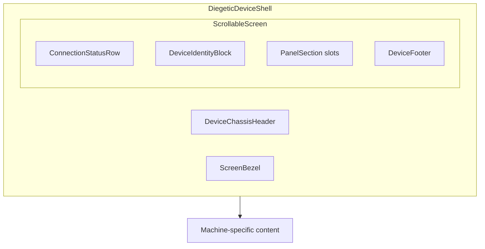
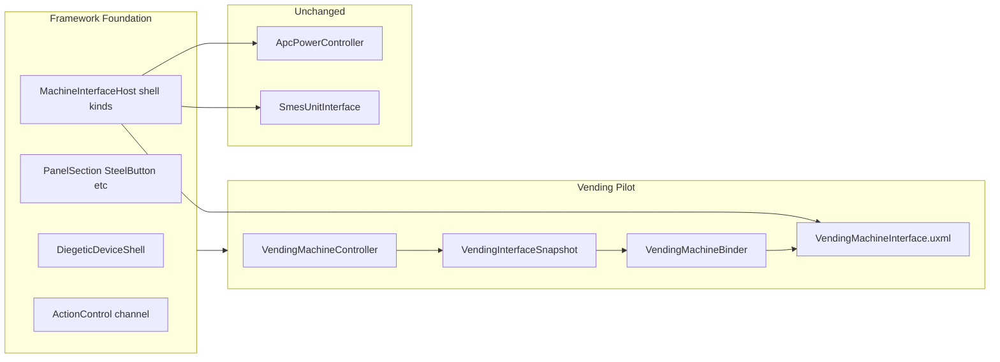

# Diegetic Screen UI Framework

## Context

You already have a **shipped machine-interface stack** ([machine-interface.md](Documents/architecture/systems/machine-interface.md)) with APC/SMES using a draggable `MachineWindow` modal shell. The prototype zip defines a **different visual language** shared across FDU, PDA, vending, etc.:




**Constraint:** Keep existing APC/SMES templates and binders untouched. New work lives alongside them.

**Pilot:** Vending machine from [Vending Machine Unit.dc.html](file:///home/rutger/Downloads/Field%20diagnostic%20device%20prototype.zip) — tray flow, stubbed ID Reader.

---

## Architecture: two shell kinds

Extend registration so the host supports both presentation modes:


| Shell                       | Used by                 | Close affordance                           |
| --------------------------- | ----------------------- | ------------------------------------------ |
| `MachineWindow` (existing)  | APC, SMES               | Header × button + drag                     |
| `DiegeticDeviceShell` (new) | Vending, future PDA/FDU | Chassis dismiss area + Escape in subsystem |


### Key framework changes

**1. Registration** — extend `[MachineInterfaceUiRegistration.cs](Assets/Scripts/SS3D/UI/MachineInterface/MachineInterfaceUiRegistration.cs)`:

```csharp
public enum MachineInterfaceShellKind { ModalWindow, DiegeticDevice }
// + ShellKind, optional DiegeticWidth (664px default from prototype)
// + change CreateBinder to Func<VisualElement, IMachineInterfaceBinder>
```

**2. Host** — `[MachineInterfaceHost.cs](Assets/Scripts/SS3D/UI/MachineInterface/MachineInterfaceHost.cs)`:

- `CreateWindow()` path unchanged for APC/SMES (`ShellKind.ModalWindow`)
- New `CreateDiegeticShell()` path: instantiate `DiegeticDeviceShell`, center on overlay (no drag), bind content into screen slot
- Wire `CloseClicked` from both shell types

**3. Control dispatch** — vending needs **action controls** (select product index, take tray item) beyond bool/numeric:

- Add `event Action<byte, int> ActionControlChanged` to `[IMachineInterfaceBinder.cs](Assets/Scripts/SS3D/UI/MachineInterface/IMachineInterfaceBinder.cs)`
- Add `SetActionControl(byte, int)` to `[IMachineInterfaceClientBridge.cs](Assets/Scripts/SS3D/UI/MachineInterface/IMachineInterfaceClientBridge.cs)` + ServerRpc in `[MachineInterfaceBehaviour.cs](Assets/Scripts/SS3D/UI/MachineInterface/MachineInterfaceBehaviour.cs)`
- Refactor `[MachineInterfaceSubSystem.cs](Assets/Scripts/SS3D/UI/MachineInterface/MachineInterfaceSubSystem.cs)` `NotifyBoolControl`/`NotifyNumericControl` type switches into per-view-model `Apply*Control` methods (keeps APC/SMES logic, adds vending without another giant switch)

**4. Escape to close** — add `KeyCode.Escape` handling in `MachineInterfaceSubSystem.Update` (currently only in dev harness)

---

## Phase 1: Diegetic component library

New C# `[UxmlElement]` controls under `[Assets/Scripts/SS3D/UI/MachineInterface/Components/](Assets/Scripts/SS3D/UI/MachineInterface/Components/)` with paired USS under `[Assets/Content/Systems/UI/MachineInterface/Components/](Assets/Content/Systems/UI/MachineInterface/Components/)`.

### Shell and chrome (from prototype shared pattern)


| Component             | Responsibility                                                                 |
| --------------------- | ------------------------------------------------------------------------------ |
| `DiegeticDeviceShell` | Metal chassis, bezel, scrollable screen viewport, PWR LED, model label, close  |
| `ConnectionStatusRow` | Bus/port label + right-side readout (e.g. "7 of 9 items stocked")              |
| `DeviceIdentityBlock` | Display title + subtitle                                                       |
| `PanelSection`        | Raised header bar + content slot (reused across ID Reader, product grid, etc.) |
| `DeviceFooter`        | Small terminal footer line ("SS3D Vending Dispenser — Model VND-7")            |
| `ActionLog`           | Scrollable terminal log (max ~4 entries)                                       |


### Interactive primitives (design-system aligned, reusable by PDA/FDU later)


| Component       | Responsibility                                                                   |
| --------------- | -------------------------------------------------------------------------------- |
| `SteelButton`   | Flat steel-variant button (Normal/Highlighted/Pressed/Disabled)                  |
| `StatusDot`     | Small LED dot with tone class                                                    |
| `InventorySlot` | Item well (empty silhouette / icon placeholder) — used in product cards and tray |
| `Badge`         | Compact tone chip (stub for future FDU tier views)                               |


### Vending-specific (built on primitives)


| Component       | Responsibility                                                                                             |
| --------------- | ---------------------------------------------------------------------------------------------------------- |
| `ProductGrid`   | 3-column grid container                                                                                    |
| `ProductCard`   | Slot + name + qty label + lock overlay + vending pulse state                                               |
| `DispenseTray`  | Inset tray area; empty state or rows with Take button                                                      |
| `IdReaderPanel` | Composes `PanelSection` + lock icon + status lines + `SteelButton` (stub: always disabled/read-only in v1) |


### Styling

Add `[Assets/Content/Systems/UI/MachineInterface/Tokens/diegetic-tokens.uss](Assets/Content/Systems/UI/MachineInterface/Tokens/diegetic-tokens.uss)` importing existing `[ss3d-tokens.uss](Assets/Content/Systems/UI/Tokens/ss3d-tokens.uss)` and adding diegetic-only values from the prototype (chassis gradient, bezel inset shadow, `--ss3d-diegetic-chassis-*`). **Do not change existing token values** — avoids visual drift on APC/SMES.

Add `[diegetic-tones.uss](Assets/Content/Systems/UI/MachineInterface/Tokens/diegetic-tones.uss)` to centralize `.tone-success` etc. currently duplicated across power components (diegetic components import this; APC/SMES untouched).

---

## Phase 2: Vending machine implementation

### Backend — refactor `[VendingMachine.cs](Assets/Scripts/SS3D/Systems/Furniture/VendingMachine.cs)`

Split into:

- `**VendingMachineController**` — `MachineInterfaceBehaviour` subclass on vendor prefabs
- Keep dispense/spawn logic, move to server-authoritative flow

**Networked state** (snapshot-driven, refreshed on dispense):

- Product slots: name key, stock count, icon id (from `ItemObjectSo`)
- Tray items: pending dispensed products awaiting Take
- Power status, vendor display name, connection label
- `IdReaderState` stub: always `NoIdRead`

**Dispense flow** (per your choice):

1. Client sends `ActionControl: SelectProduct(index)`
2. Server validates power + stock → decrements stock → adds to tray list → refreshes snapshot
3. Client sends `ActionControl: TakeTrayItem(trayIndex)` → server spawns item at `_dispensingTransform`, removes from tray

Remove per-product `DispenseProductInteraction` radial entries; use inherited `OpenMachineInterfaceInteraction` only.

### UI pipeline (mirrors APC/SMES pattern)


| Piece       | Path                                                                                  |
| ----------- | ------------------------------------------------------------------------------------- |
| Snapshot    | `VendingInterfaceSnapshot.cs`                                                         |
| Serializer  | `VendingInterfaceSnapshotSerializer.cs`                                               |
| Mapper      | `VendingInterfaceSnapshotMapper.cs`                                                   |
| View model  | `VendingInterfaceViewModel.cs`                                                        |
| Binder      | `Bindings/VendingMachineBinder.cs`                                                    |
| Template    | `Templates/VendingMachineInterface.uxml` + `.uss`                                     |
| ID          | `MachineInterfaceIds.Vending = "furniture.vending"`                                   |
| Control IDs | `MachineInterfaceControlIds.Vending.SelectProduct`, `.TakeTrayItem`, `.ReadId` (stub) |


Template structure (inside `DiegeticDeviceShell` screen):

```
ConnectionStatusRow
DeviceIdentityBlock
IdReaderPanel (stub)
PanelSection "Select Item" → ProductGrid
DispenseTray
ActionLog
DeviceFooter
```

### Prefab wiring

Update all four vendor prefabs in `[Assets/Content/WorldObjects/Furniture/Machines/Vendors/](Assets/Content/WorldObjects/Furniture/Machines/Vendors/)`:

- Add `VendingMachineController` (+ `MachineInterfaceBehaviour` wiring)
- Remove or disable old `VendingMachine` component
- Ensure `NetworkObject` + `Selectable` remain

### Dev tooling

- Add vending scenario to `[MachineInterfaceDevHarness.cs](Assets/Scripts/SS3D/UI/MachineInterface/MachineInterfaceDevHarness.cs)` (key 5)
- Add editor preview: `SS3D → Machine Interface → Preview Vending Panel` (extend existing preview window pattern)

### Tests

Extend `[MachineInterfaceSnapshotTests.cs](Assets/Scripts/Tests/EditMode/MachineInterfaceSnapshotTests.cs)`:

- Vending snapshot round-trip
- Mapper produces correct product/tray counts

---

## Phase 3: Documentation

Run `update-system-docs` skill after shipping:

- Update [machine-interface.md](Documents/architecture/systems/machine-interface.md) — diegetic shell kind, component catalog, extension recipe
- Update [furniture.md](Documents/architecture/systems/furniture.md) — vending now uses machine interface
- Add architecture effort `2026-07_diegetic-screen-ui-framework.md` (Status: shipped)
- Close remaining items in [phase 3 generalization doc](Documents/architecture/2026-07_machine-interface-phase3-smes-generalization.md) where this work addresses registry extension docs

---

## Out of scope (v1)

- Redesigning APC/SMES from the zip
- Credits / payment economy
- Functional ID card reading or gated product logic (UI stub only)
- PDA, FDU, cargo console implementations (components laid down, not wired)
- Render-to-texture on machine mesh (stay screen-space overlay)
- Importing `VendingMachine.wav` (can be a fast follow)

---

## Dependency diagram



## Implementation notes

Shipped on branch `feature/diegetic-screen-ui-framework` (commits through `a4656d77`).

**Delivered as planned**
- Diegetic component library, tokens/tones, shell kinds, action controls, Escape-to-close
- Vending snapshot pipeline, binder, template, controller, and four vendor prefab migrations
- Dev harness vending scenario (`Alpha5`), EditMode snapshot tests, architecture/system doc updates

**Divergences from plan**
- No separate `CreateDiegeticShell()` helper — `MachineInterfaceHost` mounts the full cloned UXML `TemplateContainer` for diegetic panels so attached style sheets apply (detaching only `DiegeticDeviceShell` caused transparent/unstyled UI).
- No `DiegeticWidth` field on `MachineInterfaceUiRegistration`; width comes from `diegetic-tokens.uss` (`--ss3d-diegetic-width`).
- Editor preview is `SS3D → Machine Interface → Preview Diegetic Components` (shared component preview), not a vending-only preview window.
- `VendingMachineController` lives in `Assets/Scripts/SS3D/UI/MachineInterface/`; legacy `VendingMachine.cs` and `DispenseProductInteraction.cs` were removed rather than kept alongside.
- Snapshot helper structs split into `VendingProductSnapshot.cs` and `VendingTrayItemSnapshot.cs` for StyleCop file/type rules.
- Vending stays ungated (no ID gate). Engineering ID access shipped later for APC/SMES/atmos panels — not applied to vendors.

**Follow-ups shipped on develop after the diegetic PR**
- Refresh-driven UI teardown no longer drops Take/vend click handlers (`ProductGrid` / `DispenseTray`).
- `MachinePowerConsumer` no longer sticks at "in use" wattage after vend.

**Documentation**
- Architecture effort: [2026-07_diegetic-screen-ui-framework.md](../architecture/2026-07_diegetic-screen-ui-framework.md)
- Updated maps: [machine-interface.md](../architecture/systems/machine-interface.md), [furniture.md](../architecture/systems/furniture.md)
- Phase 3 registry-extension doc item closed in [2026-07_machine-interface-phase3-smes-generalization.md](../architecture/2026-07_machine-interface-phase3-smes-generalization.md)

