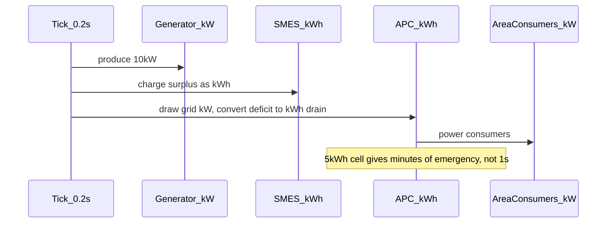
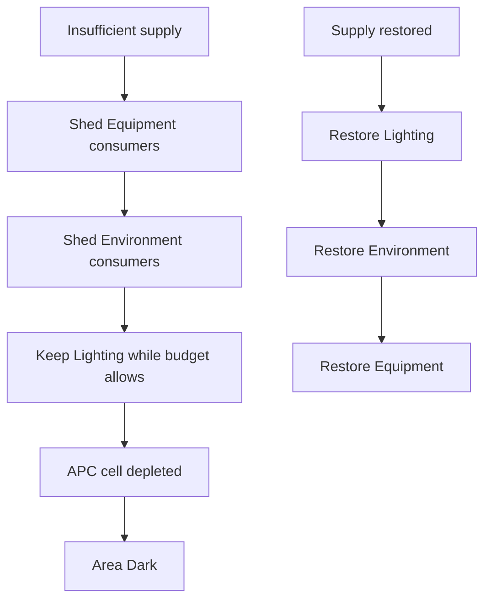

# Electricity storage foundation review and kWh fix

## Verdict: architecture is right, units and balance are wrong

Your design doc (`[ss3d_electricity_design.md](/home/rutger/Downloads/ss3d_electricity_design.md)`) describes the correct **topology and cascade**:


The code implements this shape:


| Design tier                                 | Implementation                                                                                                                                                              | Status                                                           |
| ------------------------------------------- | --------------------------------------------------------------------------------------------------------------------------------------------------------------------------- | ---------------------------------------------------------------- |
| Graph connectivity, no per-tile circuit sim | `[ElectricCableConnectivity.cs](Assets/Scripts/SS3D/Systems/Electricity/ElectricCableConnectivity.cs)` + `[Circuit.cs](Assets/Scripts/SS3D/Systems/Electricity/Circuit.cs)` | Aligned                                                          |
| SMES as non-APC grid buffer                 | `Circuit.DrainBatteries` / `ChargeStorages`, excludes `IApcChannelSource`                                                                                                   | Aligned                                                          |
| APC cell as area-local buffer               | `[AreaApcPowerDistribution.cs](Assets/Scripts/SS3D/Systems/Electricity/AreaApcPowerDistribution.cs)`                                                                        | Aligned                                                          |
| Area consumers without per-device cables    | `[ElectricitySubSystem.UpdateAreaScopedPower](Assets/Scripts/SS3D/Systems/Electricity/ElectricitySubSystem.cs)`                                                             | Aligned                                                          |
| Emergency lighting cascade                  | `[AreaLightingStateDeriver.cs](Assets/Scripts/SS3D/Systems/Area/AreaLightingStateDeriver.cs)`                                                                               | Partially aligned (logic exists, buffers too small, random shed) |


**What does not match your expectation of lasting charge:**

### 1. No kWh — values are per-tick power tokens

`[IPowerStorage](Assets/Scripts/SS3D/Systems/Electricity/IPowerStorage.cs)` stores `StoredPower` and moves the same numeric amount each 0.2s tick. Producers/consumers use `PowerProduction` / `PowerNeeded` in "kW", but **nothing multiplies by tick duration**. A "50 kW" APC cell holding 50 units at 10 units/tick drains in **~1 second**, not minutes.

```51:57:Assets/Scripts/SS3D/Systems/Electricity/BasicBattery.cs
        public float AddPower(float amount)
        {
            if (amount <= 0 || !_isOn) return 0;
            float addedAmount = Mathf.Min(RemainingCapacity, amount);
            _storedPower += addedAmount;
            return addedAmount;
```

### 2. Prototype balancing is far too small


| Asset         | Capacity | Max rate/tick | Full drain at max deficit |
| ------------- | -------- | ------------- | ------------------------- |
| SMES prefab   | 1000     | 10            | ~20 s                     |
| APC prefab    | 50       | 10            | ~1 s                      |
| Generator     | —        | 10 kW/tick    | —                         |
| Light fixture | —        | 0.25 kW/tick  | —                         |


SMES also starts **empty and off** in the prefab (`_storedPower: 0`, `_isOn: 0`), unlike design example A ("SMES-ENG charged").

### 3. Grid headroom bug can starve APCs despite generator surplus

After phase 1, `_pendingProducerSurplus` already equals `producerOutput - cableDemand`. But `[GetAvailableGridSupplyForArea](Assets/Scripts/SS3D/Systems/Electricity/Circuit.cs)` subtracts `cableDemand` again:

```162:169:Assets/Scripts/SS3D/Systems/Electricity/Circuit.cs
        public float GetAvailableGridSupplyForArea()
        {
            float cableDemand = GetActiveConsumers().Sum(consumer => consumer.PowerNeeded);
            float storageSupply = GetNonApcStorages()
                .Where(storage => storage.IsOn)
                .Sum(storage => storage.MaxRemovablePower);
            return Math.Max(0f, _pendingProducerSurplus + storageSupply - cableDemand);
        }
```

Example: generator 10 kW, cable load 3 kW, area demand 8 kW → surplus is 7 kW, but headroom computes as `7 + SMES - 3 = 4 + SMES`. Worse, when surplus equals cable load, headroom becomes **0** and the APC cell drains even though generation exceeds cable need.

### 4. Other design gaps (in scope)

- SMES input enable/max in `[SmesController](Assets/Scripts/SS3D/UI/MachineInterface/SmesController.cs)` is **display-only**; only output enable/rate affects simulation.
- Load shedding in `[AreaApcPowerDistribution.ShedLoad](Assets/Scripts/SS3D/Systems/Electricity/AreaApcPowerDistribution.cs)` and `[Circuit.ConsumePower](Assets/Scripts/SS3D/Systems/Electricity/Circuit.cs)` is **random**, not Equipment → Environment → Lighting per design §4.
- SMES charge has no input rate cap (explicit TODO in `Circuit.ChargeStorages`).

---

## Target model: kW flow, kWh storage

Keep producers/consumers in **kW** (instantaneous demand/supply). Store energy in **kWh**. Convert at transfer boundaries using the existing tick interval:

```csharp
// New shared helper, e.g. ElectricityUnits.cs
public static float KwPerTickToKwh(float kw, float tickSeconds = 0.2f)
    => kw * tickSeconds / 3600f;

public static float KwhToKwPerTick(float kwh, float tickSeconds = 0.2f)
    => kwh * 3600f / tickSeconds;
```

Per tick:

- **Discharge**: `energyRemoved_kWh = min(stored_kWh, maxRate_kW * tickToHours, requestedDeficit_kW * tickToHours)`
- **Charge**: same pattern, capped by `MaxChargeRate_kW` (new, symmetric to discharge)

`MaxRemovablePower` stays in kW (max discharge rate). `StoredPower` becomes `StoredEnergyKwh` (or keep property name but document/convert internally — prefer explicit rename to prevent regression).

### Proposed starting balance (tunable, gives "lasting a while")

Assuming ~10 kW generator and lights at 0.25 kW each:


| Asset       | Stored energy                                      | Max charge/discharge rate | Meaningful runtime                                                |
| ----------- | -------------------------------------------------- | ------------------------- | ----------------------------------------------------------------- |
| APC cell    | **5 kWh**                                          | 10 kW                     | ~~30 min at lighting-only (~~2.5 kW); ~30 s at full 10 kW deficit |
| SMES        | **100 kWh**                                        | 50 kW                     | ~2 h at 50 kW draw; much longer at typical department load        |
| Round start | APC full, SMES ~80–100% charged and output enabled | —                         | Matches design example A                                          |


These numbers are a first balancing pass; the design doc explicitly leaves exact values open.

---

## Implementation plan

### Phase A — Unit contract and conversion layer

1. Add `[ElectricityUnits.cs](Assets/Scripts/SS3D/Systems/Electricity/ElectricityUnits.cs)` with tick-aware kW↔kWh helpers; expose tick interval from `[ElectricitySubSystem._tickRate](Assets/Scripts/SS3D/Systems/Electricity/ElectricitySubSystem.cs)`.
2. Update `[IPowerStorage](Assets/Scripts/SS3D/Systems/Electricity/IPowerStorage.cs)`:
  - `StoredEnergyKwh`, `MaxCapacityKwh`
  - `MaxChargeRateKw` (new) + existing `MaxPowerRate` as discharge rate
  - `AddEnergyKwh(float)` / `RemoveEnergyKw(float requestedKw, float tickSeconds)` or equivalent that respects rate caps
3. Refactor `[BasicBattery](Assets/Scripts/SS3D/Systems/Electricity/BasicBattery.cs)` and `[ApcController](Assets/Scripts/SS3D/UI/MachineInterface/ApcController.cs)` to use kWh internally; keep SyncVar field names stable or migrate with care for networked prefabs.

### Phase B — Distribution pipeline uses energy math

1. `[Circuit.DrainBatteries` / `ChargeStorages](Assets/Scripts/SS3D/Systems/Electricity/Circuit.cs)`: pass kW deficits/surpluses, convert to kWh per tick inside storage calls.
2. `[AreaApcPowerDistribution.PowerAreaConsumers](Assets/Scripts/SS3D/Systems/Electricity/AreaApcPowerDistribution.cs)`: deficit in kW → drain kWh from APC cell; surplus charges kWh.
3. **Fix `GetAvailableGridSupplyForArea`**: return `_pendingProducerSurplus + sum(nonApc MaxDischargeRateKw)` — do **not** subtract cable demand again. Add/edit test covering producer 10 / cable 3 / area 8 scenario.

### Phase C — Priority channel shedding (design §4)

Replace random `ShedLoad` with deterministic channel-priority allocation. Design rule:

- **Under deficit (shed):** Equipment loses power first → Environment → Lighting last
- **On recovery (restore):** reverse order — Lighting returns first → Environment → Equipment last

Implementation approach — single budget allocator instead of random removal loop:

1. Add shared helper, e.g. `[PowerConsumerAllocation.cs](Assets/Scripts/SS3D/Systems/Electricity/PowerConsumerAllocation.cs)`:
  ```csharp
   // Inclusion order = restore priority (Lighting first)
   private static readonly PowerChannel[] InclusionOrder =
       { PowerChannel.Lighting, PowerChannel.Environment, PowerChannel.Equipment };

   public static List<IPowerConsumer> AllocateUnderBudget(
       IReadOnlyList<IPowerConsumer> consumers, float budgetKw)
  ```
  - Walk channels in inclusion order; add consumers (stable order within channel) while `remainingBudget >= consumer.PowerNeeded`
  - Unallocated consumers are shed — equivalent to Equipment-first shedding
2. Refactor `[AreaApcPowerDistribution.PowerAreaConsumers](Assets/Scripts/SS3D/Systems/Electricity/AreaApcPowerDistribution.cs)`:
  - Compute `totalAvailableKw = gridSupplyKw + apcCell.MaxRemovablePower` (when cell has charge)
  - Call `AllocateUnderBudget(activeAreaConsumers, totalAvailableKw)` → `poweredConsumers`
  - Drain APC cell only for `max(0, poweredDemand - gridSupplyKw)` — delete `ShedLoad` random loop
3. Refactor `[Circuit.ConsumePower](Assets/Scripts/SS3D/Systems/Electricity/Circuit.cs)` shedding branch to use the same helper when `neededPower > maxPowerFromBatteries`, so cable-distributed channel-tagged consumers follow the same priority instead of random pick.
4. **Interaction with `AreaLightingStateDeriver`:** with lighting preserved last under shed, Emergency → Dark transition should only occur once lighting demand exceeds available budget (grid + cell). Existing deriver logic (`ApcBatteryCharge > 0` → Emergency) remains valid; shedding order ensures lights stay on longer while the cell drains.
5. **Tests** (new/updated in `[AreaApcPowerDistributionTests.cs](Assets/Scripts/Tests/EditMode/ElectricityTests/AreaApcPowerDistributionTests.cs)`):
  - Budget covers lighting only → equipment and environment unpowered, lighting powered
  - Budget covers lighting + environment → equipment unpowered first
  - Budget increases → lighting restores before equipment
  - Replace `PowerAreaConsumers_GridDeficit_RespectsApcDischargeRate` assertions that assumed random shed of `second` consumer

### Phase D — SMES controls and prefab balance

1. Wire `[SmesController](Assets/Scripts/SS3D/UI/MachineInterface/SmesController.cs)` input enable/max into `Circuit.ChargeStorages` (per-SMES charge rate cap).
2. Update prefabs:
  - `[SMES.prefab](Assets/Content/WorldObjects/Furniture/Machines/Engineering/SMES.prefab)`: start charged, `IsOn: true`, new kWh capacity/rates
  - `[APC.prefab](Assets/Content/WorldObjects/Structures/WallMounts/APC.prefab)`: 5 kWh / 10 kW rates
3. Update UI labels/debug gizmos to show **kWh** for storage and **kW** for flow (`[ElectricitySubSystem.Debug.cs](Assets/Scripts/SS3D/Systems/Electricity/ElectricitySubSystem.Debug.cs)`, machine interface rows).

### Phase E — Tests and docs

1. Update edit-mode tests:
  - `[AreaApcPowerDistributionTests.cs](Assets/Scripts/Tests/EditMode/ElectricityTests/AreaApcPowerDistributionTests.cs)` — kWh + priority shedding
  - `[CircuitAreaChannelTests.cs](Assets/Scripts/Tests/EditMode/ElectricityTests/CircuitAreaChannelTests.cs)` — headroom fix + kWh drain over multiple ticks
  - `[CircuitTests.cs](Assets/Scripts/Tests/EditMode/ElectricityTests/CircuitTests.cs)` — cable-level priority shed
  - Add duration test: APC at 5 kWh with 2.5 kW lighting deficit lasts N ticks ≈ 72 minutes
2. Update `[Documents/architecture/systems/electricity.md](Documents/architecture/systems/electricity.md)` with unit contract, tick integration, and priority shedding behavior.

---

## Expected outcome after fix




Cutting thick cable: SMES discharges kWh for its branch for tens of minutes; only when SMES depletes does the APC cell take over (Emergency lighting); equipment and environment shed before lighting as the cell depletes; only when the APC cell is exhausted and lighting can no longer be fed does the area enter Dark — matching design §5 cascade **with playable durations**.




---

## Out of scope for this pass (follow-ups)

- Reactor throttle/fuel/heat/meltdown (design §2)
- Breaker trips (design §4) — distinct from consumer shedding; APC breaker flip on wiring overload rating
- Solar generation
- Per-channel manual shed override from APC panel (design §4 allows engineer override of default priority; default order is in scope)

---

## Implementation notes

**Shipped on `areas-foundation`:**

- kWh/kW unit model with tick integration; APC 5 kWh / SMES 100 kWh default prefab balance.
- `PowerConsumerAllocation` priority shedding on cable and area distribution paths.
- `GetAvailableGridSupplyForArea` headroom fix; APC UI reads cached per-tick grid draw.
- `ElectricCableConnectivity.ParticipatesInCableGrid` limits HV cable links to `IPowerProducer` and `IPowerStorage` (generators, SMES, APC).
- Light fixture visuals respect APC channel toggles and emergency powered-state policy.
- SMES machine interface controls input/output; world toggle removed from SMES prefab.
- `ConsumerPowerVisual` for vendor/jukebox/air-alarm/airlock emissive and panel indicators; `MachinePowerConsumer` client-start power sync.
