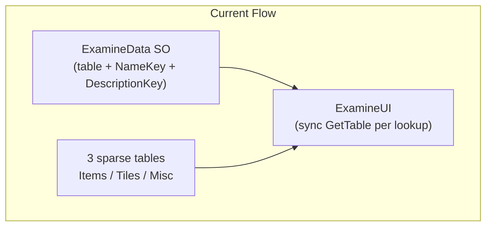
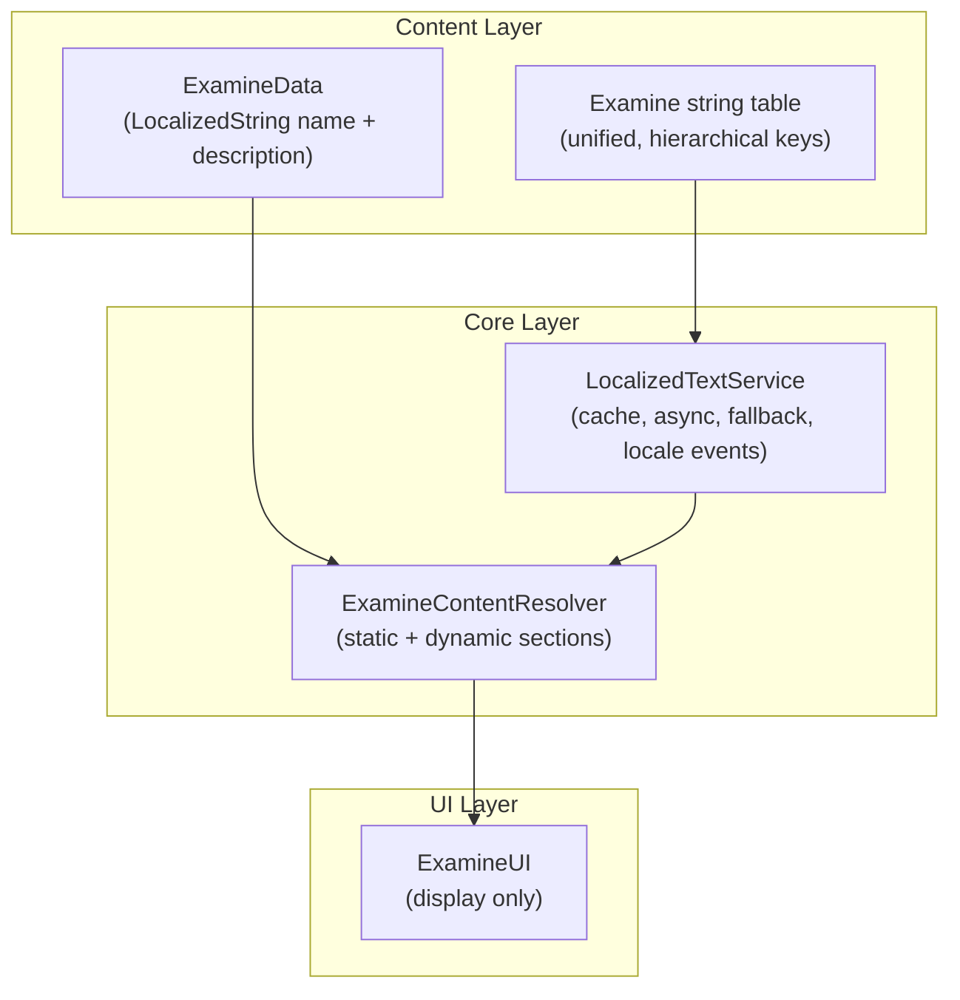
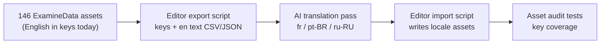

# Future-Proof Examine Localization Design

## Current State

SS3D uses **Unity Localization 1.5.8** with no shared C# accessor. Examine is the main code-driven consumer:



**Key files:**
- [`Assets/Scripts/SS3D/Systems/Examine/ExamineData.cs`](Assets/Scripts/SS3D/Systems/Examine/ExamineData.cs) — stores `LocalizedStringTable` + raw string keys
- [`Assets/Scripts/SS3D/Systems/Examine/ExamineUI.cs`](Assets/Scripts/SS3D/Systems/Examine/ExamineUI.cs) — all lookup logic, no locale-change handling
- [`Assets/Content/Data/Examine/String/`](Assets/Content/Data/Examine/String/) — ~146 `ExamineData` assets
- [`Assets/Content/Localization/Table Collections/`](Assets/Content/Localization/Table Collections/) — UI, Items, Tiles, Misc, Font

**Problems to solve:**

| Issue | Impact |
|-------|--------|
| ~133/146 assets use **English prose as keys** | Keys are not stable, not translatable, leak as fallback text |
| Tables are **sparse** (Items has 2 keys; Tiles ~20) | Most examines show `*[to be localized]*` in-game |
| **3 arbitrary tables** (furniture in Tiles, wires split across Items/Tiles) | Authors must guess table; inconsistent |
| Localization logic **embedded in ExamineUI** | No reuse for `RoundStateView`, ID cards, future stats |
| **Sync `GetTable()` every frame** while Shift held | Wasteful; no caching or locale-change subscription |
| `IDENTIFICATION_CARD` enum exists, **no dynamic content path** | Future features have nowhere to plug in |
| SmartFormat configured but **unused** | No parameterized strings (counts, names, stats) |

---

## Target Architecture



### 1. Unified `Examine` string table

Create one collection at `Assets/Content/Localization/Table Collections/Examine/`.

**Key convention** — derived from asset path under `Examine/String/`:

```
{category}.{subpath}.{asset_name}.name
{category}.{subpath}.{asset_name}.desc
```

Examples:

| Asset path | Name key | Description key |
|------------|----------|-----------------|
| `Items/Functional/Tools/Engineering/Wrench.asset` | `items.tools.engineering.wrench.name` | `items.tools.engineering.wrench.desc` |
| `Structures/Walls/SteelWall.asset` | `structures.walls.steel_wall.name` | `structures.walls.steel_wall.desc` |
| `Entities/Humanoids/Human.asset` | `entities.humanoids.human.name` | `entities.humanoids.human.desc` |

**Shared-name variants** (e.g. four atmos pipe levels sharing `atmos_pipe` name) keep a shared name key but unique desc keys:

```
structures.pipes.atmos_pipe.name          → shared
structures.pipes.atmos_pipes_l1.desc      → per-variant
structures.pipes.atmos_pipes_l2.desc
```

Rules:
- `snake_case`, lowercase, dot-separated hierarchy
- Suffix `.name` / `.desc` always
- Keys are **never** display text
- English (`en`) is the **source locale** for AI translation

Deprecate Items/Tiles/Misc examine usage after migration (keep `UI` and `Font` tables unchanged).

### 2. Refactor `ExamineData` to use `LocalizedString`

Replace the triple `(LocalizationTable, NameKey, DescriptionKey)` with Unity-native references:

```csharp
// ExamineData.cs (target shape)
public LocalizedString Name;
public LocalizedString Description;
```

Benefits: editor picker with key validation, GUID-based references (rename-safe), built-in locale awareness.

Add optional `ExamineId` string (auto-derived from asset path in editor) for dynamic content and tests.

Remove per-asset `LocalizationTable` assignment — all examine strings live in the `Examine` table.

### 3. Add `LocalizedTextService` (thin shared accessor)

New file: [`Assets/Scripts/SS3D/Localization/LocalizedTextService.cs`](Assets/Scripts/SS3D/Localization/LocalizedTextService.cs)

Responsibilities (single place for all code-driven localization):
- Async table/string resolution with per-table cache
- Subscribe to `LocalizationSettings.SelectedLocaleChanged` and invalidate cache
- Centralized missing-key policy:
  - **Editor/dev builds**: log warning + show `[MISSING: key]`
  - **Release**: fall back to English source string (never show `*[to be localized]*` to players)
- `GetString(LocalizedString)` and `GetString(table, key, args?)` for SmartFormat args

Refactor [`RoundStateView.cs`](Assets/Scripts/SS3D/Systems/Lobby/UI/RoundStateView.cs) to use this service as the second adopter (validates the abstraction early).

### 4. Add `ExamineContentResolver` (static + dynamic split)

New file: [`Assets/Scripts/SS3D/Systems/Examine/ExamineContentResolver.cs`](Assets/Scripts/SS3D/Systems/Examine/ExamineContentResolver.cs)

```csharp
public readonly struct ExamineContent
{
    public string Name { get; }
    public string Description { get; }
    public IReadOnlyList<ExamineSection> Sections { get; }  // future: stats, ID fields
}

public interface IExamineContentProvider
{
    void AppendSections(IExaminable examinable, List<ExamineSection> sections);
}
```

- **Static text**: resolved from `ExamineData.Name` / `Description` via `LocalizedTextService`
- **Dynamic text** (future): `IExamineContentProvider` implementations on examinable objects (ID card, stack count, damage) append localized template sections with SmartFormat args

`ExamineUI` becomes display-only: calls resolver once per examine change, not per-frame string lookup.

### 5. Slim down `ExamineUI`

Changes to [`ExamineUI.cs`](Assets/Scripts/SS3D/Systems/Examine/ExamineUI.cs):
- Remove `GetLocalizedValue`, `_currentStringTable`, direct table access
- Cache last resolved `ExamineContent` + examinable reference; only re-resolve on examinable change, locale change, or Shift toggle
- Subscribe to locale-changed event via service
- Keep existing hover/detailed/image view logic unchanged

---

## AI-Assisted Translation Workflow

Migration should treat **English as source of truth** and use AI for `fr`, `pt-BR`, `ru-RU`.



**Export script** (Editor tool):
- Walk all `ExamineData` assets
- Generate canonical keys from asset path
- For legacy assets: use current `NameKey`/`DescriptionKey` **values** as English source text (not as keys)
- Output: `examine_strings_export.json` with `{ key, en, context? }`

**AI translation**:
- Batch keys through AI with SS3D context (sci-fi station game, item/tool descriptions, preserve `<br>` and TMP rich text)
- Include glossary constraints (e.g. "crowbar", "SMES", "PDA" — translate or keep per project policy)
- Human review optional but recommended for first pass

**Import script**:
- Creates/updates entries in `Examine` shared data + per-locale assets
- Rewrites `ExamineData` assets to `LocalizedString` references pointing at new keys

This avoids manually translating 290+ strings and makes adding future locales repeatable.

---

## Phased Migration Plan

### Phase 0 — Foundation (code, no content breakage)
- Add `LocalizedTextService` + tests
- Add `Examine` string table collection (empty)
- Add `ExamineContentResolver`
- Refactor `ExamineUI` to use resolver (still reads old `ExamineData` fields via compatibility shim)
- Add locale-change handling and string caching
- Fix player-visible `*[to be localized]*` fallback

### Phase 1 — Key generation + English population
- Build editor export/import tooling
- Auto-generate canonical keys for all 146 assets
- Populate `Examine_en` from existing English text (from legacy key values)
- Update `ExamineData` assets to new `LocalizedString` fields
- Extend [`ExamineDataTests.cs`](Assets/Scripts/Tests/AssetAudit/ExamineDataTests.cs):
  - Every asset has valid `LocalizedString` entries
  - Every referenced key exists in `Examine` shared data
  - English value is non-empty

### Phase 2 — AI translation
- Export `Examine_en` entries for translation
- AI-translate to `fr`, `pt-BR`, `ru-RU`
- Import into locale assets
- Add audit test: all keys present in all supported locales (can warn-only initially)

### Phase 3 — Cleanup + future features
- Remove legacy `LocalizationTable`/`NameKey`/`DescriptionKey` fields from `ExamineData`
- Retire Items/Tiles/Misc examine entries (or mark deprecated)
- Implement `IExamineContentProvider` for `IDENTIFICATION_CARD` as first dynamic consumer
- Add SmartFormat templates for parameterized examine lines (e.g. `"Charge: {charge}%"`)

---

## Testing Strategy

| Test | Purpose |
|------|---------|
| `EveryExamineDataHasValidLocalizedStrings` | Asset wiring |
| `EveryExamineKeyExistsInTable` | No missing keys at build time |
| `EveryLocaleHasAllExamineKeys` | Translation completeness |
| `ExamineContentResolverTests` (EditMode) | Resolver logic, fallback, caching |
| `LocalizedTextServiceTests` | Cache invalidation on locale change |

---

## What Stays Unchanged

- **Prefab-driven UI** (`LocalizeStringEvent` on lobby prefabs) — keep as-is; no need to route through the service
- **`LocalizeFont`** — asset-table pattern is fine
- **`UI` string table** — lobby/round state strings remain separate
- **Examine UI prefabs** — layout/positioning logic unchanged
- **Addressables delivery** — add `Examine` table to existing localization addressable groups

---

## Risk Mitigations

- **Compatibility shim** in Phase 0 reads old fields if new `LocalizedString` is empty — zero breakage during rollout
- **English fallback in release** ensures untranslated keys never show dev markers
- **AI glossary file** (`examine_glossary.json`) prevents inconsistent translation of game terms
- **Incremental audit tests** (warn → fail) so translation gaps don't block development
