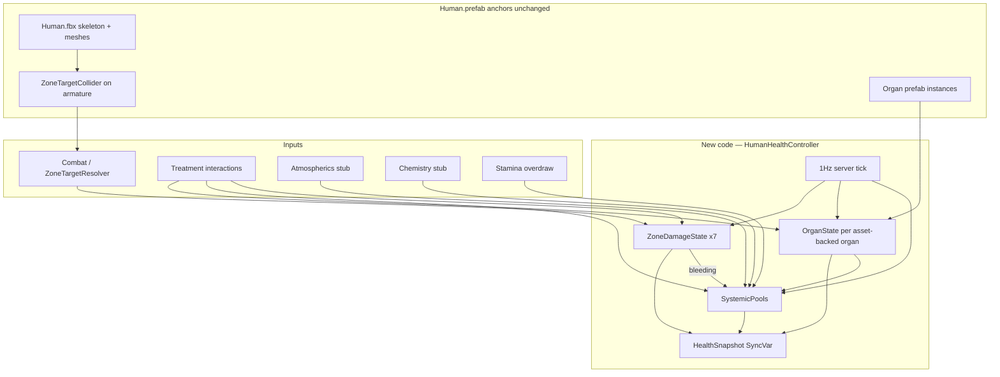
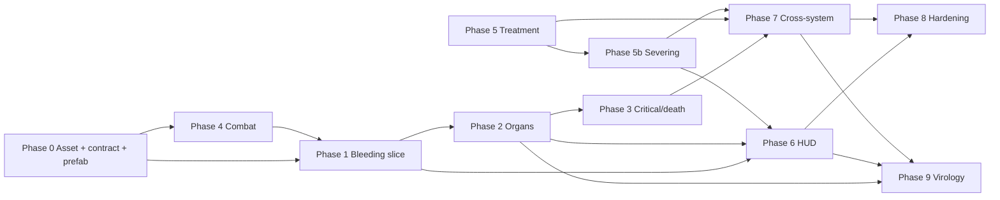

# Health System — Comprehensive Implementation Plan (Greenfield)

## Design authority

Primary spec: [Documents/design/health.md](Documents/design/health.md). Adjacent specs linked, not redesigned:

| Spec | Role |
|------|------|
| [main-hud.md](Documents/design/main-hud.md) §5–6 | Vitals cluster, screen-space feedback, seven-zone targeting |
| [combat.md](Documents/design/combat.md) | Damage input into per-limb model |
| [stamina.md](Documents/design/stamina.md) | Stamina regen + push-past-empty → oxy debt |
| [armor.md](Documents/design/armor.md) | Absorption before limb damage; seal breach |
| [surgery.md](Documents/design/surgery.md) | Medbay-grade treatment |
| [death-cloning-respawn.md](Documents/design/death-cloning-respawn.md) | Defib, cloning |
| [chemistry.md](Documents/design/chemistry.md) | Reagents → systemic pools |
| [virology.md](Documents/design/virology.md) | Disease stages as external modifiers on organ function / systemic pools (separate Phase 9) |

**Out of scope for this plan** (health.md §9, minus disease — now spec'd in virology.md): radiation/genetic, cybernetic depth, nutrition redesign. Disease/infection is **not** built here; see Phase 9.

---

## Strategic shift: clean-slate rewrite

The existing health code (~40 C# files under `Assets/Scripts/SS3D/Systems/Health/`) is a **simulation prototype** that diverges from the design spec. **Delete it entirely — do not slim, bridge, or run alongside new code.** Phase 0 opens with a purge PR; the new system is written fresh on top of prefab/content anchors only.

**No dual-stack rule:** At no point should legacy `BodyLayer`, `CirculatoryController`, `Heart`/`Lungs` pulse loops, or `InflictDamageToAllLayer` APIs coexist with the new `HumanHealthController`. One PR (or a tight back-to-back pair) must leave the tree clean.

### What we keep (content only — not C#)

These come from [Human.fbx](Assets/Art/Models/Entities/Humanoids/Human/Human.fbx) and [Human.prefab](Assets/Content/WorldObjects/Entities/Humanoids/Human/Human.prefab):

| Keep | Why |
|------|-----|
| Human.prefab hierarchy and skinned meshes | Rig, animations, visual wound surface |
| Body-part and organ **prefab assets** | Anatomy references; legacy `MonoBehaviour` scripts on them are removed and replaced |
| Skeleton colliders on armature bones | Zone raycast targets (add `ZoneTargetCollider`) |
| Bleeding **particle prefab** | Reuse VFX asset; replace `BleedingBodyPart` script with new `WoundVfx` (or equivalent) |
| Severed limb **item prefabs** | Physical drops; new severance code spawns them |
| `BodyParts` physics layer (layer 10) | Combat/medical raycast |
| `Human.Kill()` / mind-swap **integration points** on `Human` entity | Rewire to new death API; do not keep old brain-destroy path |

### Phase 0a — Legacy purge (delete entirely)

Remove all of `Assets/Scripts/SS3D/Systems/Health/` **except nothing** — the whole folder is deleted and rebuilt. Includes:

| Delete | Notes |
|--------|-------|
| `BodyLayers/` | All layer types, `DamagesContainer`, susceptibility math |
| `BodyParts/` | `Bodypart.cs`, `Heart`, `Lungs`, `Brain`, limb subclasses, organ spawn logic |
| `CirculatoryController`, `HealthController`, `FeetController` | Molar blood/O2 sim |
| `OxygenConsumerSubSystem`, `IOxygenConsumer`, `IOxygenNeeder` | Global O2 tick |
| `BleedingBodyPart`, `DamageType*`, `HealthConstants`, `HealthStateType` (old) | Replaced by new types |
| `Events/DamageEventArgs`, `Interfaces/IWalkEnabler` | Legacy hooks |
| `Stamina/` under Health | **Relocate** to `Assets/Scripts/SS3D/Systems/Stamina/` and rewrite against new health hooks in Phase 7a (interim: preserve interaction gates with a minimal stub if needed for compile) |

Also delete or rewrite **external references** in the same purge PR:

- `Assets/Scripts/SS3D/Hacks/AttackBodyPartByClickingIt.cs` — remove; replaced by `ZoneTargetResolver` in Phase 4
- `Assets/Scripts/SS3D/Systems/IngameConsoleSystem/Commands/` — `HurtCommand`, `HitBodyPartCommand`, `ExamineBodyPartCommand`, `DestroyBodyPartCommand`, `KillCommand` → rewrite against `HumanHealthController` or remove until re-added
- `Assets/Scripts/SS3D/Systems/Combat/Interactions/HitInteraction.cs` — stub to new `ApplyDamage` or no-op until Phase 4
- `Assets/Scripts/SS3D/Systems/Entities/Humanoid/HumanoidLivingController.cs` — remove `FeetController` dependency
- `Assets/Scripts/SS3D/Systems/Entities/Human.cs`, `Entity.cs` — rewire death to new API
- `Assets/Scripts/Tests/EditMode/HealthTests.cs` — delete; replace as phases ship
- Human.prefab + body-part/organ prefabs — **strip all legacy health `MonoBehaviour` components** from YAML

Prefabs must not reference deleted scripts. Unity missing-script cleanup is part of Phase 0d acceptance.

### What the new code replaces (fresh types, not refactors)

| New | Replaces |
|-----|----------|
| `HumanHealthController` | `HealthController`, `CirculatoryController`, organ tick loops |
| `ZoneDamageState[7]` | `BodyLayer` damage on every part |
| `OrganInstance` + `OrganState` | `Heart`/`Lungs`/`Brain` `BodyPart` subclasses with `Update()` pulses |
| `AnatomyNode` (or fresh `BodyPart` written from scratch) | Legacy `Bodypart.cs` tree — **new file, new API**; severance logic reimplemented, not copied |
| `ZoneTargetCollider` | Per-collider zone mapping |
| `WoundVfx` | `BleedingBodyPart` |
| `SystemicPools` | `SubstanceContainer` molar circulatory math |

`SubstancesSubSystem` integration is **deferred** until chemistry needs real bloodstream reagents; pools are normalized floats first.

---

## Human.fbx anatomy contract

The design spec defines **7 gameplay zones**; the FBX defines **finer physical anatomy**. The rewrite uses both via an explicit mapping layer.

### External body parts (prefab instances in Human.prefab)

| Prefab | Anatomy role | Detachable | Maps to zone(s) |
|--------|--------------|------------|-----------------|
| `HumanTorso` | Root | No | Chest (+ Groin via banding, no dedicated collider) |
| `HumanHead` | Head | Yes | Head |
| `HumanArmLeft` / `HumanArmRight` | Upper limb | Yes | L/R Arm |
| `HumanHandLeft` / `HumanHandRight` | Hand | Yes (child of arm) | L/R Arm (design: hand effects → arm zone) |
| `HumanLegLeft` / `HumanLegRight` | Upper leg | Yes | L/R Leg |
| `Human Foot Left` / `Human Foot Right` | Foot mesh | Part of leg tree | L/R Leg (design: foot effects → leg zone) |

`HumanEarLeft` / `HumanEarRight` prefabs exist but are **not wired** in Human.prefab — out of scope for v1.

### Skeleton colliders (raycast targets on armature)

Present today in Human.prefab:

| Collider bone | Proposed `BodyZone` |
|---------------|---------------------|
| `head` | Head |
| `chest`, `spine` | Chest (Groin resolved separately — see below) |
| `BodyColliderArm_l`, `upper_arm_l`, `forearm_l`, `hand_l` | LeftArm |
| `BodyColliderArm_r`, `forearm_r`, `hand_r` | RightArm |
| `BodyColliderLeg_l`, `lower_leg_l`, `thigh_l`, `foot_l` | LeftLeg |
| `BodyColliderLeg_r`, `thigh_r`, `foot_r` | RightLeg |

**Groin zone (no collider):** `BodyZone.Groin` stays in the data model (armor, damage, vitals per main-hud §6) but has **no dedicated raycast collider** on the `hips` bone. Targeting resolves via screen-space vertical banding on torso hits — cursor vertical offset from the target's on-screen center maps chest/spine raycast hits to Chest vs Groin (main-hud §6 fallback). Same hover-and-confirm UX, different resolution underneath.

New component: **`ZoneTargetCollider`** on each collider GameObject — `[SerializeField] BodyZone zone`. Multiple colliders per zone is intentional (design §6: hand/foot precision → arm/leg zone).

### Organs (meshes in FBX + prefabs)

| Organ | FBX mesh | Prefab | Currently coded | Design role | V1 plan |
|-------|----------|--------|-----------------|-------------|---------|
| Brain | Yes | `HumanBrain` | Yes (destroy = kill) | Consciousness, sole death trigger | Rewrite to function % |
| Heart | Yes | `HumanHeart` | Yes (pulse loop) | Circulation, cardiac arrest | Rewrite to function % |
| Lungs ×2 | Yes | `HumanLungLeft/Right` | Yes (constant intake) | O2 intake | Rewrite to function % |
| Liver | Yes | `HumanLiver` | **No** | Toxin clearance | Wire in Phase 2 |
| Kidneys | **No** | **No prefab** | No | Toxin clearance | **Asset gap — see below** |
| Eyes ×2 | Yes | `HumanEye` | No | Vision | Phase 7+ / deferred |
| Stomach | Yes | `HumanStomach` | No | Hunger (existing alert) | Deferred per health.md §3 |
| Intestines, Appendix | Yes | Yes | No | None in v1 | Deferred |

**Kidney asset gap:** [health.md](Documents/design/health.md) §3 requires liver + kidneys for toxin clearance. Human.fbx has no kidney mesh and no `HumanKidney` prefab. V1 approach:

- Wire **liver** from existing prefab for hepatic clearance.
- Model **renal clearance as a derived fraction of liver function** (e.g. `clearance = liverFn × 0.5`) until art adds kidney meshes to Human.fbx.
- Document this divergence in the architecture system map; replace with real kidney organ when asset ships.

Organs are accessed surgically via **chest** (heart, lungs, liver) and **head** (brain) per [surgery.md](Documents/design/surgery.md) §2 — no abdomen subdivision needed.

---

## Target architecture



---

## Phase 0 — Purge, asset audit, data contract, prefab wiring

### 0a. Legacy purge (first — blocking)

1. Delete entire legacy `Assets/Scripts/SS3D/Systems/Health/` tree (see purge table above).
2. Update all external references so the project compiles with new stubs or minimal `HumanHealthController` skeleton.
3. Remove `AttackBodyPartByClickingIt` hack.
4. Strip legacy health components from Human.prefab and body-part/organ prefabs.
5. **Acceptance:** `rg 'BodyLayer|CirculatoryController|InflictDamageToAllLayer|OxygenConsumerSubSystem' Assets/Scripts/SS3D/` returns zero hits (except git history).

### 0b. Anatomy map (documentation deliverable)

Create `Documents/architecture/systems/health-anatomy-map.md` (or section in health system map) listing:

- Body-part tree matching Human.prefab
- Collider → `BodyZone` table (above)
- Organ inventory with gameplay role and phase
- Known asset gaps (kidneys, ears)

### 0c. Clean-slate data contract

New types under a **fresh** `Assets/Scripts/SS3D/Systems/Health/` folder (created after purge):

```csharp
enum BodyZone { Head, Chest, LeftArm, RightArm, LeftLeg, RightLeg, Groin }

enum WoundSeverity { None, Bruised, Wound, Severe, Disabled, Severed }

struct ZoneDamageState {
    float Brute, Burn;
    WoundSeverity Severity;
    float BleedingRate;
    bool IsDisabled;
}

enum OrganType { Brain, Heart, LeftLung, RightLung, Liver /* Kidney deferred */ }

struct OrganState {
    OrganType Type;
    float FunctionPercent;  // 0–100
    bool IsCritical;
}

struct SystemicPools {
    float BloodVolumeRatio;   // 0–1
    float OxyDebt;            // 0–max
    float ToxinConcentration; // 0–max
}

struct HealthSnapshot { /* HUD + network: worst-limb brute/burn, pools, organs, HealthState, alerts */ }
```

**`HumanHealthController`** (`NetworkBehaviour` on Human prefab):

- Owns `ZoneDamageState[7]`, organ list, `SystemicPools`, consciousness/cardiac-arrest flags.
- Server 1 Hz `TickHealth()`:

```csharp
// Pool update — design §2
bloodDelta = -SumBleedingRates(zones);
oxyDelta = LungIntake(lungs, atmos) - HeartDelivery(heart, bloodVolume) - Demand(zones);
toxinDelta = Intake - LiverClearance(liver) /* kidney factor interim */;
```

- Critical/death per §4: any systemic threshold OR low brain function → critical; brain function = 0 → death; heart = 0 → cardiac arrest (not death).
- Publishes `HealthSnapshot` via `SyncVar`.
- **`ApplyDamage(BodyZone, brute, burn)`** — sole damage entry point for combat.
- **`ApplyTreatment(...)`** — entry point for medical interactions.
- **`IHealthEffectModifier` registry** — per-tick deltas on organ function and systemic pools from downstream systems ([virology.md](Documents/design/virology.md) disease stages, [chemistry.md](Documents/design/chemistry.md) reagents, stamina overdraw). No parallel infection meter; virology routes through this hook. Open surgical wounds are contact-exposure vectors for virology only — no health-specific surgical-infection mechanic.

**No legacy code carried forward.** `AnatomyNode`, `OrganInstance`, and `WoundVfx` are new implementations — severance, organ attachment, and bleed VFX behavior is re-derived from design docs, not copied from deleted `Bodypart.cs` / `BleedingBodyPart`.

### 0d. Prefab wiring (Human.prefab only)

1. Add **`ZoneTargetCollider`** to every armature collider listed above (excluding groin — no hips collider).
2. Attach new `HumanHealthController`, `AnatomyNode` tree, and `OrganInstance` registrations (liver alongside heart/lungs).
3. Replace all removed legacy components on Human.prefab — **zero missing-script refs**.
4. Fix or remove obsolete `_bodyCollider` fields on prefabs; colliders live on armature via `ZoneTargetCollider`.

**Deliverable:** Purge complete + data contract + compiling skeleton + EditMode tests for pool math and critical/death checks. No treatment UI yet.

---

## Phase 1 — Vertical slice: bleeding → blood volume → oxy debt

Implements health.md §10 prompt 2 / §8 steps 1–5.

1. Brute damage on zone → wound severity threshold → bleeding rate.
2. Bleeding drains `BloodVolumeRatio` each tick.
3. Low blood volume raises `OxyDebt` independent of organ health.
4. **Bandage** (Help, Tier 2, zone-targeted): stops `BleedingRate`; does not restore blood.
5. Rewire `BleedingBodyPart` VFX via new `WoundVfx` component (same particle prefab, new script).
6. **"Bleeding" alert chip** (main-hud §9).

**Exit criteria:** worked example steps 1–5 in two-player test scene.

---

## Phase 2 — Organ function (asset-backed)

1. **`OrganInstance`** component on brain, heart, lungs, liver prefabs — exposes `FunctionPercent` from damage; registers with `HumanHealthController`.
2. Spawn liver from `HumanLiver` prefab on torso (mesh already in FBX).
3. Heart → circulation multiplier; zero → cardiac arrest.
4. Lungs → `lungFn × atmosO2` (atmos stub = 1.0).
5. Liver → toxin clearance; interim renal factor until kidney art.
6. Brain → consciousness debuffs; zero → `Human.Kill()`; head-zone severe brute → brain function drain.
7. Limb function: disabled leg → movement debuff; disabled arm → interaction/aim debuff (stub).

---

## Phase 3 — Critical, death, revival window

1. Multi-threshold critical (blood, oxy, toxin, brain) — `HealthCriticalFlags` on snapshot + Critical alert chip.
2. ~~Screen-space condition feedback~~ — **deferred to Phase 6** (wire to existing custom HUD designs there).
3. Cardiac arrest sub-state + defib window — systemic stress drains heart; arrest drains brain each tick.
4. Death only at brain function = 0; corpse persists via existing `Human.Kill()`.
5. Defibrillator: chest zone Help interaction + admin `defib` command; restarts heart if brain > 0; mis-shock burns chest. Charge/armor deferred to Phase 7d.

---

## Phase 4 — Combat integration

1. **`ZoneTargetResolver`** — raycast `BodyParts` layer → `ZoneTargetCollider.zone` (new in Phase 4; hack removed in Phase 0a).
2. Replace [HitInteraction.cs](Assets/Scripts/SS3D/Systems/Combat/Interactions/HitInteraction.cs) → `ApplyDamage(zone, packet)`.
3. One melee weapon with windup/recovery (combat.md §2).
4. **`ZoneTargetResolver`** groin resolution: vertical banding on chest/spine hits (no groin collider).

---

## Phase 5 — Field treatment

Bandage pattern extended to: burn dressing, splint, O2 mask, CPR, antitoxin, IV/transfusion (health.md §6). All Help-intent, server-validated.

---

## Phase 5b — Limb severing

Ships between Phase 5 and Phase 6. Design authority: health.md §5 (Severed tier), §6 (reattach deferred to Phase 7c surgery).

1. **`AnatomyNode`** — restore detach fields: skinned mesh ref, sever anchor, optional severed-item prefab; `IsSevered` runtime state.
2. **`HumanAnatomyController`** — zone → anatomy subtree map from nested HumanBodyParts prefabs; hide meshes, disable zone colliders, spawn severed item via `ItemSubSystem`.
3. **`ZoneDamageState.IsSevered`** — explicit transition to `WoundSeverity.Severed` (not derived from brute thresholds); max bleeding; limb function hard-disabled.
4. **Severance trigger** — zone must reach Disabled first; sharp melee (`CanSever` on `MeleeDamagePacket`) or admin `sever` / `destroybodypart` commands.
5. **Head decapitation** — mind-swap to severed head entity (plan key decision); body deactivates player controls, does not run ghost/death flow.
6. **Reattachment / prosthetics** — explicitly deferred to Phase 7c.

**Out of scope:** stump blendshapes (`HumanCut.mat` wiring), groin/chest severance, nested NetworkObject unparent (spawn fresh item copy instead).

---

## Phase 6 — Vitals HUD

1. Vitals cluster — worst-limb brute/burn + systemic toxin/oxy (health.md §7). **Follow existing custom vitals-cluster designs** — wire bars/alerts to `HealthSnapshot`, do not redesign layout.
2. ~~**Screen-space condition feedback**~~ — **shipped:** `HealthScreenEffectMapper` + local-owner `HumanHealthController` drive dying/blood-loss/oxy/concussion/unconscious; hit flash on `ApplyDamage`.
3. Examine-self hold → per-zone + organ function readout. Reserve a slot for diagnosed infections (virology.md §8) — listed once scanned, not a standalone infection bar.
4. **Wound visuals on character model** — replace Phase 1 interim particle bleed with purpose-built assets:
   - **New bleeding VFX** — per-zone particle/stream prefabs tuned for Human anatomy anchors (not the legacy bleed particle reused in `WoundVfx`). *(Partial: emission/lifetime tuned in code; dedicated stream prefab still TODO.)*
   - **Blood decals** — pooled blood marks on floors/walls and optional body-surface splatter, driven by wound severity and active bleeding; prefer **URP Decal Renderer** (`DecalProjector` + decal materials) over mesh quads. *(Shipped: `BloodDecalSpawner`, body + floor decals via `WoundVfx`.)*
   - Wire spawn/fade/cleanup from `WoundVfx` (or successor) + `HealthSnapshot` zone mask / severity; decals accumulate while bleeding, stop growing when bandaged. *(Shipped.)*
   - Blendshapes/material tint on Human.fbx remain optional if art adds them later — decals + particles are the v1 path.

**URP Decal prerequisites:** URP renderer exposes Decal Renderer feature on `SS3D_ForwardPlusRenderer`; blood decal shader/material variants live under `Assets/Content/WorldObjects/World/VFX/Health/`. Wet/dry/footprint variants remain optional follow-ups.

---

## Phase 7 — Cross-system integration

| Track | Scope |
|-------|-------|
| 7a Stamina | **Shipped (core):** regen = f(heart, lungs, blood) × carried-weight; overdraw → `ApplyOxyDebt`; no bar. Combat drains deferred. See [systems/stamina.md](../architecture/systems/stamina.md). |
| 7b Armor | Per-zone absorption before `ApplyDamage`; seal breach |
| 7c Surgery | Incise → clamp → repair → close; unclamped-close → internal bleed |
| 7d Death/cloning | DNA record, defib polish, cloning pod |
| 7e Chemistry | Reagents → pools via `IHealthEffectModifier`; sedation for surgery; disease cures are ordinary recipes (virology.md §6) |

Deferred organ gameplay when assets exist: eyes (vision), stomach (hunger), ears, kidneys (replace interim clearance).

---

## Phase 9 — Virology (separate effort, not part of health MVP)

Spec: [Documents/design/virology.md](Documents/design/virology.md). Resolves items health.md §9, chemistry.md §12, surgery.md §11, and examine.md §11 previously deferred.

**Why separate from Phases 0–8:** Virology is its own system (exposure tracking, disease roster, scanner UI, immunity on crew identity). It does **not** add new health pools — disease stages register as `IHealthEffectModifier` instances on `HumanHealthController`, the same pattern chemistry reagents use.

**Depends on:** Phase 2 (organ function), Phase 6 (organ readout slot), Phase 7e (chemistry delivery), plus Areas (airborne interim), armor (mask coverage), crew identity (immunity flag).

**Scope (virology.md §13 prompt 2 vertical slice):**

1. Authored disease record (contact transmission, stages, cure recipe ref).
2. Exposure accumulation per (character, disease id) — contact dose events + Area co-location airborne interim.
3. Threshold → infection → incubation → symptomatic stage writing real organ/pool deltas.
4. Medical scanner (live scan + blood sample) — diegetic device screen.
5. Chemistry-synthesized cure → halts progression, reverses stage effects → immunity on crew record.

**Explicitly not in health plan:** mutation/culture minigame, quarantine enforcement, prophylactic vaccination, gamemode antagonist diseases (virology.md §11).

**Surgery note:** Unclamped surgical wounds and open incisions are contact-exposure triggers only (virology.md §11) — health/surgery phases need no special infection mechanic.

---

## Phase 8 — Hardening

- EditMode + PlayMode: health.md §8 full chain (steps 1–8).
- Update [health.md](Documents/architecture/systems/health.md) system map, effort doc, INDEX status.
- **Verify no legacy health symbols remain** — grep audit across `Assets/Scripts/SS3D/` for deleted type names.
- Add new test suite; do not port old `HealthTests.cs`.

---

## Implementation order



**Recommended ship order:** P0 → P1 → P6 (minimal) → P2 → P3 → P4 → P5 → P7 → P8 → **P9** (virology, after health MVP + chemistry).

---

## Key decisions (resolved for clean slate)

| Decision | Choice |
|----------|--------|
| Retain old health code? | **No** — full purge in Phase 0a; zero dual-stack |
| Dual-stack / bridge period? | **Forbidden** — purge and skeleton land together |
| Damage storage | Per-zone `ZoneDamageState`, not per-layer |
| Blood/O2 simulation | Normalized pools, not molar `SubstanceContainer` |
| 7 zones vs 11 body parts | Mapping layer on colliders; anatomy tree stays granular for severing |
| Kidneys missing from FBX | Liver-only clearance + interim renal factor; art follow-up |
| Groin zone | No dedicated collider; `BodyZone.Groin` in data model, resolved via vertical banding on torso hits |
| Screen-space / vitals UI | Implement owner's existing custom designs; code wires `HealthSnapshot` → designed assets |
| Wound / bleed visuals | Phase 6: new per-zone bleed VFX + URP Decal Renderer blood decals; Phase 1 `WoundVfx` particle reuse is interim |
| Global tick | `HumanHealthController.TickHealth()` at 1 Hz; delete `OxygenConsumerSubSystem` |
| Death | Brain function → 0 only; severed head keeps special mind-swap behavior |
| Disease/infection | Separate Phase 9 per virology.md; routes through `IHealthEffectModifier`, not new health pools |
| Surgical-site infection | Contact-exposure vector in virology; no health-plan mechanic |

---

## Risk register

| Risk | Mitigation |
|------|------------|
| Greenfield breaks severing/head-swap | Reimplement on fresh `AnatomyNode`; port behavior from design, not deleted code |
| Legacy scripts on prefabs | Phase 0d strips all removed components; missing-script check is acceptance criteria |
| Stamina interaction gates break on purge | Relocate `Stamina/` out of Health; minimal stub preserves compile until Phase 7a |
| Kidney missing vs design spec | Document divergence; derived clearance until art |
| FBX has no wound blendshapes | Phase 6 ships URP Decal blood marks + new bleed particles; blendshapes/material tint if art adds later |

---

## Success criteria

health.md §8 + death-cloning §9 example A, end-to-end:

1. Zone-targeted melee hit on chest applies brute.
2. Wound opens, bleeds, alert chip lights, visible on model.
3. Blood volume drops → oxy debt rises (healthy organs).
4. Bandage stops bleed; transfusion restores blood.
5. Untreated → critical → cardiac arrest → defib window.
6. Defib in time → recovery; late → brain death → corpse.
7. Vitals + examine-self accurate throughout.

---

## Implementation notes

### Phase 1 (shipped)

- `ZoneTargetResolver` added early for bandage zone targeting; Phase 4 will extend it for combat raycasts.
- Bandage wired to `MedicalPatch.prefab` via `BandageItemExtension`; dedicated bandage prefab can split later.
- `WoundVfx` is auto-added on `HumanHealthController` startup if missing from prefab.
- Transfusion and other blood restoration deferred to Phase 5.
- **Interim bleed VFX only** — Phase 1 reuses the legacy particle prefab via `WoundVfx`; Phase 6 replaces with new bleeding VFX and URP Decal blood decals on surfaces.

### Phase 2 (shipped)

- `OrganSimulation` drives zone→organ damage, cardiac-arrest brain drain, perfusion-scaled effective function, and limb capability multipliers.
- `HumanHealthController.EnsureBuiltinOrgans()` attaches `OrganInstance` to inline Human prefab organ meshes at server start.
- `HumanLiver.prefab` now carries `OrganInstance`; kidney clearance remains liver-derived interim.
- Unconscious players cannot move; disabled legs slow movement; both arms disabled blocks hand interactions (stub).
- Full `heal … all` restores organ function via `RestoreOrgans()`.

### Phase 3 (shipped)

- Screen-space condition feedback deferred to Phase 6 at the time; **now shipped** via `HealthScreenEffectMapper`.
- `HealthCriticalFlags` + Critical / Cardiac Arrest alert chips; defibrillation via `DefibrillatorInteraction` + admin `defib` command.
- Untreated critical systemic pools drain heart function → cardiac arrest → brain drain → death at brain function zero.
- Defib charge, armor block, and portable defib prefab deferred (Phase 7d / art import).

### Hemorrhage tuning (2026-07)

- Oxy debt scales **continuously** with blood lost `(1 − bloodVolume) × gain` — hypoxia begins around **60–70%** blood remaining, not near empty.
- Heart O₂ delivery uses **volume^1.75** so circulation collapses faster as blood drops (shock before exsanguination).
- **`BleedingBloodDrainScale = 0.010`** (~2× slower than early Phase 1): untreated single-zone blood clocks — Wound ~2:00 critical / ~3:20 empty; Severe ~1:00 / ~1:40; Disabled ~40s / ~1:07; Severed ~30s / ~50s. Rates stay severity-only (no per-zone bleed multipliers).
- **Oxy synced to bleed:** `LowBloodOxyDebtGainScale = 0.035` so oxy critical lands **after** blood critical (not a hypoxia snap while volume is still high). Pre-arrest brain drain is mild (`CriticalOxyBrainDrainPerTick = 0.5`); post-arrest `CardiacArrestBrainDrainPerTick = 2.5` opens a **~15–30 s** defib window.
- **Reference: `hurt Head 100`** — Disabled head wound (bleed 1.5), brain ~60% instantly; untreated death typically **~90–120 s** via hypoxia → heart failure → brain death (bandage/transfusion/defib interrupt each stage).

### Phase 4 (shipped)

- `HitInteraction` removed; `MeleeHitInteraction` applies zone-targeted `ApplyDamage(BodyZone, MeleeDamagePacket)` with Harm intent, windup, and hand recovery lockout.
- `ZoneTargetResolver.TryResolveCombatZone` raycasts `BodyParts` colliders from aim origin; groin resolved via lower-chest vertical banding (`GroinTorsoBandFraction`).
- Fists via `HandHit`; crowbar vertical slice via `MeleeWeaponItemExtension` on `Crowbar.prefab` (18 brute, 0.35s windup, 0.5s recovery).
- Held weapons resolve the owning `Hand` through `IInteractionSource.Source` for range checks and recovery tracking.

### Phase 5 (shipped)

- Field treatments follow the bandage Help-intent pattern via `MedicalInteractionUtility` and targeted zone/systemic application.
- **BurnPatch** → burn dressing (zone burn heal); **BrutePatch** → splint (disabled limb stabilization via `IsSplinted`); **OxygenTank** → head-targeted oxy relief; **Medkit** → chest transfusion + antitoxin (reusable); empty hands → chest CPR (3s windup).
- `HumanHealthController` adds `ApplyBloodTransfusion`, `ApplyOxyRelief`, `ApplyAntitoxin`, `ApplyCpr`, and splint support on `ApplyTreatment`.
- Dedicated IV bag / syringe prefabs deferred until art import; medkit stands in for field blood + antitoxin.

### Phase 5b (shipped)

- `AnatomyNode` expanded with severed visuals, optional drop prefab, and sever anchor; legacy `_bodyPartItem` YAML ignored — spawns via `Items.*` constants or `Item.Asset.Id`.
- `HumanAnatomyController` maps zones to nested body-part prefabs, hides anatomy, disables zone colliders, spawns world item copies; head severance instantiates `HumanHead` with runtime `Entity` before FishNet spawn, then `MindSubSystem.SwapMinds`.
- `ZoneDamageState.IsSevered` + `HealthSnapshot.SeveredZoneMask`; severance requires Disabled tier unless admin `force`.
- Sharp melee: `CanSever` on `MeleeDamagePacket` / `MeleeWeaponProfile`; hatchet and kitchen knife wired via `MeleeWeaponItemExtension`.
- Admin: `sever (ckey) (zone) [force]`; `destroybodypart` force-severs head for decap testing.
- Reattachment / stump `HumanCut.mat` / nested NO unparent deferred (Phase 7c / art).

### Phase 6 (partial)

- **Screen-space feedback shipped:** `HealthScreenEffectMapper` maps local-owner `HealthSnapshot` to dying/blood-loss/oxy/concussion/unconscious; `ApplyDamage` TargetRpc fires hit flash. EditMode: `HealthScreenEffectMapperTests`.
- Vitals cluster UITK and examine-self organ readout still open.
- Blood decals / bleed VFX tuning already landed earlier in Phase 6 wound-visuals work.

### Body presentation debt (banked 2026-07)

Death and unconsciousness collapse were fixed with interim reinforce RPCs + `Ragdoll.ApplyCollapseVisuals` + `SetPosingSuppressed`. That is stopgap — Health must not grow a third collapse path. Future single-authority refactor: [2026-07_body-presentation-authority.md](../architecture/2026-07_body-presentation-authority.md).
