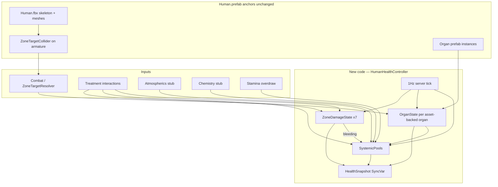
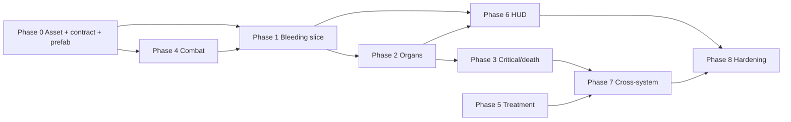

# Health System — Comprehensive Implementation Plan (Greenfield)

## Design authority

Primary spec: [Documents/design/health.md](Documents/design/health.md). Adjacent specs linked, not redesigned:

| Spec | Role |
|------|------|
| [main-hud.md](Documents/design/main-hud.md) §5–6 | Vitals cluster, screen-space feedback, seven-zone targeting |
| [combat.md](Documents/design/combat.md) | Damage input into per-limb model |
| [stamina.md](Documents/design/stamina.md) | Stamina regen + push-past-empty → oxy debt |
| [armor.md](Documents/design/armor.md) | Absorption before limb damage; seal breach |
| [surgery.md](Documents/design/surgery.md) | Medbay-grade treatment |
| [death-cloning-respawn.md](Documents/design/death-cloning-respawn.md) | Defib, cloning |
| [chemistry.md](Documents/design/chemistry.md) | Reagents → systemic pools |

**Out of scope** (health.md §9): disease/infection, radiation/genetic, cybernetic depth, nutrition redesign.

---

## Strategic shift: greenfield rewrite

The existing health code (~40 files) is a **simulation prototype** (multi-layer damage, molar circulatory math, heartbeat `Update()` loops) that diverges from the design spec's gameplay-facing model. **We do not need to retain it.**

### What we keep (content / prefab anchors)

These come from [Human.fbx](Assets/Art/Models/Entities/Humanoids/Human/Human.fbx) and [Human.prefab](Assets/Content/WorldObjects/Entities/Humanoids/Human/Human.prefab) — the rewrite adheres to this anatomy, not to legacy C# structure:

| Keep | Why |
|------|-----|
| Human.prefab hierarchy and skinned meshes | Rig, animations, visual wound surface |
| Body-part prefab instances (torso, head, limbs, hands, feet) | Detachable anatomy tree |
| Skeleton colliders on armature bones | Zone raycast targets |
| Organ meshes + organ prefabs | Diegetic organ model, surgery extract/install |
| `BleedingBodyPart` VFX pattern | Acute bleed feedback (rewire, don't inherit logic) |
| Severed-item spawning pattern | Physical severed limbs as holdable items |
| `BodyParts` physics layer (layer 10) | Combat/medical raycast |
| `Human.Kill()` / mind-swap hooks | Death and head-severance integration points |

### What we delete / replace (code)

| Retire | Replace with |
|--------|--------------|
| `BodyLayers/` (bone, muscle, circulatory, nerve, organ layers) | Per-zone `ZoneDamageState` (brute, burn, wound severity) |
| `CirculatoryController` molar `SubstanceContainer` sim | `SystemicPools` (blood volume ratio, oxy debt, toxin concentration) |
| `OxygenConsumerSubSystem` + per-layer O2 reserves | Single 1 Hz tick on `HumanHealthController` |
| `Heart`/`Lungs` `Update()` heartbeat loops | `OrganState.FunctionPercent` driving pool deltas |
| 11-type `DamageType` on layers | 4 HUD categories (brute/burn/toxin/oxy) + optional fine-grained `DamageSource` for combat weapons |
| `FeetController` | Limb function debuffs on `ZoneDamageState` |
| `BodyPart.InflictDamageToAllLayer` | `ApplyDamage(BodyZone, DamagePacket)` on controller |
| Binary bleed (`RelativeDamage > 0`) | `BleedingRate = f(WoundSeverity)` |

`SubstancesSubSystem` integration is **deferred** until chemistry needs real bloodstream reagents; pools are normalized floats first.

---

## Human.fbx anatomy contract

The design spec defines **7 gameplay zones**; the FBX defines **finer physical anatomy**. The rewrite uses both via an explicit mapping layer.

### External body parts (prefab instances in Human.prefab)

| Prefab | Anatomy role | Detachable | Maps to zone(s) |
|--------|--------------|------------|-----------------|
| `HumanTorso` | Root | No | Chest, Groin |
| `HumanHead` | Head | Yes | Head |
| `HumanArmLeft` / `HumanArmRight` | Upper limb | Yes | L/R Arm |
| `HumanHandLeft` / `HumanHandRight` | Hand | Yes (child of arm) | L/R Arm (design: hand effects → arm zone) |
| `HumanLegLeft` / `HumanLegRight` | Upper leg | Yes | L/R Leg |
| `Human Foot Left` / `Human Foot Right` | Foot mesh | Part of leg tree | L/R Leg (design: foot effects → leg zone) |

`HumanEarLeft` / `HumanEarRight` prefabs exist but are **not wired** in Human.prefab — out of scope for v1.

### Skeleton colliders (raycast targets on armature)

Present today in Human.prefab:

| Collider bone | Proposed `BodyZone` |
|---------------|---------------------|
| `head` | Head |
| `chest`, `spine` | Chest |
| `hips` | Groin — **bone exists, collider missing; add BoxCollider in Phase 0c** |
| `BodyColliderArm_l`, `upper_arm_l`, `forearm_l`, `hand_l` | LeftArm |
| `BodyColliderArm_r`, `forearm_r`, `hand_r` | RightArm |
| `BodyColliderLeg_l`, `lower_leg_l`, `thigh_l`, `foot_l` | LeftLeg |
| `BodyColliderLeg_r`, `thigh_r`, `foot_r` | RightLeg |

New component: **`ZoneTargetCollider`** on each collider GameObject — `[SerializeField] BodyZone zone`. Multiple colliders per zone is intentional (design §6: hand/foot precision → arm/leg zone).

### Organs (meshes in FBX + prefabs)

| Organ | FBX mesh | Prefab | Currently coded | Design role | V1 plan |
|-------|----------|--------|-----------------|-------------|---------|
| Brain | Yes | `HumanBrain` | Yes (destroy = kill) | Consciousness, sole death trigger | Rewrite to function % |
| Heart | Yes | `HumanHeart` | Yes (pulse loop) | Circulation, cardiac arrest | Rewrite to function % |
| Lungs ×2 | Yes | `HumanLungLeft/Right` | Yes (constant intake) | O2 intake | Rewrite to function % |
| Liver | Yes | `HumanLiver` | **No** | Toxin clearance | Wire in Phase 2 |
| Kidneys | **No** | **No prefab** | No | Toxin clearance | **Asset gap — see below** |
| Eyes ×2 | Yes | `HumanEye` | No | Vision | Phase 7+ / deferred |
| Stomach | Yes | `HumanStomach` | No | Hunger (existing alert) | Deferred per health.md §3 |
| Intestines, Appendix | Yes | Yes | No | None in v1 | Deferred |

**Kidney asset gap:** [health.md](Documents/design/health.md) §3 requires liver + kidneys for toxin clearance. Human.fbx has no kidney mesh and no `HumanKidney` prefab. V1 approach:

- Wire **liver** from existing prefab for hepatic clearance.
- Model **renal clearance as a derived fraction of liver function** (e.g. `clearance = liverFn × 0.5`) until art adds kidney meshes to Human.fbx.
- Document this divergence in the architecture system map; replace with real kidney organ when asset ships.

Organs are accessed surgically via **chest** (heart, lungs, liver) and **head** (brain) per [surgery.md](Documents/design/surgery.md) §2 — no abdomen subdivision needed.

---

## Target architecture



---

## Phase 0 — Asset audit, data contract, prefab wiring

### 0a. Anatomy map (documentation deliverable)

Create `Documents/architecture/systems/health-anatomy-map.md` (or section in health system map) listing:

- Body-part tree matching Human.prefab
- Collider → `BodyZone` table (above)
- Organ inventory with gameplay role and phase
- Known asset gaps (kidneys, ears, groin collider)

### 0b. Greenfield data contract

New types under `Assets/Scripts/SS3D/Systems/Health/`:

```csharp
enum BodyZone { Head, Chest, LeftArm, RightArm, LeftLeg, RightLeg, Groin }

enum WoundSeverity { None, Bruised, Wound, Severe, Disabled, Severed }

struct ZoneDamageState {
    float Brute, Burn;
    WoundSeverity Severity;
    float BleedingRate;
    bool IsDisabled;
}

enum OrganType { Brain, Heart, LeftLung, RightLung, Liver /* Kidney deferred */ }

struct OrganState {
    OrganType Type;
    float FunctionPercent;  // 0–100
    bool IsCritical;
}

struct SystemicPools {
    float BloodVolumeRatio;   // 0–1
    float OxyDebt;            // 0–max
    float ToxinConcentration; // 0–max
}

struct HealthSnapshot { /* HUD + network: worst-limb brute/burn, pools, organs, HealthState, alerts */ }
```

**`HumanHealthController`** (`NetworkBehaviour` on Human prefab):

- Owns `ZoneDamageState[7]`, organ list, `SystemicPools`, consciousness/cardiac-arrest flags.
- Server 1 Hz `TickHealth()`:

```csharp
// Pool update — design §2
bloodDelta = -SumBleedingRates(zones);
oxyDelta = LungIntake(lungs, atmos) - HeartDelivery(heart, bloodVolume) - Demand(zones);
toxinDelta = Intake - LiverClearance(liver) /* kidney factor interim */;
```

- Critical/death per §4: any systemic threshold OR low brain function → critical; brain function = 0 → death; heart = 0 → cardiac arrest (not death).
- Publishes `HealthSnapshot` via `SyncVar`.
- **`ApplyDamage(BodyZone, brute, burn)`** — sole damage entry point for combat.
- **`ApplyTreatment(...)`** — entry point for medical interactions.

**Delete** (after new controller passes tests): `BodyLayers/`, `CirculatoryController`, `OxygenConsumerSubSystem`, `IOxygenConsumer`, `IOxygenNeeder`, old `Heart`/`Lungs`/`Brain` simulation logic, `FeetController`, `HealthConstants` molar values.

**Retain and slim:** `BodyPart` base for anatomy tree + severing + organ container attachment — but strip layer damage; body parts become **structural nodes** located by `BodyZone`, not damage containers.

### 0c. Prefab wiring (Human.prefab only)

1. Add **`ZoneTargetCollider`** to every armature collider listed above.
2. Add **BoxCollider on `hips` bone** → `BodyZone.Groin`.
3. Register organ prefabs on torso/head body-part components (liver spawn alongside heart/lungs).
4. Replace `HealthController` with `HumanHealthController` on Human.prefab.
5. Fix `_bodyCollider: {fileID: 0}` on body-part prefabs — point to armature colliders or remove unused field.

**Deliverable:** Data contract + EditMode tests (pool math, critical/death, wound severity thresholds). No treatment UI yet.

---

## Phase 1 — Vertical slice: bleeding → blood volume → oxy debt

Implements health.md §10 prompt 2 / §8 steps 1–5.

1. Brute damage on zone → wound severity threshold → bleeding rate.
2. Bleeding drains `BloodVolumeRatio` each tick.
3. Low blood volume raises `OxyDebt` independent of organ health.
4. **Bandage** (Help, Tier 2, zone-targeted): stops `BleedingRate`; does not restore blood.
5. Rewire `BleedingBodyPart` VFX from any zone with `BleedingRate > 0`.
6. **"Bleeding" alert chip** (main-hud §9).

**Exit criteria:** worked example steps 1–5 in two-player test scene.

---

## Phase 2 — Organ function (asset-backed)

1. **`OrganInstance`** component on brain, heart, lungs, liver prefabs — exposes `FunctionPercent` from damage; registers with `HumanHealthController`.
2. Spawn liver from `HumanLiver` prefab on torso (mesh already in FBX).
3. Heart → circulation multiplier; zero → cardiac arrest.
4. Lungs → `lungFn × atmosO2` (atmos stub = 1.0).
5. Liver → toxin clearance; interim renal factor until kidney art.
6. Brain → consciousness debuffs; zero → `Human.Kill()`; head-zone severe brute → brain function drain.
7. Limb function: disabled leg → movement debuff; disabled arm → interaction/aim debuff (stub).

---

## Phase 3 — Critical, death, revival window

1. Multi-threshold critical (blood, oxy, toxin, brain).
2. Screen-space feedback: heartbeat audio + vignette pulse (main-hud §5).
3. Cardiac arrest sub-state + defib window.
4. Death only at brain function = 0; corpse persists.
5. Defibrillator: chest zone, charge, restart heart if brain > 0.

---

## Phase 4 — Combat integration

1. **`ZoneTargetResolver`** — raycast `BodyParts` layer → `ZoneTargetCollider.zone` (replaces [AttackBodyPartByClickingIt.cs](Assets/Scripts/SS3D/Hacks/AttackBodyPartByClickingIt.cs) hack).
2. Replace [HitInteraction.cs](Assets/Scripts/SS3D/Systems/Combat/Interactions/HitInteraction.cs) → `ApplyDamage(zone, packet)`.
3. One melee weapon with windup/recovery (combat.md §2).
4. Screen-space vertical banding fallback if camera lacks zone separation (main-hud §6).

---

## Phase 5 — Field treatment

Bandage pattern extended to: burn dressing, splint, O2 mask, CPR, antitoxin, IV/transfusion (health.md §6). All Help-intent, server-validated.

---

## Phase 6 — Vitals HUD

1. Vitals cluster — worst-limb brute/burn + systemic toxin/oxy (health.md §7).
2. Screen-space condition feedback.
3. Examine-self hold → per-zone + organ function readout.
4. Wound severity on character model (materials/decals/blendshapes if available on Human.fbx).

---

## Phase 7 — Cross-system integration

| Track | Scope |
|-------|-------|
| 7a Stamina | Regen = f(heart, lungs, blood); overdraw → oxy debt |
| 7b Armor | Per-zone absorption before `ApplyDamage`; seal breach |
| 7c Surgery | Incise → clamp → repair → close; unclamped-close → internal bleed |
| 7d Death/cloning | DNA record, defib polish, cloning pod |
| 7e Chemistry | Reagents → pools; sedation for surgery |

Deferred organ gameplay when assets exist: eyes (vision), stomach (hunger), ears, kidneys (replace interim clearance).

---

## Phase 8 — Hardening

- EditMode + PlayMode: health.md §8 full chain (steps 1–8).
- Update [health.md](Documents/architecture/systems/health.md) system map, effort doc, INDEX status.
- Remove dead code and orphaned health tests; add new suite.

---

## Implementation order



**Recommended ship order:** P0 → P1 → P6 (minimal) → P2 → P3 → P4 → P5 → P7 → P8.

---

## Key decisions (resolved for greenfield)

| Decision | Choice |
|----------|--------|
| Retain old health code? | **No** — rewrite; keep prefab/content anchors only |
| Damage storage | Per-zone `ZoneDamageState`, not per-layer |
| Blood/O2 simulation | Normalized pools, not molar `SubstanceContainer` |
| 7 zones vs 11 body parts | Mapping layer on colliders; anatomy tree stays granular for severing |
| Kidneys missing from FBX | Liver-only clearance + interim renal factor; art follow-up |
| Groin zone | Add collider on existing `hips` bone |
| Global tick | `HumanHealthController.TickHealth()` at 1 Hz; delete `OxygenConsumerSubSystem` |
| Death | Brain function → 0 only; severed head keeps special mind-swap behavior |

---

## Risk register

| Risk | Mitigation |
|------|------------|
| Greenfield breaks severing/head-swap | Keep `BodyPart` severance hooks; port tests early |
| Kidney missing vs design spec | Document divergence; derived clearance until art |
| `_bodyCollider` unset on prefabs | Phase 0c audit; colliders live on armature via `ZoneTargetCollider` |
| FBX has no wound blendshapes | Start with bleed particles + material tint; art pass later |
| Large deletion PR | Phase 0 ships new controller alongside old; delete old in Phase 1 after slice passes |

---

## Success criteria

health.md §8 + death-cloning §9 example A, end-to-end:

1. Zone-targeted melee hit on chest applies brute.
2. Wound opens, bleeds, alert chip lights, visible on model.
3. Blood volume drops → oxy debt rises (healthy organs).
4. Bandage stops bleed; transfusion restores blood.
5. Untreated → critical → cardiac arrest → defib window.
6. Defib in time → recovery; late → brain death → corpse.
7. Vitals + examine-self accurate throughout.
