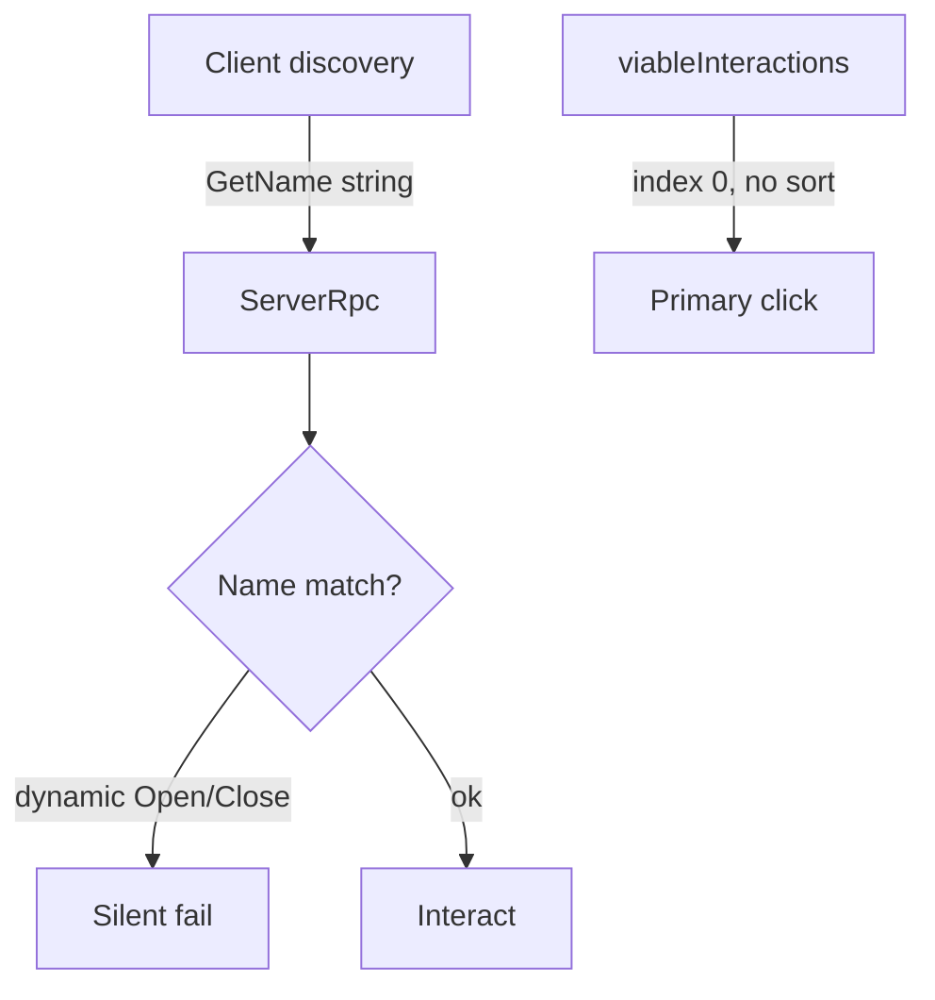
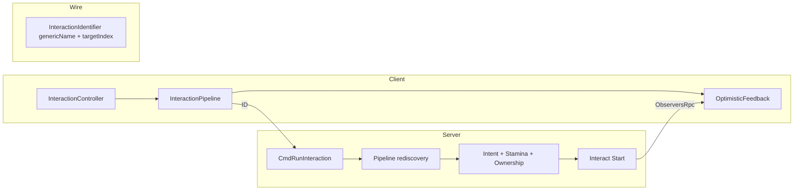
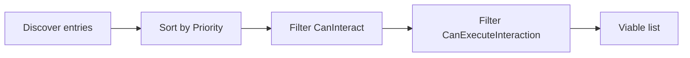

# Interaction System Improvement Plan

Based on the [architectural review](c38e9f56-55f9-4f13-b23b-33bbeeac1c98) and current codebase state.

## Goals

Fix the highest-risk multiplayer gaps **without rewriting** the source/target discovery model (`CreateTargetInteractions` + `CreateSourceInteractions` + extensions, server-authoritative `Start()`).

**Preserve:** composable discovery, `DelayedInteraction` lifecycle, `Requirement` decorator, range checks, tool→hand chaining.

**In scope:** networking correctness, deterministic primary-click, cross-cutting gates, cancellation, optimistic client feedback, integration tests.

**Out of scope (for now):** full gameplay prediction of inventory state, ScriptableObject interaction registry, rate limiting, body-part targeting integration, `IsWallTop` range blocking.

---

## Baseline — what the review found




| Gap                                    | Severity | Evidence                                                                                                                                                                                |
| -------------------------------------- | -------- | --------------------------------------------------------------------------------------------------------------------------------------------------------------------------------------- |
| Wire protocol uses display `GetName()` | High     | `[OpenInteraction.GetName](Assets/Scripts/SS3D/Systems/Inventory/Interactions/OpenInteraction.cs)` returns `"Open X"` / `"Close X"` based on animator state; RPC matches on that string |
| `GetGenericName()` unimplemented       | High     | ~19 of 22 interaction classes still `throw new NotImplementedException()`                                                                                                               |
| Primary click order undefined          | Medium   | `[InteractionController.HandleRunPrimary](Assets/Scripts/SS3D/Systems/Interactions/InteractionController.cs)` uses `viableInteractions[0]`                                              |
| Inventory RPC uses fragile index       | Medium   | `CmdRunInventoryInteraction(target, source, index, name)`                                                                                                                               |
| Observer RPC null-unsafe               | Medium   | `RpcExecuteClientInventoryInteraction` dereferences `Find` result without null check                                                                                                    |
| Host/client RPC asymmetry              | Medium   | Inventory observer RPC skips server; world RPC does not                                                                                                                                 |
| Intent UI disconnected                 | Medium   | `[IntentController](Assets/Scripts/SS3D/Interactions/IntentController.cs)` toggles state; nothing reads it                                                                              |
| Stamina gate unused                    | Medium   | `StaminaController.CanCommenceInteraction` exists; not called in pipeline                                                                                                               |
| Mixed replication                      | Medium   | `OpenInteraction.Start()` mutates local `Animator`; `[NetworkedOpenable](Assets/Scripts/SS3D/Systems/Inventory/Containers/NetworkedOpenable.cs)` uses `SyncVar` but hook path is split  |
| No cancellation tracking               | Low      | TODO at line 267 of `InteractionController`                                                                                                                                             |
| No interaction tests                   | Low      | Only selection/stamina unit tests; no PlayMode interaction outcomes                                                                                                                     |


**Parallel work in flight:** radial menu UI refactor (`RadialInteractionMenuView`, `Examine` icon assets). Phase 1 RPC changes must update radial callbacks to pass stable identifiers, not re-resolve by `IInteraction` reference + index.

---

## Architecture target




**Key files:**

- `[Assets/Scripts/SS3D/Systems/Interactions/InteractionController.cs](Assets/Scripts/SS3D/Systems/Interactions/InteractionController.cs)` — input, RPCs, discovery callers
- `[Assets/Scripts/SS3D/Interactions/Interfaces/IInteraction.cs](Assets/Scripts/SS3D/Interactions/Interfaces/IInteraction.cs)` — contract extensions
- `[Assets/Scripts/SS3D/Interactions/InteractionEntry.cs](Assets/Scripts/SS3D/Interactions/InteractionEntry.cs)` — entry metadata
- `[Assets/Scripts/SS3D/Interactions/InteractionSource.cs](Assets/Scripts/SS3D/Interactions/InteractionSource.cs)` — instance lifecycle / cancel
- ~22 `*Interaction.cs` files across Inventory, Combat, Crafting, Furniture, Substances, UI

---

## Phase 1: Stable identification and RPC safety

**Problem:** Display names are the wire protocol; inventory uses list indices; observer RPCs can throw.

### 1a. Add `InteractionIdentifier`

New struct in `Assets/Scripts/SS3D/Interactions/`:

```csharp
public readonly struct InteractionIdentifier
{
    public string GenericName { get; }       // stable wire ID
    public int TargetComponentIndex { get; } // index in GetComponents<IInteractionTarget>(), -1 for source-only
}
```

- `GetName()` → **UI display only**
- `GetGenericName()` → **wire ID** (state-independent; e.g. `"Open"` not `"Close Backpack"`)

For parameterized interactions (`StoreInteraction`, `CraftingInteraction`), use stable suffixes derived from serialized data (`"Store:Backpack"`, `"Craft:Welder"`) — never runtime animator/toggle state.

### 1b. Extend `InteractionEntry`

Add `InteractionIdentifier Id` and `int Priority` (from `IInteraction.Priority`, default 0). Compute `TargetComponentIndex` while iterating targets in `GetInteractionsFromTargets`.

### 1c. Change RPC signatures


| Current                                                   | Proposed                                                                                         |
| --------------------------------------------------------- | ------------------------------------------------------------------------------------------------ |
| `CmdRunInteraction(target, point, interactionName)`       | `CmdRunInteraction(target, point, genericName, targetComponentIndex)`                            |
| `CmdRunInventoryInteraction(target, source, index, name)` | `CmdRunInventoryInteraction(target, source, genericName, targetComponentIndex)` — **drop index** |
| Match via `GetName()`                                     | Match via `InteractionIdentifier`                                                                |


Shared helper on `InteractionController`:

```csharp
private static bool TryResolveEntry(List<InteractionEntry> entries, InteractionIdentifier id, out InteractionEntry entry)
```

Update all call sites: primary click, radial menu (`ViewTargetInteractions`, `InteractInHand`), and both observer RPCs.

### 1d. RPC robustness

- Null-safe `TryResolveEntry` in `RpcExecuteClientInteraction` and `RpcExecuteClientInventoryInteraction`
- **Unify host behavior:** document rule — client FX run on all non-dedicated-server clients; dedicated server host skips FX. Apply consistently to world + inventory paths (today inventory skips `IsServer`, world does not)
- Log server-side when resolution fails (aids desync debugging)

### 1e. Implement `GetGenericName()` on all interactions


| Interaction         | Generic name                                                                                     |
| ------------------- | ------------------------------------------------------------------------------------------------ |
| `PickupInteraction` | `"Pickup"`                                                                                       |
| `DropInteraction`   | `"Drop"`                                                                                         |
| `OpenInteraction`   | `"Open"`                                                                                         |
| `StoreInteraction`  | `"Store:{containerName}"`                                                                        |
| `HitInteraction`    | `"Hit"`                                                                                          |
| Locker set          | `"LockLocker"`, `"UnlockLocker"`, `"OpenLocker"`                                                 |
| Already done        | `OpenCraftingMenuInteraction`, `OpenMachineInterfaceInteraction`, `DispenseSubstanceInteraction` |
| Others              | One stable string each                                                                           |


**Deliverable:** PR 1 (1a–1d) + PR 2 (1e). Fewer silent failures; radial menu refactor should consume `InteractionEntry` + identifier, not raw `IInteraction` + index.

---

## Phase 2: Deterministic discovery + shared pipeline

**Problem:** Primary click is `viableInteractions[0]` with component-enumeration order. `CanExecuteInteraction` is never called.

### 2a. Add `IInteraction.Priority`

Default interface member in `[IInteraction.cs](Assets/Scripts/SS3D/Interactions/Interfaces/IInteraction.cs)`:

```csharp
int Priority => 0;
```

Suggested bands (tune during implementation):


| Band  | Examples                        |
| ----- | ------------------------------- |
| 100+  | Combat (`HitInteraction`)       |
| 50–99 | Machine UI, vending             |
| 10–49 | Inventory (pickup, store, open) |
| 0–9   | Passive / fallback              |


Sort **descending** before returning viable list.

### 2b. Extract `InteractionPipeline`

New static class `Assets/Scripts/SS3D/Interactions/InteractionPipeline.cs` — single path for client discovery and server RPC re-validation:




Replace duplicated logic in `GetInteractionsFromTargets` / `GetViableInteractionsFromTarget` with pipeline calls.

### 2c. Replication audit — `OpenInteraction`

`OpenInteraction.Start()` directly toggles `Animator` ([lines 104–112](Assets/Scripts/SS3D/Systems/Inventory/Interactions/OpenInteraction.cs)). `NetworkedOpenable` syncs via `SyncVar` but the interaction bypasses it.

**Fix:** Introduce `IOpenable` (or use existing `NetworkedOpenable` API). `OpenInteraction.Start()` calls server-side open/close on the networked component; animator driven by `SyncVar` onChange on all clients. Audit other `Start()` methods for direct local mutations.

**Deliverable:** PR 3 (2a–2b) + PR 4 (2c). Primary click becomes predictable.

---

## Phase 3: Cross-cutting gates + early optimistic feedback

**Problem:** Intent, stamina, and inventory ownership exist but are not in the execution path. Client has zero feedback until RPC round-trip.

### 3a. Intent filtering (Help / Harm)

1. Expose `IntentType CurrentIntent` on `IntentController` (default `Help`)
2. Add optional `IIntentRestrictedInteraction { IntentType AllowedIntent }`
3. Filter in `InteractionPipeline` on client; re-validate on server (lightweight `SyncVar` on player or intent included in RPC payload)
4. Tag: `HitInteraction` → Harm; medical/crafting → Help; neutral (pickup, open) → unrestricted

### 3b. Stamina gating

Per `[design/stamina.md](Documents/design/stamina.md)` — gate **commencement** of interactions when stamina is zero:

- **Server:** check `StaminaController.CanCommenceInteraction` in both `CmdRunInteraction` paths before `Interact()`
- **Delayed interactions:** extend `DelayedInteraction.Update()` to also check `CanContinueInteraction`
- **Client:** optional pipeline filter so exhausted players don't see impossible options

### 3c. Inventory access validation

Close the TODO at line 488 of `InteractionController`:

- Verify `sourceObject` belongs to the RPC sender's owned player
- Verify target is reachable in the inventory UI context
- Reject with log on spoof

### 3d. Permission re-check

Use existing permission types (locker interactions already check IDs). Add **server-side re-check in `Start()`** for permission-gated interactions to close the check-then-act race window.

### 3e. Early optimistic client feedback (per your scope choice)

Ship lightweight feedback **before** full state prediction:

1. **On click (immediate):** show loading bar / interaction sound via `OptimisticFeedback` helper called from `HandleRunPrimary` and radial selection — fires before RPC, hides on server confirm or rejection
2. **Instant interactions (toggle, pickup):** optimistic UI cue (highlight, brief animation) that rolls back if server RPC fails resolution — **do not** predict inventory contents or permission-gated state
3. **Rejection path:** when `TryResolveEntry` fails server-side, send `TargetRpc` rejection to initiating client to clear optimistic state

Depends on Phase 1 stable IDs so client and server agree on which interaction was attempted.

**Deliverable:** PR 5 (3a–3d) + PR 6 (3e).

---

## Phase 4: Cancellation and active-interaction tracking

**Problem:** Only `DelayedInteraction` supports cancel today; `InteractionController` has a TODO.

### 4a. Track active interactions

Server stores active `InteractionReference` per player; client mirrors last confirmed reference.

### 4b. Player-initiated cancel

`CmdCancelInteraction(referenceId)` → `InteractionSource.CancelInteraction`. Bind to existing cancel input.

### 4c. Automatic cancel

- **Movement:** cancel in-progress delayed interactions when `CharacterMoveCheck` fails (reuse `[InteractionExtensions.CharacterMoveCheck](Assets/Scripts/SS3D/Interactions/Extensions/InteractionExtensions.cs)`)
- Clear optimistic feedback on cancel

Defer damage/stun auto-cancel to a follow-up unless trivial to hook.

**Deliverable:** PR 7.

---

## Phase 5: Tests and developer conventions

### 5a. EditMode tests

`Assets/Scripts/Tests/EditMode/InteractionPipelineTests.cs`:

- Priority sort order
- `InteractionIdentifier` matching with multiple `IInteractionTarget` on one object
- Intent filtering
- Generic name matching ignores display name drift

### 5b. PlayMode integration tests

Extend `[PlayModeTest](Assets/Scripts/Tests/PlayMode/Framework/AbstractTests/PlayModeTest.cs)`:

- Pickup in range → item in hand (server state)
- Primary click selects highest-priority interaction
- Server rejects out-of-range RPC
- Inventory RPC rejected when source doesn't belong to player
- Optimistic feedback clears on server rejection

### 5c. Contract documentation

XML docs on `[IInteraction.cs](Assets/Scripts/SS3D/Interactions/Interfaces/IInteraction.cs)`: `GetGenericName` stability rules, `Priority` bands, replication requirements, `IIntentRestrictedInteraction` usage.

### 5d. Architecture docs

After shipping, run **update-system-docs** skill to create/update:

- `Documents/architecture/systems/interactions-framework.md`
- `Documents/architecture/systems/interactions-runtime.md`
- Architecture effort doc `Documents/architecture/2026-07_interaction-system-hardening.md`

**Deliverable:** PR 8.

---

## Suggested PR sequence


| PR  | Content                                                      | Risk   | Depends on |
| --- | ------------------------------------------------------------ | ------ | ---------- |
| 1   | Identifier struct, RPC signature change, null-safe observers | Medium | —          |
| 2   | All `GetGenericName()` implementations                       | Low    | PR 1       |
| 3   | Priority + `InteractionPipeline`                             | Low    | PR 1       |
| 4   | `OpenInteraction` / replication audit                        | Medium | PR 1       |
| 5   | Intent, stamina, inventory ownership, permission re-check    | Medium | PR 3       |
| 6   | Optimistic feedback + rejection RPC                          | Medium | PR 1, PR 5 |
| 7   | Cancellation                                                 | Low    | PR 1       |
| 8   | Tests + architecture docs                                    | Low    | PR 3–6     |


Each PR independently mergeable; PRs 1–4 can ship before gameplay gates.

---

## Success criteria

- No RPC matches on `GetName()` — only `InteractionIdentifier`
- Primary click order is deterministic and documented via `Priority`
- Host and client observer paths follow one documented rule
- Intent and stamina affect discovery and server execution
- Inventory RPCs validate ownership
- Open/close state replicates through `NetworkedOpenable` / `SyncVar`
- Client gets immediate feedback on interaction attempt; rolls back on rejection
- PlayMode tests cover pickup, priority, RPC rejection, and feedback rollback

