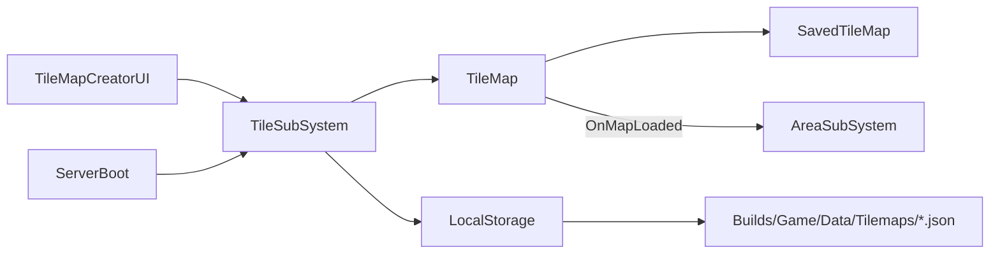
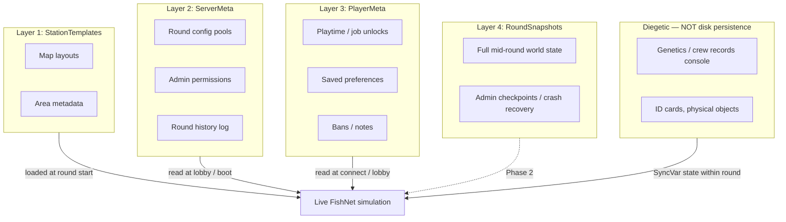
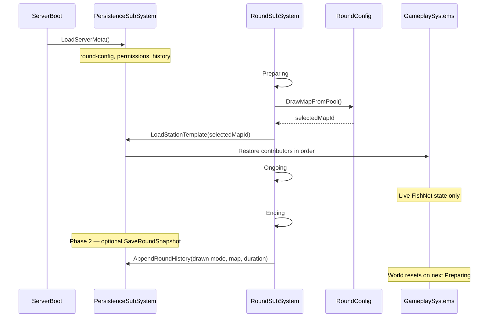

# Persistence Architecture — Recommended Design

## Revision note (Jul 2026 fork state, updated 14 Jul)

The [areas implementation plan](areas_implementation_plan_c0639343.plan.md) is **complete** — all todos shipped. The [2026-07 area-foundation](../architecture/2026-07_area-foundation.md) effort (phases 0–4 plus consumer visuals and wall light switches) landed save/load hooks in the tilemap pipeline. This validates the plan's contributor split and gives concrete extraction points, but does **not** change the recommended architecture.

**What changed since the original draft:**

- Area save/load is live: per-chunk `areaIds`, `SavedAreaRecord[]` (departmental light tint, `defaultRequiredAccessBits`), `AreaSubSystem.BuildSavedAreaRecords()`, restore via `TileMap.LoadedAreaRecords` + `OnMapLoaded`
- [ID access foundation](../architecture/systems/id-access.md) shipped — area door defaults persist via `SavedAreaRecord.defaultRequiredAccessBits`; same APC-restore precedence gap applies on production maps
- Architecture docs current: [`area.md`](../architecture/systems/area.md), [`2026-07_area-foundation`](../architecture/2026-07_area-foundation.md), [`tile.md`](../architecture/systems/tile.md), [`id-access.md`](../architecture/systems/id-access.md)
- [Electricity kWh foundation](electricity_kwh_foundation_917ccdbc.plan.md) shipped — APC/SMES use kWh reservoirs; relevant for Phase 2 electricity contributor
- [Atmos ECS foundation](../architecture/2026-07_atmos-ecs-foundation.md) shipped — turf gas cell buffers; relevant for Phase 2 atmospherics contributor
- **Atmos pipe network foundation shipped** — vents, scrubbers, pumps, air-alarm routing; Phase 2 substances contributor can build on pipe topology (full pipe-contents persistence still Phase 2)
- [Diegetic screen UI framework](../architecture/2026-07_diegetic-screen-ui-framework.md) shipped — confirms machine UI snapshots are derived, not persisted
- EditMode coverage expanded: area/power/lighting/HV-cable/ID-access tests; one save/load test remains (`AreaFloodFillTests.SaveLoad_PreservesAreaIdsAndMetadata`)
- Area rebuild on load has a **dual path** (see load-order note below): if APCs are already registered, `AreaSubSystem` re-floods from live APCs and **discards** saved metadata (display names, tints, access bits)
- **`LightingSwitchOn` is not saved** — `AreaRecord.LightingSwitchOn` (wall light switch state) is runtime-only; gap to fix in Phase 1a area contributor
- **Map Editor UI** (`feature/map-editor-replacement`, not merged) will replace TileMap Creator — Phase 1a rewire targets current `TileMapSaveTab`/`TileMapLoadTab`; update entry points when that branch merges

**What did not change:** no central `PersistenceSubSystem`, no envelope format, no round-config integration, no round snapshots. Core recommendations stand. Phase 1a is unblocked; Phase 1b waits on round-config implementation; player meta waits on auth.

---

## Current state (what exists)

The only real disk persistence today is a **tilemap authoring pipeline** (now including embedded area data):



| Piece | Location | Role |
| ----- | -------- | ---- |
| Generic I/O | [`LocalStorage.cs`](Assets/Scripts/SS3D/Data/Management/LocalStorage.cs) | `JsonUtility` read/write to `Builds/Game/Data/` |
| Orchestration | [`TileSubSystem.cs`](Assets/Scripts/SS3D/Systems/Tile/TileSubSystem.cs) | Server-only `Save()` / `Load()`; auto-loads most recent map on boot |
| DTO + walk | [`TileMap.Save/Load`](Assets/Scripts/SS3D/Systems/Tile/TileMap.cs), `SavedObjects/*` | Chunk/tile/item/area serialization |
| Cross-system hook | [`AreaSubSystem`](Assets/Scripts/SS3D/Systems/Area/AreaSubSystem.cs) | `BuildSavedAreaRecords()` on save; restore via `TileMap.LoadedAreaRecords` + `OnMapLoaded` |
| Area storage | [`TileChunk`](Assets/Scripts/SS3D/Systems/Tile/TileChunk.cs) area-id grid | Per-chunk `ushort[] areaIds` serialized in `SavedTileChunk` |
| Area DTO | [`SavedAreaRecord`](Assets/Scripts/SS3D/Systems/Tile/SavedObjects/SavedAreaRecord.cs) | id, displayName, parentTag, apcWorldPosition, departmentalLightTint, `defaultRequiredAccessBits` — **not** `LightingSwitchOn` |
| Network identity | [`TileAssetCatalog`](Assets/Scripts/SS3D/Systems/Tile/TileAssetCatalog.cs) | Stable ushort IDs for FishNet sync; saves still use prefab name strings |
| Tests | [`AreaFloodFillTests.SaveLoad_PreservesAreaIdsAndMetadata`](Assets/Scripts/Tests/EditMode/AreaFloodFillTests.cs) | Baseline for contributor extraction tests (harness without live APCs) |

**What it is:** a **station layout template** editor, not gameplay persistence. Items in containers/inventory are explicitly excluded. Adjacency, electricity, atmospherics, substances, machine runtime state, round state, and player meta are not saved.

**Pain points to address:**

- No central orchestrator — `TileSubSystem` owns save/load directly
- `JsonUtility` + `[SerializeReference]` on [`SavedTileChunk`](Assets/Scripts/SS3D/Systems/Tile/SavedObjects/SavedTileChunk.cs) — bloated files, weak polymorphism, no schema versioning
- Asset identity is **prefab name strings** at save time; network uses **ushort catalog IDs** via `TileAssetCatalog` — two parallel identity systems
- Areas are coupled into tilemap DTOs (shipped in area foundation; still should be split into separate contributor chunks)
- **Area template metadata lost on load when APCs present** — `HandleMapLoaded` re-floods from live APCs and ignores saved display names, parent tags, tints, and access bits
- **`LightingSwitchOn` not persisted** — wall light switch state resets to default on every load
- Area restore depends on `OnMapLoaded` firing after tiles **and** APC NetworkObjects exist — contributor load order must guarantee this (see below)
- No integration with [`RoundSubSystem`](Assets/Scripts/SS3D/Systems/Rounds/RoundSubSystem.cs) — server boot always loads "most recent" map, not round-selected map
- Design docs ([`lobby.md`](Documents/design/lobby.md) §11, [`round-config.md`](Documents/design/round-config.md) §5, [`inventory-storage.md`](Documents/design/inventory-storage.md)) assume a **Persistence & accounts** layer that does not exist

---

## SS13 persistence domains (the mental model)

Space Station 13 has **four distinct persistence layers**. The framework should make these explicit rather than conflating them:



**Critical design rule (from [`death-cloning-respawn.md`](Documents/design/death-cloning-respawn.md) §4):** genetics/crew records are **in-fiction physical databases** — destructible station objects synced via FishNet, not external save files. The persistence framework must not shortcut this.

---

## Recommended architecture

### Core: `PersistenceSubSystem` + contributor pattern

Add a new infrastructure subsystem at [`Assets/Scripts/SS3D/Data/Persistence/`](Assets/Scripts/SS3D/Data/Persistence/) that owns **when** and **what** gets saved, while each domain owns **how** its data is serialized.

```csharp
// Contracts (sketch)
public enum PersistenceLayer { StationTemplate, ServerMeta, PlayerMeta, RoundSnapshot }

public interface IPersistenceContributor
{
    string ContributorId { get; }           // e.g. "tilemap", "areas", "electricity"
    PersistenceLayer Layer { get; }
    int LoadOrder { get; }                   // lower = loaded first
    object Capture();                        // domain DTO
    void Restore(object data, PersistenceContext ctx);
}

public interface IPersistenceStore
{
    bool TrySave(string path, object envelope, bool overwrite);
    bool TryLoad<T>(string path, out T envelope);
    IReadOnlyList<string> List(string directory);
}
```

**`PersistenceSubSystem`** responsibilities:

- Register contributors at startup (each subsystem calls `RegisterContributor` in `OnStartServer`)
- Orchestrate **layered save/load** with ordered contributors and explicit lifecycle hooks
- Expose admin/API entry points: `SaveStationTemplate(name)`, `LoadStationTemplate(name)`, `SaveRoundSnapshot(name)` (Phase 2)
- Fire events: `OnBeforeRestore`, `OnAfterRestore`, `OnBeforeCapture` — replaces ad-hoc `OnMapLoaded` pattern
- Enforce **server-only** disk I/O (same rule as tilemap today)

**`PersistenceEnvelope`** — wrapper for all saves:

```csharp
[Serializable]
public class PersistenceEnvelope
{
    public int schemaVersion;          // migration support
    public string envelopeType;        // "station-template" | "round-snapshot" | "server-meta"
    public string createdAt;           // ISO timestamp
    public string gameVersion;         // build identifier
    public List<PersistenceChunk> chunks;
}

[Serializable]
public class PersistenceChunk
{
    public string contributorId;
    public string payloadJson;         // contributor-owned DTO, serialized separately
}
```

Each contributor serializes its own DTO into `payloadJson`. This avoids `[SerializeReference]` across the whole document, keeps domains decoupled, and allows contributors to migrate their own schema independently.

### Storage layout

```
Builds/Game/Data/
├── StationTemplates/
│   └── outpost-station.json          # envelope with tilemap + areas chunks
├── ServerMeta/
│   ├── round-config.json
│   ├── permissions.json              # migrate from Config/
│   └── round-history.jsonl           # append-only log
├── PlayerMeta/
│   └── {ckey}.json                   # playtime, prefs (Phase 1b)
└── RoundSnapshots/                   # Phase 2
    └── 2026-07-10_143022.json
```

Keep [`LocalStorage`](Assets/Scripts/SS3D/Data/Management/LocalStorage.cs) as the low-level file primitive; add `EnvelopePersistenceStore` on top that reads/writes `PersistenceEnvelope`.

### Serializer strategy

**Phase 1:** Keep `JsonUtility` for contributor DTOs (minimal migration cost). The envelope wrapper is simple enough for `JsonUtility`.

**Phase 1.5 / 2:** Evaluate **Newtonsoft.Json** (already common in Unity projects) or **System.Text.Json** for contributor payloads that need polymorphism, dictionaries, or `[JsonProperty]`. The contributor boundary means this can be adopted per-domain without rewriting everything.

Add **`IAssetResolver`** for load-time identity — wrap the existing [`TileAssetCatalog`](Assets/Scripts/SS3D/Systems/Tile/TileAssetCatalog.cs) rather than building catalog identity from scratch:

```csharp
public interface IAssetResolver
{
    bool TryResolve(string assetKey, out GenericObjectSo asset);  // prefab name (legacy)
    bool TryResolve(ushort assetId, out GenericObjectSo asset);  // catalog ID (preferred)
    string GetStableKey(GenericObjectSo asset);                    // canonical save key
}
```

Migrate tilemap saves from raw prefab names to **catalog-backed stable keys** with fallback to legacy names on load.

---

## Refactoring the tilemap save system

### Split tilemap into two contributors

| Contributor | Layer | Captures | Notes |
| ----------- | ----- | -------- | ----- |
| `TileMapPersistenceContributor` | StationTemplate | `SavedTileMap` minus areas | Existing `TileMap.Save/Load` logic, extracted |
| `AreaPersistenceContributor` | StationTemplate | `SavedAreaRecord[]` + per-chunk `areaIds` + `LightingSwitchOn` + `defaultRequiredAccessBits` | Wrap existing `AreaSubSystem.BuildSavedAreaRecords()` + restore path; decouple from `SavedTileMap` DTO |

**Load order:** tilemap first (creates chunks, tiles, and per-chunk `areaIds`), then APC NetworkObjects spawn/register, then areas contributor restores registry.

**Required Phase 1a fix — APC restore precedence:** shipped `AreaSubSystem.HandleMapLoaded` re-floods from live APCs when any are registered, **discarding** saved display names, parent tags, tints, and `defaultRequiredAccessBits`. Maps with placed APC NetworkObjects (typical production maps) always hit this path. Phase 1a must add a public `RestoreFromSave()` (or equivalent template-restore flag) on `AreaSubSystem` that takes precedence over `RebuildAllAreasFromApcs()` during station template restore. The persistence orchestrator calls this explicitly after tile placement.

**Required Phase 1a fix — `LightingSwitchOn`:** add to `SavedAreaRecord` and capture/restore in the area contributor so wall light switch state survives template save/load.

**Backward compatibility:** `PersistenceSubSystem` detects legacy flat `SavedTileMap` JSON (no envelope wrapper) and routes through a `LegacyTileMapMigrator` that wraps it into the new format on first save.

### Slim down `TileSubSystem`

[`TileSubSystem.Save/Load`](Assets/Scripts/SS3D/Systems/Tile/TileSubSystem.cs) become thin delegates:

```csharp
// Before: TileSubSystem owns file I/O directly
// After:
public void Save(string mapName, bool overwrite)
    => SubSystems.Get<PersistenceSubSystem>()
         .SaveStationTemplate(mapName, overwrite);
```

TileMap Creator UI ([`TileMapSaveTab`](Assets/Scripts/SS3D/Systems/Tile/TileMapCreator/TileMapSaveTab.cs), [`TileMapLoadTab`](Assets/Scripts/SS3D/Systems/Tile/TileMapCreator/TileMapLoadTab.cs)) continues to work; only the backend changes.

### Replace `OnMapLoaded` with framework events

[`TileMap.OnMapLoaded`](Assets/Scripts/SS3D/Systems/Tile/TileMap.cs) → `PersistenceSubSystem.OnAfterRestore(PersistenceLayer.StationTemplate)`. [`AreaSubSystem.HandleMapLoaded`](Assets/Scripts/SS3D/Systems/Area/AreaSubSystem.cs) subscribes to the persistence event instead of tilemap-specific event.

---

## Round lifecycle integration

Today the server auto-loads the most recent tilemap on boot, ignoring round config. The framework should wire persistence into the round state machine:



**Round start:** load station template selected by round config pool ([`round-config.md`](Documents/design/round-config.md)), not "most recent file." Keep "load most recent" as a **map editor dev default** only.

**Round end:** append to `round-history.jsonl`; do **not** auto-save round snapshots unless admin requests it (Phase 2).

---

## Phase 2: Round snapshot contributors

When implementing full mid-round persistence, each gameplay domain registers a contributor at `PersistenceLayer.RoundSnapshot`:

| Contributor (future) | Priority | Captures |
| -------------------- | -------- | -------- |
| `TileMapPersistenceContributor` | early | Structural diffs from template (damaged walls, new constructions) |
| `AtmosphericsPersistenceContributor` | early/mid | Turf gas cell buffers (O₂, N₂, CO₂, plasma per cell) from [`AtmosWorld`](Assets/Scripts/SS3D/Systems/Atmospherics/ECS/AtmosWorld.cs) |
| `ElectricityPersistenceContributor` | mid | kWh on APC cells and SMES, breaker/channel state, cable topology |
| `ItemPersistenceContributor` | mid | World items + container contents (requires `Item` serialization; see [`inventory-storage.md`](Documents/design/inventory-storage.md)) |
| `SubstancePersistenceContributor` | mid | Tank/pipe contents (pipe network foundation shipped; full contents persistence still Phase 2) |
| `EntityPersistenceContributor` | late | Humanoid health, inventory, mind links |
| `GamemodePersistenceContributor` | late | Objectives, antag assignments |

**Snapshot vs template:** a round snapshot references a `baseTemplateId` and stores **deltas** where possible (only changed tiles, moved items). Full snapshots are a fallback for admin "save round" commands.

**FishNet consideration:** persistence runs **server-only on disk**. After restore, normal `NetworkObject` spawn + `SyncVar` replication brings clients up to date. No save/load RPCs to clients. Late-joiners after restore use existing spawn flow.

**Load ordering matters:** structural (tilemap) → infrastructure (power, atmospherics) → entities (mobs, items in hands). The `LoadOrder` field on contributors enforces this.

---

## Server meta contributors (Phase 1b)

| Contributor | Source today | Action |
| ----------- | ------------ | ------ |
| `PermissionsPersistenceContributor` | [`PermissionSubSystem`](Assets/Scripts/SS3D/Permissions/PermissionSubSystem.cs) reads `permissions.txt` from Config/ | Migrate to envelope; keep txt import for backward compat |
| `RoundConfigPersistenceContributor` | Design only ([`round-config.md`](Documents/design/round-config.md)) | New; pool model with enabled/weight/preconditions — **blocked on round-config feature** |
| `RoundHistoryPersistenceContributor` | None | Append-only JSONL: timestamp, gamemode, map, player count, fallback flag |

---

## Player meta contributors (Phase 1b)

Deferred until accounts/auth exist, but design for it now:

- `PlayerMetaPersistenceContributor` — per-ckey file: playtime per role, job unlock state, lobby preference defaults
- Ties into [`lobby.md`](Documents/design/lobby.md) playtime-gated jobs
- Requires real authentication (today ckey is client-trusted in [`PlayerSubSystem`](Assets/Scripts/SS3D/Systems/PlayerControl/PlayerSubSystem.cs))

---

## What NOT to build into disk persistence

- **Genetics/crew records** — in-world objects per design spec
- **ID card contents** — physical items; saved only in round snapshots (Phase 2) as item state
- **Machine UI snapshots** ([`ApcInterfaceSnapshot`](Assets/Scripts/SS3D/UI/MachineInterface/ApcInterfaceSnapshot.cs)) — derived read models, rebuilt from sim state (confirmed by diegetic UI framework)
- **FishNet wire serializers** — keep separate from disk format; optionally share DTO shapes where sensible

---

## Implementation phases

### Dependencies / sequencing

| Phase | Blocked? | Prerequisite |
| ----- | -------- | ------------ |
| **Phase 1a** | No — start now | [Areas plan](areas_implementation_plan_c0639343.plan.md) complete |
| **Phase 1b** | Yes | Round-config feature (pool UI + draw logic) — design in [`round-config.md`](Documents/design/round-config.md), no C# yet |
| **Player meta** | Yes | Real authentication (ckey currently client-trusted) |
| **Phase 2** | Partially | Inventory/entity serialization maturity; atmos/electricity foundations already shipped |

### Phase 1a — Framework + station templates (first ship)

1. Create `PersistenceSubSystem`, `IPersistenceContributor`, `PersistenceEnvelope`, `EnvelopePersistenceStore`
2. Extract `TileMapPersistenceContributor` and `AreaPersistenceContributor` from existing save logic
3. Add `AreaSubSystem.RestoreFromSave()` with template-restore precedence over APC re-flood; persist `LightingSwitchOn`
4. Add `LegacyTileMapMigrator` for old flat JSON files
5. Rewire `TileSubSystem` and TileMap Creator UI to use framework
6. Replace `OnMapLoaded` with persistence lifecycle events
7. Add EditMode tests: envelope round-trip, legacy migration, contributor load ordering, **APC-present load scenario** — extend/migrate existing `AreaFloodFillTests.SaveLoad_PreservesAreaIdsAndMetadata` rather than rewriting from scratch

### Phase 1b — Server meta

1. `RoundConfigPersistenceContributor` (when round config is implemented)
2. Migrate permissions to contributor
3. `RoundHistoryPersistenceContributor` + hook into `RoundSubSystem` ending state
4. Wire round-start map selection through `PersistenceSubSystem.LoadStationTemplate(mapId)`

### Phase 2 — Round snapshots

1. Define delta format for tilemap changes from template
2. Item/container serialization (biggest new work — inventory is currently stub)
3. Electricity (kWh reservoirs), atmospherics (turf gas cells), substances contributors
4. Entity/mind/gamemode contributors
5. Admin console commands: `save_round`, `load_round`, `list_snapshots`
6. Optional: periodic auto-checkpoint for crash recovery

### Ongoing — docs

- Add `Documents/architecture/systems/persistence.md` system map
- Update [`rounds-lobby.md`](Documents/architecture/systems/rounds-lobby.md) with persistence hooks (round-start template load, round-end history append)
- Register persistence in [`INDEX.md`](Documents/architecture/INDEX.md)
- Already done (area-foundation effort): [`tile.md`](Documents/architecture/systems/tile.md), [`area.md`](Documents/architecture/systems/area.md), [`2026-07_area-foundation.md`](Documents/architecture/2026-07_area-foundation.md)

---

## Related docs

| Doc | Relevance |
| --- | --------- |
| [areas_implementation_plan_c0639343.plan.md](areas_implementation_plan_c0639343.plan.md) | Complete — Phase 1a prerequisite |
| [electricity_kwh_foundation_917ccdbc.plan.md](electricity_kwh_foundation_917ccdbc.plan.md) | Shipped — Phase 2 electricity contributor uses kWh model |
| [2026-07_atmos-ecs-foundation.md](../architecture/2026-07_atmos-ecs-foundation.md) | Shipped — Phase 2 atmospherics contributor source |
| [2026-07_diegetic-screen-ui-framework.md](../architecture/2026-07_diegetic-screen-ui-framework.md) | Shipped — confirms UI snapshots are not persisted |
| [id-access.md](../architecture/systems/id-access.md) | Shipped — area `defaultRequiredAccessBits` in save DTO; Phase 1a must preserve on APC-present loads |
| [round-config.md](Documents/design/round-config.md) | Design only — blocks Phase 1b map pool + history |
| [inventory-storage.md](Documents/design/inventory-storage.md) | Defers container persistence to cross-cutting infra (Phase 2) |

---

## Key design decisions (summary)

| Decision | Recommendation | Rationale |
| -------- | -------------- | --------- |
| Central orchestrator | `PersistenceSubSystem` | Matches existing `SubSystem` pattern; single lifecycle owner |
| Domain serialization | Contributor pattern | Tilemap refactor is proof-of-concept; scales to 10+ domains |
| File format | Envelope + per-chunk JSON | Decouples domains, enables versioning, fixes SerializeReference bloat |
| Station vs round | Separate layers + directories | SS13 resets world each round; templates != snapshots |
| Asset identity | `TileAssetCatalog` stable keys + legacy fallback | Unifies save and network identity over time |
| Serializer | JsonUtility now, Newtonsoft per-domain later | Minimize Phase 1 churn; upgrade at contributor boundary |
| Diegetic records | Excluded from disk | Honors design spec; keeps stakes physical |
| Area template restore | `RestoreFromSave()` over APC re-flood | Saved metadata must survive on maps with placed APCs |

---

## Implementation notes (Jul 2026)

**Phase 1a shipped** on `feature/persistence-framework`: envelope-based station templates, tilemap/area contributors, legacy tilemap migration, template-restore APC linking.

**Phase 1b shipped (partial):** `PermissionsPersistenceContributor` + `LegacyPermissionsMigrator` (envelope at `ServerMeta/permissions.json`, legacy `Config/permissions.txt` fallback); `RoundHistoryStore` append-only JSONL at `ServerMeta/round-history.jsonl`; `LoadServerMeta` on server boot via `TileSubSystem`; round-end history hook in `RoundSubSystem`. **Deferred:** `RoundConfigPersistenceContributor` and round-start `LoadStationTemplate(mapId)` until round-config feature exists.

**Next:** Phase 2 round snapshot contributors.
