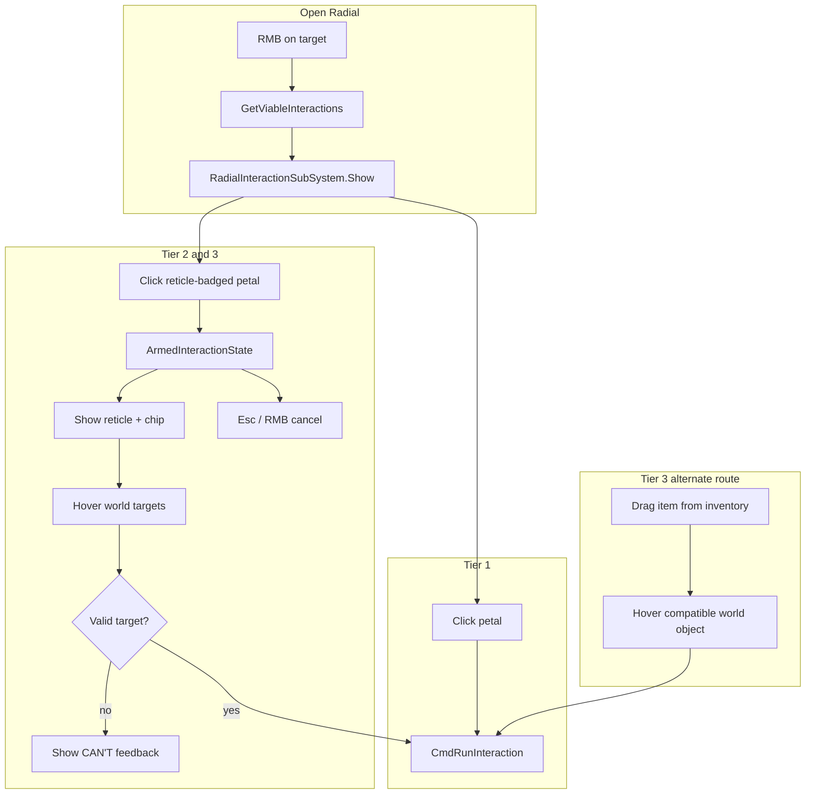

# Radial Menu — Three-Tier Interaction Implementation

## Context

The mockup (`[RadialMenuMockup.dc.html](/home/rutger/Downloads/Radial%20menu%20interaction%20mockup.zip)`) defines a redesigned radial menu with three interaction tiers:


| Tier       | Behavior                                                                               | Mockup example               |
| ---------- | -------------------------------------------------------------------------------------- | ---------------------------- |
| **Tier 1** | Click petal → resolves immediately on current target                                   | Examine, Take, Drop, Rotate  |
| **Tier 2** | Reticle-badged petal → arms cursor → click valid world target                          | Weld (deferred for crafting) |
| **Tier 3** | "Use With…" petal → arms cursor (compatible targets only) **or** drag item onto target | Welding Tool → Metal Rod     |


**Current state:** SS3D already has a working radial menu (`[RadialInteractionSubSystem.cs](Assets/Scripts/SS3D/Systems/Interactions/RadialInteractionSubSystem.cs)`) with fixed 8 petals, rotating indicator, text labels, and click-to-select. All interactions resolve immediately — no armed-cursor state exists. Tier 2/3 and drag-combine are referenced in `[main-hud.md](Documents/design/main-hud.md)` but not implemented in code.

**Input model (unchanged):** Keep existing bindings — LMB runs first viable interaction, RMB opens radial (`[InteractionController.cs](Assets/Scripts/SS3D/Systems/Interactions/InteractionController.cs)`). The mockup uses left-click only for HTML demo purposes.




**Architecture (updated):** Logic/view split — `InteractionController` and tier/armed-state logic are UI-framework-agnostic. The radial **view** is UI Toolkit (`RadialInteractionMenuView`, `RadialInteractionPetal`) on a `UIDocument` with `HudOverlayPanelSettings`, using shared tokens at `Assets/Content/Systems/UI/Tokens/`. Lives under `Systems` in `Game.unity` (not nested in PlayerCanvas).

---

## Phase 1b — UI Toolkit View Migration (completed)

**Goal:** Replace the hybrid UGUI radial with a Toolkit overlay matching the mockup design language.

### Done

- Shared tokens: `[Assets/Content/Systems/UI/Tokens/](Assets/Content/Systems/UI/Tokens/)` (machine interface re-imports from here)
- `[HudOverlayPanelSettings.asset](Assets/Content/Systems/UI/Interactions/RadialInteractionMenu/HudOverlayPanelSettings.asset)` — overlay, sort order 110, no depth clear
- `[RadialInteractionMenuView.cs](Assets/Scripts/SS3D/Systems/Interactions/UI/RadialInteractionMenuView.cs)` + `[RadialInteractionPetal.cs](Assets/Scripts/SS3D/Systems/Interactions/UI/RadialInteractionPetal.cs)`
- `[RadialInteractionSubSystem.cs](Assets/Scripts/SS3D/Systems/Interactions/RadialInteractionSubSystem.cs)` — UIDocument lifecycle (enable/disable like MachineInterfaceHost)
- Removed UGUI `RadialInteractionButton`, petal prefab; menu moved to `Game.unity` Systems hierarchy
- Event simplified to `Action<IInteraction>`

---

## Phase 1a — UGUI Visual Refactor (superseded)

**Goal:** Match the mockup's visual language without changing interaction behavior yet.

### Assets

- Import mockup sprites from the zip into `[Assets/Art/Graphics/UI/Interactions/RadialMenu/](Assets/Art/Graphics/UI/Interactions/RadialMenu/)`:
  - `Petal.png`, `Ring.png`, `CenterButton.png` (replace existing)
  - Add `ReticleBadge.png` (small corner badge for Tier 2/3 petals — derive from mockup's inline CSS circle badge)
- Copy interaction icon PNGs from zip `_ds_assets/interactions/` only where they improve on existing generated icons.

### Prefab refactor — `[RadialInteractionMenu.prefab](Assets/Content/Systems/UI/Systems/Interactions/RadialInteractionMenu/RadialInteractionMenu.prefab)`

- Replace fixed 8 pre-positioned `Slot_XX` nodes with a **dynamic petal container**:
  - One `PetalTemplate` prefab child (icon-only, no text label on petal)
  - Reticle badge `Image` child on each petal (hidden by default)
  - Center **X close button** (replaces reliance on RMB-release-only dismiss)
- Remove the rotating `_indicator` element (mockup has no indicator; selection is direct petal hover)
- Apply design-system styling: raised circular background, hairline border, icon inverted white on dark petal, ~176px diameter (mockup size)

### Script changes

- Refactor `[RadialInteractionButton.cs](Assets/Scripts/SS3D/Systems/Interactions/RadialInteractionButton.cs)`:
  - Remove `_interactionNameText` from petal (icons only)
  - Add `SetReticleBadge(bool visible, InteractionTier tier)` for badge color (rust = Tier 2, green = Tier 3 per mockup)
- Refactor `[RadialInteractionSubSystem.cs](Assets/Scripts/SS3D/Systems/Interactions/RadialInteractionSubSystem.cs)`:
  - **Dynamic petal layout:** instantiate N petals, position at `(i/n) * 2π` around center (logic from mockup lines 359–371)
  - Remove indicator rotation (`UpdateIndicator`, `_indicatorRotateSequence`)
  - Wire center X button to `Disappear()`
  - Keep existing `OnInteractionSelected` event for Phase 1 (behavior unchanged)

### Cleanup

- Delete or mark deprecated `[InteractionMenuView.cs](Assets/Scripts/SS3D/Interactions/UI/InteractionMenuView.cs)` (unused vertical list menu)

---

## Phase 3 — Armed Cursor State (completed)

**Goal:** Implement the reticle + chip + target validation loop from the mockup.

### Done

- `ITargetedInteraction` interface for follow-up target validation
- `ArmedInteractionSubSystem` + `ArmedInteractionOverlayView` (UI Toolkit, shared tokens)
- `ArmedInteractionOverlay.prefab` under `Game.unity` Systems hierarchy
- `InteractionController` routes Tier 2/3 radial selections to armed state; LMB resolves, RMB/Esc cancels
- `TransferSubstanceInteraction` classified as Tier 2 proof-of-concept

---

## Phase 2 — Tier Metadata and Tier 1 Polish

**Goal:** Classify interactions by tier; Tier 1 petals resolve instantly as today.

### New types — `Assets/Scripts/SS3D/Interactions/`

```csharp
public enum InteractionTier { Instant = 1, Targeted = 2, Combine = 3 }

public interface IInteractionTierProvider
{
    InteractionTier GetTier(InteractionEvent interactionEvent);
}
```

- Add `IInteractionTierProvider` as an **optional** interface on `IInteraction` implementations (default = Tier 1 when not implemented — no mass migration required upfront)
- Extend `[RadialInteractionItem.cs](Assets/Scripts/SS3D/Systems/Interactions/RadialInteractionItem.cs)` with `InteractionTier Tier`

### Tier 1 classification (initial pass)

Annotate existing instant interactions:


| Interaction                                     | Tier | File                                                          |
| ----------------------------------------------- | ---- | ------------------------------------------------------------- |
| Pickup, Drop, Take, Open, Toggle, Examine (new) | 1    | Various in `Systems/Inventory/Interactions/`, `Interactions/` |
| Hit, Store, ViewContainer                       | 1    | Existing                                                      |


### Tier 1 behavior in `[InteractionController.cs](Assets/Scripts/SS3D/Systems/Interactions/InteractionController.cs)`

- On petal select: if `GetTier() == Instant` → existing `CmdRunInteraction` path (no change)
- On petal select: if Tier 2 or 3 → delegate to armed state (Phase 3 hook, stub for now)

### Add missing Tier 1 interaction: **Examine**

- Create `ExamineInteraction : IInteraction, IClientInteractionSource, IInteractionTierProvider` that opens `[ExamineUI](Assets/Scripts/SS3D/Systems/Examine/ExamineUI.cs)` detailed view for the hovered `IExaminable`
- Register via `IInteractionTarget` on examinable objects (or as a source interaction from hand when target is examinable)

---

## Phase 3 — Armed Cursor State (Tier 2 and Tier 3)

**Goal:** Implement the reticle + chip + target validation loop from the mockup.

### New subsystem — `ArmedInteractionSubSystem.cs`

Client-only UI/logic subsystem managing armed state:

```csharp
public sealed class ArmedInteractionState
{
    public IInteraction Interaction;
    public InteractionEvent OriginEvent;   // source + initial target context
    public InteractionTier Tier;
    public string Label;                   // e.g. "Weld — Welding Tool →"
}
```

**Responsibilities:**

- `Arm(state)` / `Cancel()` / `TryResolveAt(Selectable target)`
- Subscribe to `UpdateEvent` for reticle position tracking (follow mouse)
- Listen for `Escape` and RMB (`ViewInteractions.canceled` or new cancel binding) to cancel
- On LMB click while armed: raycast selection → build new `InteractionEvent` with original source + clicked target → `CanInteract` check → execute or show invalid feedback
- Suppress normal LMB primary interaction while armed (same pattern as existing LMB disable during radial)

### New UI — `ArmedInteractionOverlay.prefab` (child of PlayerCanvas)

- **Reticle:** crosshair circle that changes color (rust idle / green valid / red invalid) per mockup lines 378–384
- **Action chip:** label + "Esc or right-click to cancel" hint (mockup lines 96–99)
- **Target highlight:** hook into `[SelectionSubSystem](Assets/Scripts/SS3D/Systems/Selection/SelectionSubSystem.cs)` hover — dim non-valid targets (opacity 0.4), green ring on valid, red "CAN'T" chip on invalid hover (mockup lines 317–328)

### InteractionController integration

- After radial petal click for Tier 2/3:
  1. Close radial
  2. Call `ArmedInteractionSubSystem.Arm(...)` instead of `CmdRunInteraction`
- While armed, `HandleRunPrimary` routes to `TryResolveAt` instead of first-interaction shortcut
- Resolution calls existing `CmdRunInteraction` / `CmdRunInventoryInteraction` with the **combined** source+target event

### Target validation API

Add to `IInteraction` or a companion interface:

```csharp
public interface ITargetedInteraction : IInteractionTierProvider
{
  bool CanTarget(InteractionEvent originEvent, InteractionEvent targetEvent);
}
```

- Tier 2: `CanTarget` checks if the armed action is valid on the hovered object
- Tier 3: `CanTarget` checks compatibility for combine (source item + target item)

### Proof-of-concept interactions (no crafting)

Use existing two-object interactions to validate the framework:


| Tier  | Example                 | Implementation                                                                                                                                                                 |
| ----- | ----------------------- | ------------------------------------------------------------------------------------------------------------------------------------------------------------------------------ |
| **2** | Pour/transfer substance | `[TransferSubstanceInteraction](Assets/Scripts/SS3D/Systems/Substances/Interactions/TransferSubstanceInteraction.cs)` — arm from source container, click destination container |
| **3** | Use With… (generic)     | New `UseWithInteraction` on items — arms cursor, `CanTarget` checks a predicate/recipe hook; wire to one simple item pair (e.g. two generic items with a test combine)         |


**Deferred:** `OpenCraftingMenuInteraction` / Weld remains on the old CraftingMenu path until crafting is revisited.

---

## Phase 4 — Tier 3 Drag-and-Drop Combine

**Goal:** Route B from mockup — drag inventory item onto compatible world object.

### World drop target

- Add `IWorldCombineTarget` interface (or extend `Selectable`) with `bool AcceptsCombine(Item source, out IInteraction interaction)`
- New component `WorldCombineDropTarget : MonoBehaviour` on items that accept Tier 3 combines

### Inventory drag extension — `[ItemDisplay.cs](Assets/Scripts/SS3D/Systems/Inventory/UI/ItemDisplay.cs)`

- During `OnDrag`: raycast world selection (reuse `SelectionSubSystem` + camera raycast, not just UI raycast)
- When hovering a compatible `IWorldCombineTarget`: show same green/red highlight as armed state
- On `OnEndDrag` over valid world target: call same resolution path as armed Tier 3 (`CmdRunInventoryInteraction`)
- On drop over invalid target or empty space: existing drop behavior unchanged

### Shared resolution

Extract a single method in `InteractionController`:

```csharp
void ResolveCombineInteraction(InteractionEvent originEvent, GameObject targetObject, IInteraction interaction)
```

Used by both armed-click (Phase 3) and drag-drop (Phase 4) so both routes produce identical server RPCs.

---

## Phase 5 — Polish, Migration, and Documentation

- Audit all `IInteraction` implementations and assign tiers; add reticle badges in radial for Tier 2/3
- Remove dead code: indicator assets, `InteractionFolder` if still unused, `InteractionMenuView`
- Add a short **interaction tier convention** section to `[main-hud.md](Documents/design/main-hud.md)` or a new `Documents/design/interaction-radial.md` documenting:
  - When to use each tier
  - How to implement `ITargetedInteraction` / `UseWithInteraction`
  - Drag-drop as Tier 3 alternate route
- Manual test checklist (see below)

---

## Key Files Summary


| Area                 | Primary files                                                                                                                                                                                                                                                                                                                                       |
| -------------------- | --------------------------------------------------------------------------------------------------------------------------------------------------------------------------------------------------------------------------------------------------------------------------------------------------------------------------------------------------- |
| Radial UI            | `[RadialInteractionSubSystem.cs](Assets/Scripts/SS3D/Systems/Interactions/RadialInteractionSubSystem.cs)`, `[RadialInteractionButton.cs](Assets/Scripts/SS3D/Systems/Interactions/RadialInteractionButton.cs)`, `[RadialInteractionMenu.prefab](Assets/Content/Systems/UI/Systems/Interactions/RadialInteractionMenu/RadialInteractionMenu.prefab)` |
| Input/routing        | `[InteractionController.cs](Assets/Scripts/SS3D/Systems/Interactions/InteractionController.cs)`                                                                                                                                                                                                                                                     |
| Armed state (new)    | `ArmedInteractionSubSystem.cs`, `ArmedInteractionOverlay.prefab`                                                                                                                                                                                                                                                                                    |
| Tier contracts (new) | `InteractionTier.cs`, `IInteractionTierProvider.cs`, `ITargetedInteraction.cs`, `UseWithInteraction.cs`                                                                                                                                                                                                                                             |
| Drag combine (new)   | `WorldCombineDropTarget.cs`, changes to `[ItemDisplay.cs](Assets/Scripts/SS3D/Systems/Inventory/UI/ItemDisplay.cs)`                                                                                                                                                                                                                                 |
| Canvas parent        | `[PlayerCanvas.prefab](Assets/Content/Systems/UI/Lobby/Canvas/PlayerCanvas.prefab)`                                                                                                                                                                                                                                                                 |


---

## Test Plan

**Phase 1**

- [ ] RMB on object with 3 interactions shows 3 petals (not 8 empty slots)
- [ ] RMB on object with 8+ interactions handles gracefully (cap or paginate — decide during implementation; mockup shows dynamic N)
- [ ] Center X closes radial; fade/scale animation still works
- [ ] Petals show icons only; reticle badge hidden for Tier 1

**Phase 2**

- [ ] Tier 1 petals (Take, Drop, Open) resolve on click as before
- [ ] Examine interaction opens examine UI

**Phase 3**

- [ ] Tier 2 petal arms reticle + chip; valid targets highlight green; invalid show CAN'T
- [ ] Click valid target resolves interaction; Esc/RMB cancels
- [ ] LMB does not fire unrelated primary interaction while armed
- [ ] Transfer substance works as Tier 2 proof-of-concept

**Phase 4**

- [ ] Dragging compatible item onto world target resolves same as armed Tier 3
- [ ] Dragging onto incompatible target shows red feedback, does not consume item
- [ ] Dragging to empty space still drops item normally

**Regression**

- [ ] LMB still runs first interaction when radial is closed
- [ ] E key in-hand activation still works
- [ ] Server re-validates interaction name on RPC (no client spoofing)

---

## Out of Scope (this effort)

- Crafting/Weld Tier 2 migration (deferred per your choice — revisit after framework is stable)
- Comms channel radial (`[comms.md](Documents/design/comms.md)`)
- Intent modifier chords (Ctrl disarm, Alt grab)
- Gamepad radial navigation

---

## Implementation notes

**Shipped (Jul 2026, branch `feature/radial-menu-redesign`, merged into `feature/interaction-system-hardening`):**

- Phases 1b–3 complete: UI Toolkit radial view (`RadialInteractionMenuView`, `RadialInteractionPetal`), shared tokens at `Assets/Content/Systems/UI/Tokens/`, `InteractionTier` + `IInteractionTierProvider`, `ArmedInteractionSubSystem` + overlay, `ExamineInteraction`, `TransferSubstanceInteraction` as Tier 2 proof-of-concept.
- Deprecated UGUI `RadialInteractionButton` and legacy `InteractionMenuView` removed; radial lives on scene `Game.unity` HUD overlay, not `PlayerCanvas`.
- Post-merge with interaction hardening: radial and armed dispatch use `InteractionIdentifier` (`genericName` + `targetComponentIndex`), not display `GetName()`. Armed second-click resolves entries by `GetGenericName()` on the new target.

**Still pending:** Phase 4 drag-combine (`WorldCombineDropTarget`), Phase 5 tier audit and polish.

**Regression note:** Server RPC validation matches `InteractionIdentifier`, not display names (supersedes plan checklist item "re-validates interaction name on RPC").
