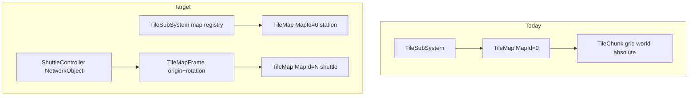
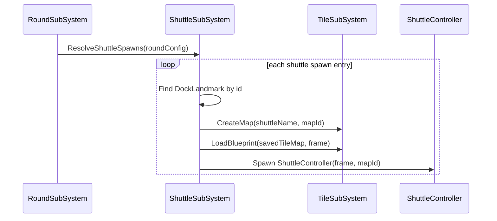
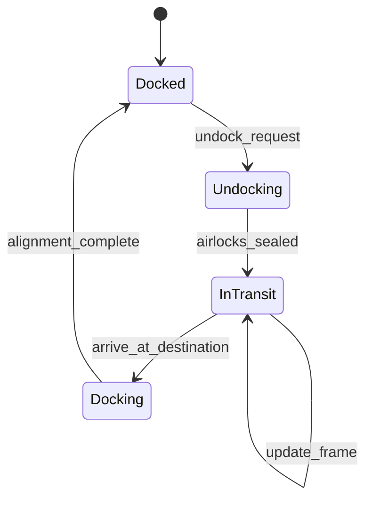

# Shuttle System Design

## Current state

The tilemap is **server-authoritative**, **world-absolute**, and **single-instance** today:

- `[TileSubSystem](Assets/Scripts/SS3D/Systems/Tile/TileSubSystem.cs)` holds one `_currentMap` and refuses a second map (`CreateMap` early-returns if a map exists).
- `[TileCoord](Assets/Scripts/SS3D/Systems/Tile/TileCoord.cs)` already carries `MapId`, and `[PlacedTileObject](Assets/Scripts/SS3D/Systems/Tile/PlacedObjects/PlacedTileObject.cs)` syncs it — but runtime always uses `MapId = 0`.
- Grid lookups (`[TileQueryService](Assets/Scripts/SS3D/Systems/Tile/TileQueryService.cs)`, `[TileMap.GetKey](Assets/Scripts/SS3D/Systems/Tile/TileMap.cs)`) convert `TileCoord.Grid` ↔ world XZ with **no transform offset**; chunk keys are derived from absolute world position.
- `[SavedTileMap](Assets/Scripts/SS3D/Systems/Tile/SavedObjects/SavedTileMap.cs)` can serialize any tile region — ideal shuttle blueprint format.
- `[AreaBoundaryEvaluator](Assets/Scripts/SS3D/Systems/Area/AreaBoundaryEvaluator.cs)` already treats cross-`MapId` as a hard boundary (relevant later, not Phase 1).
- **No shuttle/docking code or design spec exists.**




---

## Design goals


| Goal                                    | Rationale                                                                                                             |
| --------------------------------------- | --------------------------------------------------------------------------------------------------------------------- |
| **Reuse tilemap, not a parallel grid**  | Shuttles are built from the same `TileObjectSo` assets, adjacency connectors, and save format as the station.         |
| **SS13 parity long-term**               | Mobile region undocks, transits, arrives, docks; contents move with the craft.                                        |
| **Phase 1: docked-only, tile-only**     | Ship a vertical slice without movement or cross-system merge (no dock-seam adjacency, areas, power, entities, atmos). |
| **Minimal station refactor in Phase 1** | Station map (`MapId = 0`) behavior stays unchanged; shuttles are additive second maps.                                |


---

## Core concepts

### 1. Shuttle = secondary `TileMap` instance

Each shuttle owns a dedicated `TileMap` with a unique `MapId` (station stays `0`). Shuttles are **not** extra chunks inside the station map — they are logically separate grids that happen to be placed adjacent in world space when docked.

### 2. `TileMapFrame` (map-local coordinates)

Introduce a frame describing how map-local grid coords map to world space:

```csharp
// Conceptual — lives on TileMap or ShuttleController
struct TileMapFrame
{
    Vector3 WorldOrigin;   // map-local (0,0) corner in world space
    Direction Facing;      // 0/90/180/270 — SS13 shuttles rotate in 90° steps
}
```

- **Map-local grid**: tile indices relative to shuttle blueprint origin `(0,0)`.
- **World position**: `frame.LocalToWorld(localGrid)` / `frame.WorldToLocal(worldPos)`.
- **Phase 1**: frame is set once at spawn from dock landmark; never updated.
- **Future movement**: updating `WorldOrigin` (and optionally `Facing`) moves the entire shuttle without re-indexing tile data.

This is the critical refactor that makes movement possible. Today `PlacedTileObject.WorldOrigin` and chunk keys are world-absolute; movement requires either full re-indexing (reject) or frame-aware queries (adopt).

### 3. `ShuttleController` (region owner)

Server-spawned `NetworkObject` that owns one shuttle:


| Field          | Purpose                                                                |
| -------------- | ---------------------------------------------------------------------- |
| `ShuttleId`    | Stable string/id (e.g. `"cargo_shuttle"`)                              |
| `MapId`        | Matches child `TileMap.MapId`                                          |
| `Frame`        | Current origin + facing (SyncVar in future phases)                     |
| `State`        | `Docked` / `InTransit` / `Undocked` (SyncVar; Phase 1 always `Docked`) |
| `DockedAt`     | Reference to dock landmark when docked                                 |
| `BlueprintRef` | Which `SavedTileMap` to load                                           |


Hierarchy:

```
ShuttleController (NetworkObject)
  └── TileMap (MapId = N)
        └── TileChunk(s) → PlacedTileObject(s)
```

### 4. `DockLandmark` (authored dock anchor)

Authored markers on the station map (TileMap Creator placable or scene prefab):


| Field                  | Purpose                                                                                             |
| ---------------------- | --------------------------------------------------------------------------------------------------- |
| `LandmarkId`           | e.g. `"cargo_bay_south"`                                                                            |
| `Frame`                | Position + facing the dock expects shuttles to align to                                             |
| `AcceptedShuttleIds[]` | Which shuttle blueprints can use this dock (optional filter)                                        |
| `PortOffset`           | Map-local tile offset on shuttle blueprint where the docking port airlock sits — used for alignment |


Phase 1: landmark is spawn-time only (shuttle placed at `landmark.Frame` with port offset applied).

### 5. Shuttle blueprint (`SavedTileMap`)

Reuse existing save format. Author shuttles in TileMap Creator, save to `/Tilemaps/Shuttles/{name}`, load at runtime into a new `TileMap` instance. Blueprint stores tiles in **map-local chunk coords** (already how chunks save local origins).

---

## Phase 1 — Docked shuttle tile regions

**Scope:** Spawn prefabricated shuttle grids at dock landmarks at round start. Tile geometry only — shuttle and station remain separate `MapId`s with no cross-map connectivity.

### Spawn flow




1. Round config (extend `[round-config.md](Documents/design/round-config.md)` pool model later) lists shuttle spawn entries: `{ shuttleId, blueprintName, dockLandmarkId }`.
2. `ShuttleSubSystem` allocates next `MapId` (1..N), creates child `TileMap`, loads blueprint offset by dock landmark frame.
3. `ShuttleController` spawned and parented under `ShuttleSubSystem` transform.
4. Adjacency runs within shuttle map only (`UpdateAllAdjacencies` after load — same as station load path).

### Required tilemap changes (Phase 1)


| Change                      | File(s)                                                                                                                                                        | Notes                                                                                                                                                    |
| --------------------------- | -------------------------------------------------------------------------------------------------------------------------------------------------------------- | -------------------------------------------------------------------------------------------------------------------------------------------------------- |
| **Multi-map registry**      | `[TileSubSystem.cs](Assets/Scripts/SS3D/Systems/Tile/TileSubSystem.cs)`                                                                                        | Replace single `_currentMap` with `Dictionary<int, TileMap>`. Keep `CurrentMap` → station (`MapId 0`). Add `TryGetMap(mapId)`, `CreateMap(name, mapId)`. |
| **Frame-aware load**        | `[TileMap.cs](Assets/Scripts/SS3D/Systems/Tile/TileMap.cs)`                                                                                                    | `Load(SavedTileMap, TileMapFrame frame)` — translate blueprint local coords to world via frame.                                                          |
| **Frame-aware queries**     | `[TileQueryService.cs](Assets/Scripts/SS3D/Systems/Tile/TileQueryService.cs)`, `[ITileQueryService.cs](Assets/Scripts/SS3D/Systems/Tile/ITileQueryService.cs)` | `WorldToTile(worldPos, mapId)` uses map's frame. Existing `TileCoord`-based API unchanged.                                                               |
| **Map-scoped construction** | `[ConstructionService.cs](Assets/Scripts/SS3D/Systems/Tile/ConstructionService.cs)`                                                                            | Accept target map (default station). Admin creator unchanged for station.                                                                                |
| **Observer routing**        | Tile prefabs / HashGrid                                                                                                                                        | Phase 1: shuttles at fixed world positions — existing HashGrid works. No movement rebuild needed yet.                                                    |


### What Phase 1 explicitly does NOT do

- Cross-map adjacency at dock seam (walls don't connect across `MapId` boundary).
- Area flood-fill spanning dock.
- Power circuit merge.
- Moving players/items with shuttle.
- Undock/transit/dock state machine.
- Atmospherics zone merge.

Station and shuttle are visually adjacent but **logically isolated grids** — sufficient to build and walk inside a shuttle interior at a dock.

### Phase 1 validation

- Load station + cargo shuttle blueprint at cargo dock landmark.
- Shuttle interior tiles render with correct adjacency (walls, floors, doors).
- `TryGetOccupant` on shuttle tiles returns correct objects when queried with shuttle `MapId`.
- Station `MapId 0` queries unaffected.
- Save/reload round preserves shuttle tile state.

---

## Future phases (designed now, implemented later)

### Phase 2 — Movement


| Component               | Design                                                                                                                                                                                                        |
| ----------------------- | ------------------------------------------------------------------------------------------------------------------------------------------------------------------------------------------------------------- |
| **Transit**             | `ShuttleController` updates `Frame.WorldOrigin` along a path; `TileMap` transform follows. Server tick moves frame; clients interpolate.                                                                      |
| **Coordinate refactor** | All `TileMap` internal lookups use map-local coords + frame; `PlacedTileObject` stores map-local origin (world origin derived). Chunk keys become map-local (0..15 within shuttle bounds) not world-absolute. |
| **Contents**            | Entities/items on shuttle tiles tracked by `(MapId, localGrid)`; on move, re-parent or translate transforms. Items on shuttle parented under `ShuttleController`.                                             |
| **Observers**           | On frame change, rebuild HashGrid observers for all shuttle `NetworkObject`s (mirror `[Entity](Assets/Scripts/SS3D/Systems/Entities/Entity.cs)` grid-crossing pattern).                                       |
| **Destinations**        | `ShuttleDestination` landmarks (mining, centcom, alternate dock) with same shape as `DockLandmark`.                                                                                                           |





### Phase 3 — Dock seam connectivity

When docked, create temporary **bridge links** at aligned port tiles:

```csharp
// Conceptual
struct DockBridge
{
    TileCoord StationSide;  // MapId 0
    TileCoord ShuttleSide;  // MapId N
    Direction ShuttleFacing;
}
```

Consumers opt in:

- **Adjacency**: `AdjacencyEngine` checks bridge table for cross-map neighbor resolution when docked.
- **Areas**: optional area-id bridge or merged flood-fill post-dock (fork already blocks cross-MapId in `[AreaBoundaryEvaluator](Assets/Scripts/SS3D/Systems/Area/AreaBoundaryEvaluator.cs)`).
- **Electricity**: cable adjacency connector reads bridge for circuit merge.
- **Atmospherics**: zone merge at bridge (depends on atmos branch).

Bridges are **ephemeral** — created on dock, destroyed on undock. No permanent mutation of either map's tile data.

### Phase 4 — Shuttle operations UI

- Shuttle console / request console interactions (reuse [interactions framework](Documents/architecture/systems/interactions-framework.md)).
- Call shuttle, set destination, confirm transit — server-authoritative via `ShuttleSubSystem` RPCs.
- Docking port airlock sequence (extend `[AirLockOpener](Assets/Scripts/SS3D/Systems/Furniture/AirLockOpener.cs)` or new `DockingAirlock` with dock-state gating).

---

## New subsystem: `ShuttleSubSystem`

```
Assets/Scripts/SS3D/Systems/Shuttle/
  ShuttleSubSystem.cs          — registry, spawn, dock/undock API (stub in Phase 1)
  ShuttleController.cs         — NetworkObject region owner
  ShuttleState.cs              — enum
  ShuttleSpawnEntry.cs         — round config record
  DockLandmark.cs              — authored anchor component
  ShuttleDestination.cs        — transit target (Phase 2)
  TileMapFrame.cs              — coord transform helper
  IDockBridgeRegistry.cs       — Phase 3 bridge table
```

**Depends on:** [tile](Documents/architecture/systems/tile.md), [rounds-lobby](Documents/architecture/systems/rounds-lobby.md)  
**Used by (future):** [electricity](Documents/architecture/systems/electricity.md), [entities](Documents/architecture/systems/entities.md), atmospherics

Register on scene actor alongside `TileSubSystem`. Does **not** implement `ITileMutationObserver` in Phase 1.

---

## Integration with existing extension points


| Extension point                                                                      | Shuttle use                                                      |
| ------------------------------------------------------------------------------------ | ---------------------------------------------------------------- |
| `[SavedTileMap](Assets/Scripts/SS3D/Systems/Tile/SavedObjects/SavedTileMap.cs)`      | Shuttle blueprints — same format as station maps                 |
| `[MapId` on `TileCoord](Assets/Scripts/SS3D/Systems/Tile/TileCoord.cs)`              | Primary identity for multi-map routing                           |
| `[ITileMutationObserver](Assets/Scripts/SS3D/Systems/Tile/ITileMutationObserver.cs)` | Future: react to shuttle tile changes, rebuild bridges           |
| `[IAdjacencyConnector](Assets/Scripts/SS3D/Systems/Tile/Connections/)`               | Future: dock-port connector type for cross-map links             |
| FishNet HashGrid AOI                                                                 | Works Phase 1 at fixed positions; needs rebuild strategy Phase 2 |
| Round config pool                                                                    | New shuttle spawn list alongside map pool                        |


---

## Authoring workflow

1. **Build shuttle** in TileMap Creator (same tools as station) — bounded region with walls, floors, doors, furniture.
2. **Save blueprint** to `/Tilemaps/Shuttles/{name}`.
3. **Place dock landmark** on station map at intended dock location (TileMap Creator placable or scene prefab in Game.unity).
4. **Configure round spawn** entry linking blueprint → landmark.
5. **(Future)** Mark docking port tiles with a `DockPortMarker` tile object or component for alignment.

---

## Key architectural decisions


| Decision          | Choice                            | Alternative rejected                                               |
| ----------------- | --------------------------------- | ------------------------------------------------------------------ |
| Shuttle storage   | Second `TileMap` per shuttle      | Separate non-tilemap mini-grid — duplicates adjacency/construction |
| Coordinate model  | Map-local + `TileMapFrame`        | World-absolute only — blocks movement without full re-index        |
| Phase 1 isolation | Separate `MapId`, no bridge       | Cross-map adjacency in Phase 1 — premature without frame refactor  |
| Blueprint format  | Reuse `SavedTileMap`              | Custom shuttle schema — unnecessary duplication                    |
| Movement owner    | `ShuttleController` NetworkObject | Moving station chunks — wrong abstraction                          |


---

## Documented deviations / open questions

- **Design spec location**: No `Documents/design/shuttle.md` yet (read-only to agents). This plan lives in `Documents/plans/`; owner should promote to design spec when approved.
- **Round config integration**: `[round-config.md](Documents/design/round-config.md)` covers map pool only today — shuttle spawn list is a new pool shape (same weight/precondition model could apply later).
- **Rotation**: SS13 shuttles rotate in 90° steps. `TileMapFrame.Facing` handles this; adjacency direction math must account for frame rotation (Phase 2).
- **Multi-shuttle MapId allocation**: Server assigns sequentially; persisted in round state, not save file.
- **Live wall breach on shuttle**: Same deferred recompute as station areas — not Phase 1.
- **Centcom/off-station destinations**: Phase 2 can unload shuttle from world space at transit (hide region) vs. move to far coordinates — decide during Phase 2 implementation.

---

## Implementation order

1. `**TileMapFrame**` + frame-aware `Load` / `WorldToTile` / `TileToWorld`
2. **Multi-map registry** in `TileSubSystem` (station unchanged as `MapId 0`)
3. `**ShuttleSubSystem` + `ShuttleController` + `DockLandmark**`
4. **Blueprint load at landmark** + round spawn hook
5. **Edit-mode tests**: frame coord round-trip, blueprint load at offset, multi-map query isolation
6. **Docs**: new `Documents/architecture/systems/shuttle.md`, update [INDEX.md](Documents/architecture/INDEX.md) and [tile.md](Documents/architecture/systems/tile.md)

Phases 2–4 (movement, bridges, operations UI) follow after Phase 1 gate.