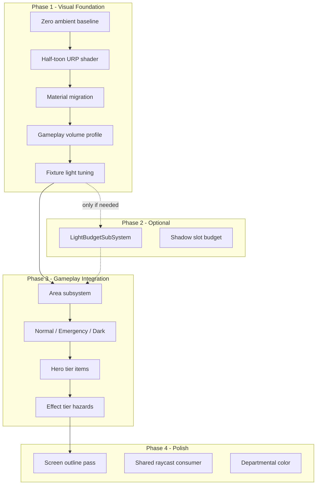

# URP Lighting & Look-and-Feel Implementation Plan

## Context

**Design target:** [Documents/design/rendering-lighting.md](Documents/design/rendering-lighting.md) — scarce authored light, no ambient sun, half-toon shading, bloom-heavy post stack, fixture-driven shadows.

**Historical reference (Built-in era, not directly portable):**


| PR                                               | What it shipped                                                                                                                           | URP relevance                                                                                                                                             |
| ------------------------------------------------ | ----------------------------------------------------------------------------------------------------------------------------------------- | --------------------------------------------------------------------------------------------------------------------------------------------------------- |
| [#283](https://github.com/RE-SS3D/SS3D/pull/283) | Wrapped deferred BRDF, bloom/tonemapping/AO, corner fill lights, blob drop shadows                                                        | Concepts only; deferred pipeline is gone. Corner-fill lights and fixture tuning values are still useful. SSRT was reverted — skip.                        |
| [#857](https://github.com/RE-SS3D/SS3D/pull/857) | **Half-toon** (`smoothstep` diffuse banding in `DeferredShadingHalfToon.shader`), **MKII** color grading, light falloff + prefab retuning | **Primary port target.** Shader logic must be rewritten for URP forward; MKII values map to a URP Volume profile. Recoverable from git commit `5f7e737a`. |


**Current fork state (gaps):**

- URP 17 Forward+ foundation shipped ([FORK_STATUS.md](Documents/FORK_STATUS.md) § URP migration); [rendering.md](Documents/architecture/systems/rendering.md) is `partial`.
- [Simple Toon URP port](Assets/Content/Resources/Simple%20Toon/Shaders/STDefault.shader) exists but uses procedural step bands with **hard black** shadow color (`STCore.hlsl` line 25) — not the half-toon ramp + tinted shadows the design calls for.
- Station materials are mostly **URP Lit**; characters use Simple Toon (~7 mats). Hybrid look, not unified station aesthetic.
- Post-processing exists for **lobby/intro cameras only** ([SS3D_LobbyVolumeProfile.asset](Assets/Settings/URP/VolumeProfiles/SS3D_LobbyVolumeProfile.asset)); no in-round gameplay volume.
- [Game.unity](Assets/Content/Scenes/Game.unity) has `m_AmbientIntensity: 1` (skybox ambient) — contradicts "genuinely dark" rooms.
- SSAO is active on the Forward+ renderer — design doc §8 de-prioritizes AO for dark interiors.
- [LightPower.cs](Assets/Scripts/SS3D/Systems/Electricity/LightPower.cs) does binary on/off; fixtures default to `PowerChannel.Equipment` not `Lighting`.
- **No** Area subsystem or shared occlusion raycast in code. Light-budget manager also absent — optional; Forward+ may be sufficient without it.

**Chosen scope:** Visual-first pass now; Area/APC lighting-state gameplay wiring deferred. Light-budget manager (Phase 2) optional — add only if profiling shows it's needed.

---

## Architecture overview




---

## Phase 1 — Visual foundation (ship first)

Goal: In-round scenes look like SS3D again — soft half-toon, pastel grade, bloom on lights, near-zero ambient — before any gameplay state machine.

### 1a. Ambient & pipeline baseline

- Set [Game.unity](Assets/Content/Scenes/Game.unity) `RenderSettings`: `m_AmbientMode` → flat color, `m_AmbientIntensity` → ~0 (or Trilight with all channels near zero). No directional sun (`m_Sun` already null).
- In [SS3D_URPAsset.asset](Assets/Settings/URP/SS3D_URPAsset.asset): disable or minimize baked/SH ambient contribution; keep `m_AdditionalLightsRenderingMode` enabled (Forward+ handles many lights).
- **Disable SSAO** on [SS3D_ForwardPlusRenderer.asset](Assets/Settings/URP/SS3D_ForwardPlusRenderer.asset) — conflicts with dark-room design and adds cost where corners are already black.
- Remove main-light shadow cascade special-casing from tuning focus; fixture spot/point lights are the primary shadow casters (no directional sun).

### 1b. Half-toon shader (URP forward rewrite)

Port the *visual intent* of upstream `DeferredShadingHalfToon.shader` (commit `5f7e737a`) into the existing Simple Toon URP stack under [Assets/Content/Resources/Simple Toon/Shaders/](Assets/Content/Resources/Simple%20Toon/Shaders/):


| Change                | File(s)                              | Detail                                                                                                                                                                                          |
| --------------------- | ------------------------------------ | ----------------------------------------------------------------------------------------------------------------------------------------------------------------------------------------------- |
| Ramp-based diffuse    | `STCore.hlsl`                        | Replace or augment `ST_Toon()` stepped bands with a **1D ramp texture** lookup on N·L (banded diffuse, smooth transition — the PR 857 `smoothstep(0, 0.75, diffuseTerm) * 0.7 + 0.3` behavior). |
| Tinted shadow band    | `STCore.hlsl`, material props        | Expose `_ShadowTint` (per-material or global) instead of hardcoded `darkColor = float4(0,0,0,1)`. Design §7: pastel shadows, not near-black.                                                    |
| Smoother specular/rim | `STCore.hlsl`                        | Keep existing `ST_PostShine` but tune defaults to be less harsh than full cel — "half-toon" specular pass.                                                                                      |
| Light attenuation     | Custom falloff or URP light settings | Port PR 857 falloff tuning; address known issue ("too bright near source") during in-Unity iteration.                                                                                           |


Add a shared ramp texture asset (e.g. `Assets/Art/Graphics/ToonRamp.png`) and reference from station + character materials.

### 1c. Material migration

Migrate high-visibility station materials from URP Lit → half-toon shader in batches:

1. **Floors/tiles** — highest surface area; PR 857 touched `TileGrey`, `TilePlating`, etc. (paths changed in fork; find equivalents under `Assets/Content/`).
2. **Walls/structures** — plating, windows (glass may stay a dedicated transparent toon variant).
3. **Fixtures** — emissive bulb meshes already use Simple Toon `_Lumin` / `_EmissionColor`.

Keep URP Lit only where half-toon genuinely fails (dissolve/hologram shadergraphs, special VFX).

Reduce floor specular per PR 857 material notes.

### 1d. Gameplay post-processing volume

Create `Assets/Settings/URP/VolumeProfiles/SS3D_GameplayVolumeProfile.asset` by porting MKII values from commit `5f7e737a:Assets/Content/World/PostProcessing/MKII.asset` into URP Volume overrides:


| Effect            | Target            | Notes                                                                                                                                         |
| ----------------- | ----------------- | --------------------------------------------------------------------------------------------------------------------------------------------- |
| Bloom             | High priority     | Threshold/intensity tuned for flashlight cones and emergency red in darkness (design §8). Start from lobby profile, push higher for gameplay. |
| Tonemapping       | Neutral           | Design §8; lobby already uses Neutral — match.                                                                                                |
| Color Adjustments | Warm pastel grade | MKII: slight warm filter, +saturation, moderate contrast. Must work at both lit medbay and near-black tunnel.                                 |
| Vignette          | Subtle or off     | Design §8: HUD effects already provide edge feedback.                                                                                         |


Wire to the in-round player camera prefab (find spawned camera under game content — likely derived from lobby `PlayerCamera.prefab` pattern with global Volume component). Use [URPVolumeMigrationSetup.cs](Assets/Editor/URPMigration/URPVolumeMigrationSetup.cs) patterns if helpful.

### 1e. Fixture & scene light tuning

Retune [LightBulbFixture.prefab](Assets/Content/WorldObjects/Structures/WallMounts/Lights/LightBulbFixture.prefab) and [LightTubeFixture.prefab](Assets/Content/WorldObjects/Structures/WallMounts/Lights/LightTubeFixture.prefab):

- Spot intensity, range, color temperature per PR 857 prefab diffs (recover from `5f7e737a`).
- Fix `BasicPowerConsumer._channel` → `PowerChannel.Lighting` on both fixtures (currently defaults to Equipment).
- Enable soft shadows on fixtures (`m_Shadows.m_Type` currently 0) in a test room; rely on URP Forward+ defaults unless profiling later justifies a budget manager.
- Optional corner fill: PR 283 added low-intensity point lights in fixture prefabs; evaluate whether still needed with half-toon ramp (likely reduced, not eliminated).

**Validation scene:** Pick one lit corridor + one intentionally unlit corner in Game scene; iterate until screenshots resemble PR 857 security-bay reference images.

---

## Phase 2 — Light budget manager (optional, defer)

**Status: skip unless profiling proves necessary.**

URP Forward+ already removes the old per-object light-count ceiling that motivated tiering in the design doc. For a visual-first pass, fixture shadows and light counts can run on engine defaults. Revisit this phase only if playtesting shows:

- Shadow map thrashing or frame drops from too many shadow-casting spot lights
- Visible light popping when many rooms are in view
- Hero-tier personal lights (flashlight) competing with fixture shadows

If triggered later, add `LightBudgetSubSystem` under `Assets/Scripts/SS3D/Systems/Lighting/` with tier registration (`Hero` / `Key` / `Ambient` / `Effect`), shadow-slot cap, and distance-based reevaluation per [rendering-lighting.md](Documents/design/rendering-lighting.md) §3 and §7. Fixture integration would extend [LightPower.cs](Assets/Scripts/SS3D/Systems/Electricity/LightPower.cs) to register as `Key` tier.

Until then: tune shadow distance and additional-light shadow resolution in [SS3D_URPAsset.asset](Assets/Settings/URP/SS3D_URPAsset.asset) as static pipeline settings.

---

## Phase 3 — Area lighting states (gameplay, after Area exists)

Deferred now; spec is ready in [area.md](Documents/design/area.md) §5 and [rendering-lighting.md](Documents/design/rendering-lighting.md) §4.

**Prerequisites:** Area record + per-tile area-id layer + area→APC derivation ([area.md](Documents/design/area.md) prompts 1–2).

**Data contract (implement when Area lands):**

```csharp
enum AreaLightingState { Normal, Emergency, Dark }

// Derived from APC circuit stats (already partially available):
// Normal   → grid powers lighting channel
// Emergency → !gridMeetsLoad && ApcBatteryCharge > 0
// Dark     → !gridMeetsLoad && ApcBatteryCharge <= 0
```

Hook into existing [ApcController.cs](Assets/Scripts/SS3D/UI/MachineInterface/ApcController.cs) / [CircuitStats.cs](Assets/Scripts/SS3D/Systems/Electricity/CircuitStats.cs) (`ApcBatteryCharge`, `GridMeetsLoad`).

**Fixture authoring:** Tag fixtures as `NormalOnly` vs `EmergencyCapable`; emergency state activates reduced subset with separate authored color/intensity (not a red filter on normal).

**Vertical slice:** Engineering main bay — full worked example from design doc §10.

---

## Phase 4 — Remaining tiers & renderer features


| Item                    | Depends on                          | Notes                                                                                                                                                                                    |
| ----------------------- | ----------------------------------- | ---------------------------------------------------------------------------------------------------------------------------------------------------------------------------------------- |
| **Hero tier**           | Held-item system                    | Flashlight/welder as equippable lights; shadow priority only matters if Phase 2 is added.                                                                                                |
| **Ambient tier**        | Area room graph                     | Bleed-through from adjacent lit areas (1–2 hops).                                                                                                                                        |
| **Effect tier**         | Atmospherics/VFX                    | Fire, sparks, muzzle flashes as `Effect` tier.                                                                                                                                           |
| **Light occlusion**     | Shared raycast system               | 4th consumer per design §5; blocked until comms/hacking/combat occlusion exists.                                                                                                         |
| **Screen outline pass** | URP renderer feature                | Global silhouette outlines for reticle legibility (design §8); distinct from per-object [InteractionOutlineView.cs](Assets/Scripts/SS3D/Systems/Interactions/InteractionOutlineView.cs). |
| **Departmental color**  | Area per-area fields                | Extension of ambience-track pattern (design §6); tuning pass.                                                                                                                            |
| **Vision/FOV fog**      | `feature/vision-urp-tilemap` branch | Separate effort; coordinate so darkness + FOV fog compose correctly.                                                                                                                     |


---

## What NOT to port from old PRs

- **Deferred shading stack** (`DeferredShadingWrap`, `DeferredShadingToon`) — replaced by URP forward half-toon.
- **SSRT** — reverted in PR 283; out of scope.
- **Blob/drop shadow projectors** — PR 283 approach; prefer real fixture shadows + tinted toon shadow bands unless performance requires revisiting.
- **Built-in Post Processing Stack v2** (`MKII.asset` format) — values only; implementation is URP Volumes.

---

## Documentation updates (after each phase ships)

Per [AGENTS.md](AGENTS.md), run the `update-system-docs` skill:

- [rendering.md](Documents/architecture/systems/rendering.md) — shader, volume profile, outline feature; light budget only if Phase 2 ships.
- [electricity.md](Documents/architecture/systems/electricity.md) — `LightPower` / fixture channel / Area state hooks.
- New architecture effort doc: `Documents/architecture/2026-07_rendering-lighting.md`.
- Plan todos in `Documents/plans/` as work progresses.

---

## Suggested implementation order (todos)

Phase 1 is parallelizable across shader author, environment artist, and volume tuning. After visual validation, proceed directly to Phase 3 (Area lighting states) when Area subsystem is ready. Phase 2 remains on the shelf unless profiling demands it.