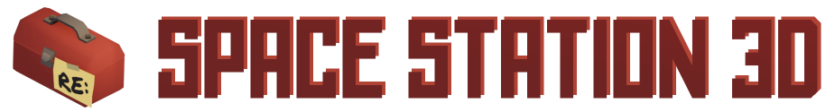
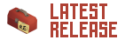
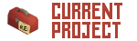

###  Welcome to the offical repository for "RE: Space Station 3D" the game! RE:SS3D is an open-source resurrection of the original SS3D project, which was an impressive demo attempting to give the infamous  an extra dimension.

# DOWNLOADS:

The latest official build of RE:SS3D. It's working on Windows but needs testing on other OSs.

The current state of RE:SS3D (every commit) in a .zip. You'll need to build the game in Unity still.

*Note: RE:SS3D is currently still in a 'pre-alpha' phase as we do some redesigning, documenting, core system work, and basic system implementation. During this early phase there are not many systems, content, or even interactions. What you see in the current project is just the beginning to something much, much greater.*

## INFO:

**[Devblogs](https://ss3d.space/devblog/) - [FAQ](https://ss3d.space/faq/) - [About](https://ss3d.space/about/) - [Wiki](https://github.com/RE-SS3D/SS3D/wiki)**

## CONTRIBUTING:

[CONTRIBUTING.md](Documents/CONTRIBUTING.md) contains information regarding technical contributions, including Unity version, setting up the project, styling code, and using github.

[https://ss3d.space/contribute/](https://ss3d.space/contribute/) breaks down the contribution types (including art assets) with links to helpful guides and to-do boards.

## LICENSING:

This project's **code** falls under the **[MIT](Documents/LICENSE-CODE.md)** license.

All **art assets** fall under the **[CC BY-NC-SA 4.0](Documents/LICENSE-ASSETS.md)** license.

## COMMUNITY:

Discord is the primary communication for our devs and community. There you'll find helpful people, WIP content, & community polls.

Our YouTube is where we upload many of our important videos including 3D animations, trailers, and gameplay clips of teasers/tests.

We also have a subreddit, where you will find similar discussions and content posts, although it is not as active as our Discord server.

Currently our twitter is mostly used for announcements & memes but we will start using it more for other posts eventually.

## BOARDS:

This GitHub repository hosts our [issues page](https://github.com/RE-SS3D/SS3D/issues) and [wiki page](https://github.com/RE-SS3D/SS3D/wiki). For more info on our issues you can check the [project boards](https://github.com/RE-SS3D/SS3D/projects) and [milestone pages](https://github.com/RE-SS3D/SS3D/milestones).

Trello hosts all our other boards, including the task boards for our various asset types (3D, 2D, audio, etc.) and our management board.

## DONATE:

PayPal is our monetary hub where all donations go before distribution to development costs. You can donate either via the link or our email (ress3d.project@gmail.com).

Patreon is our primary subscription-based donation platform with tiers (currently no extra benefit for different tiers).

Subscribestar is our other subscription-based donation platform. Has fewer features and isn't as popular as our PayPal.

"SpaceStation3D.crypto" is our crypto domain which currently routes BCH, BTC, ETH, & LTC payments. [Specific addresses can be found at the bottom of this page](https://github.com/RE-SS3D/SS3D/wiki/Sites-&-Resources).
