# Style and general 3D guide for SS3D


This is aimed at people who have the Blender basics down. Many people wanting to contribute are new to modeling
so while there’s some general art advice, everything applies to SS3D.

This PDF covers topics in order of priority. Silhouette is the most important thing, try not to add color or detail you’re
satisfied with the shape of the model.

## Shape

Remember that items will be seen from pretty far away, so
zoom out early and often, and always look at your work from all angles.

### Proportions

Stylisation involves emphasizing the defining parts of an
object. When modeling something that exists in reality don't try to
accurately reproduce it, even with reference the goal is just to make a caricature of the real thing.

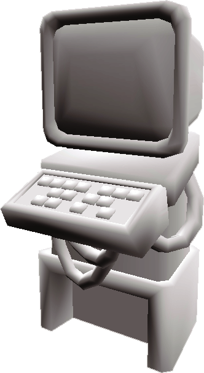
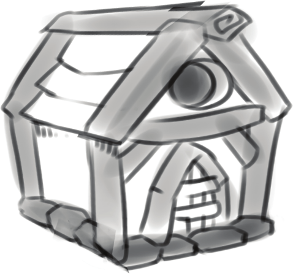

### Detail

Focus on details that contribute to the silhouette. A gun
barrel or tube doesn’t need to be hollow, it’s enough if the end cap is a
darker color or just solid black.
If certain details are important but too small to be
noticeable, make them bigger. As a poor example, you don’t need 101
keys to model a keyboard the same way you wouldn’t draw every brick
in a wall, just enough so that it’s readable as one, and big enough that
it can be seen from far away.
Don’t get attached to close shots of your model. Too fine or
complex detail might just become noise when viewed from the proper
distance, so zoom out often.

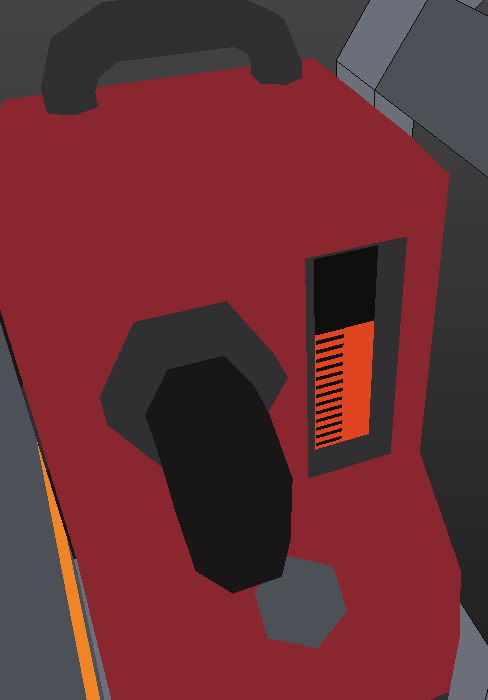
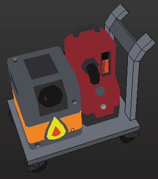

### Polycount

The current year is two thousand eighteen and
modern computers are capable of rendering millions of
triangles per frame. Low poly is largely a stylistic choice, but
SS13 is a sandbox game and it’s not unreasonable to expect that
hundreds of objects could be on screen at the same time.
It’s also about consistency— objects that are very
polygon-dense will look out of place next to their low-poly
friends.

### How many sides should my cylinder/sphere have?

Enough that it looks like a cylinder from camera
distance. Larger objects have more sides, as well as objects that
should have glossy highlights like the cryotube on the right. It's
dicult to correct this later in the modeling process.
Remember to turn on smooth shading by selecting
all faces then Ctrl-F > Shade Smooth. Select a matcap
from the Shading panel on the right, regular Blender lighting is
distractingly shiny and bumpy. Matcaps don’t affect the material
whatsoever, it’s just a preview within Blender.

* Nuts and bolts: 4 to 6 sides
* Cryo tube, 2x2 tiles: 24 sides
* Small objects: 8 sides (can), 12 sides (burger and bucket)

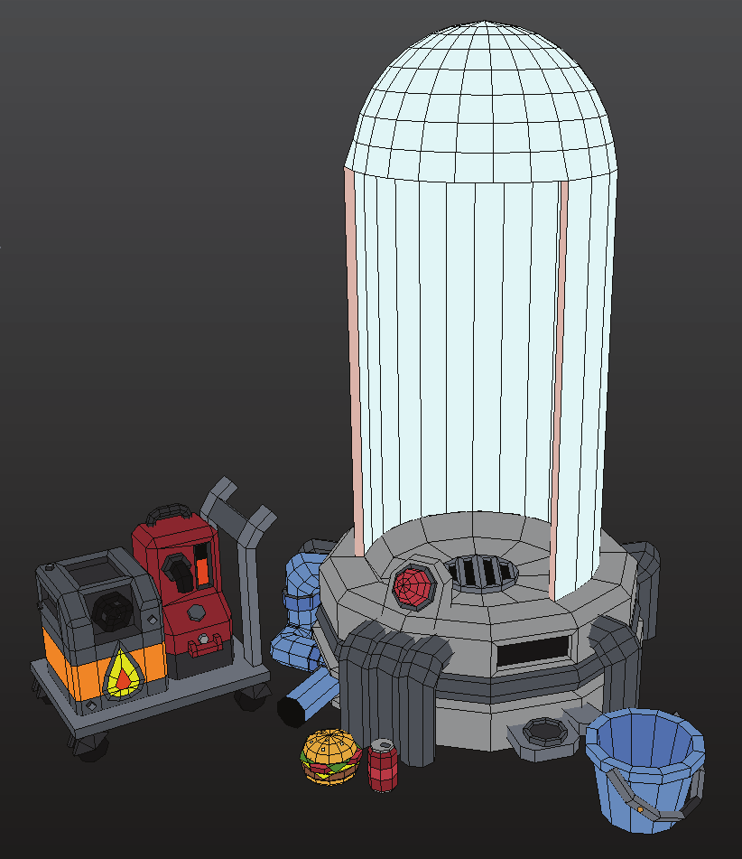

## Bevels
Bevels are very useful in hard surface modeling since they catch
and reflect light, highlighting the edges of an object. SS3D though has a rough
clay look, with left smoothness as a special effect for things that really need it,
so bevels are not that important and mostly optional.
Do add them when your object has large flat surfaces, like a fridge,
which otherwise would look like a tall box. Small objects or small parts of
larger objects don’t need them, since it would have little impact on the
silhouette.

Alternatively use the Bevel Modifier in
combination with bevel weights,
which you can set individually for
edges in the model.
It’s easier to tweak but I recommend applying the modifier after you’re done with it.

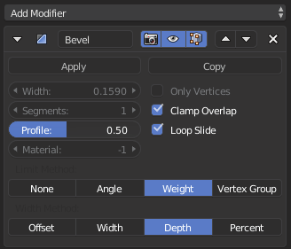

Sawn-off, stock without modifiers

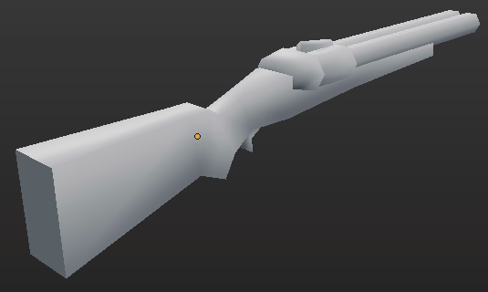

Bevel weights in blue, darker = less bevel

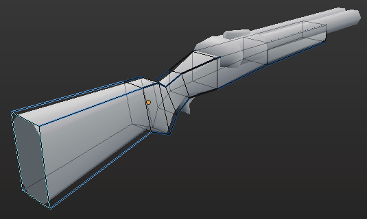

Result

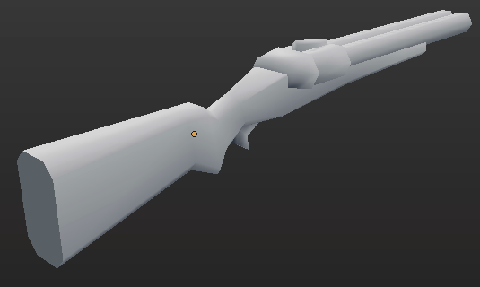

## Value

Value is brightness independent of the color you use. If you
were drawing a picture that would be the end of it, but in 3D, value is a
function of the shape of your object and the lighting ingame, which
could come from any different angle.
You can’t control lighting, but the shape of the object is up
to you. If computers could draw an infinite amount of polygons you
wouldn’t have to worry about anything else, since you could just
perfectly describe the surface of any object.

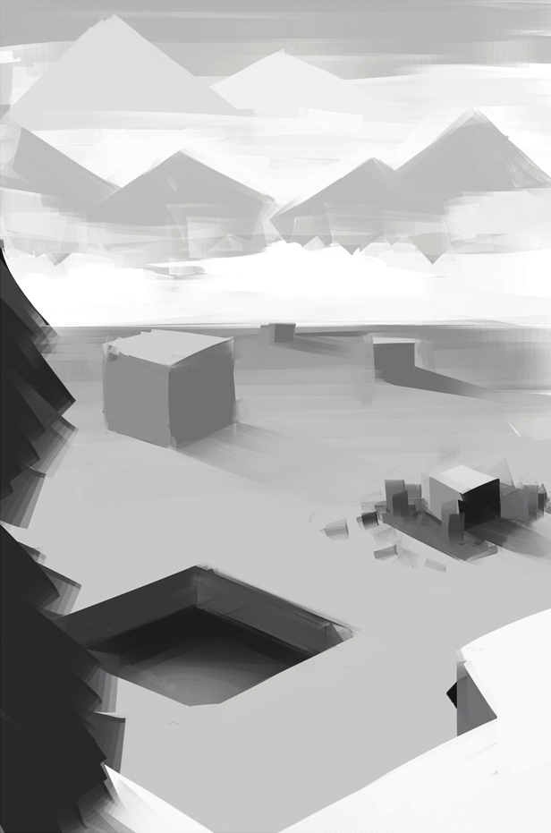

### Normals

But we have a limited polygon budget so we rely on normals to make up for it. Normals are just the direction the
surface is facing, which by default is straight up from each individual face. By tweaking these directions you’re “bending” the
surface even though its shape hasn’t really changed.

* A flat quad. The normals are sticking straight up as expected.
* Slice of a sphere with way too many polygons.
* Taking the normals from the sphere and onto the quad, we get a plane that appears to be round, for no extra rendering cost over the original.

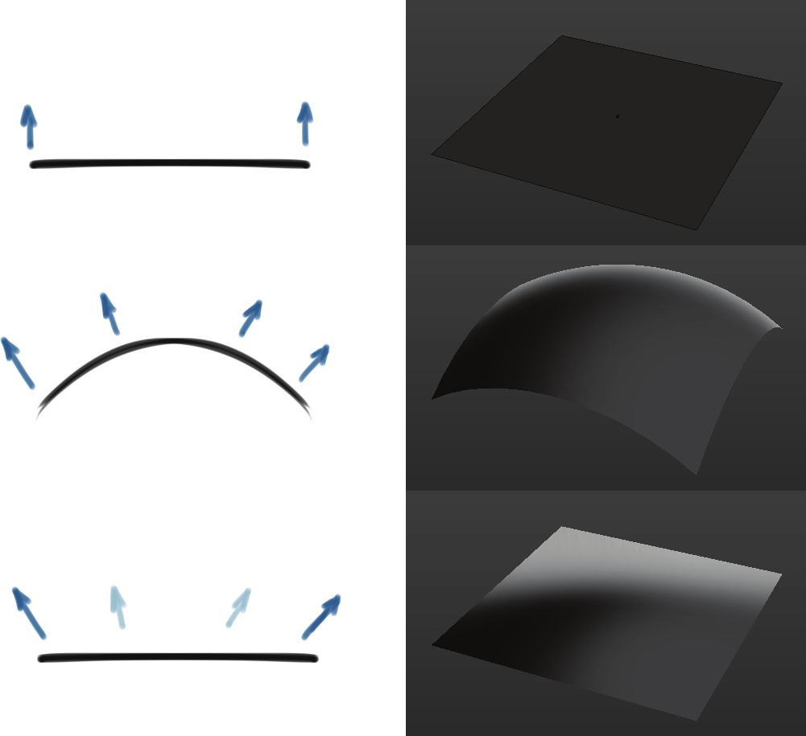

Mood in a single SS13 round can vary wildly, and lighting needs to lend itself
to both calm and spooky situations. Under regular conditions, like well lit Medbay or
hallways, objects are fairly uniformly lit so normals aren't that big of a deal.
This is intentional as the skill floor for creating new assets shouldn't be high.
The exception to this are objects with large flat surfaces, which can look pretty different.

### Sharp edges

Sharp edges are hints for Blender to do the normal splitting for you. Setting
sharp edges is very easy, just put them down wherever there should be a discontinuity in
the surface. The base of a bolt sticking out of plating, two different materials making up
the same surface, or the seam where parts of an object would be welded together.

Use smooth shading on the whole model and then
enable Auto Smooth in the mesh tab to make use
of sharp edges.
Values lower than 180° will “auto sharpen” angles
below this value, which can be handy if your model
is complex.
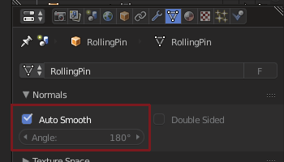

* Edges (sharp edges in cyan)
* Resulting shading

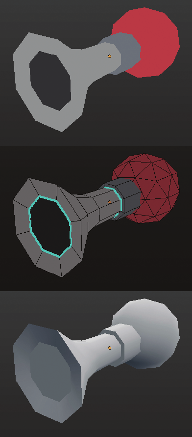

Some examples. The tubes going into the cryo don’t need it, since sharp edges are used to split continuous meshes
and the tubes are separate from the base.

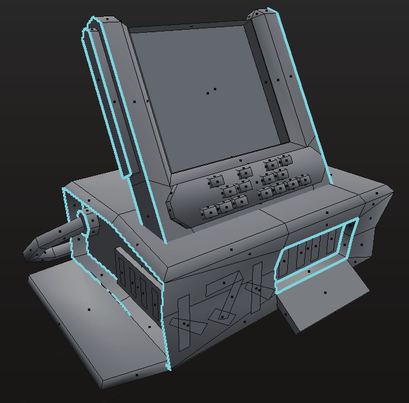
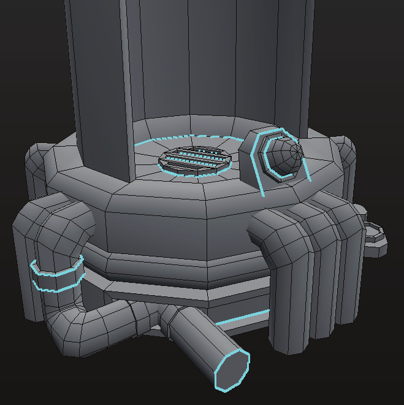
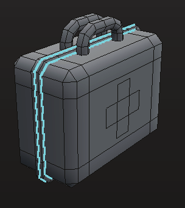
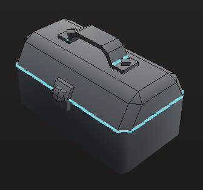
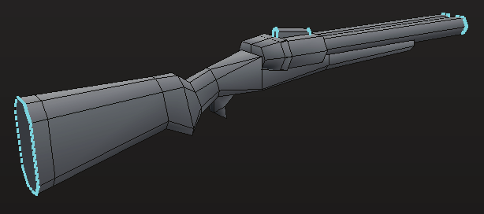

## Color

### Palette

Having a palette has many upsides. It removes the need to learn texturing
and also UV unwrapping, which is a tedious mechanical process that would raise the
entry barrier to making SS3D content. It makes it really easy to try different color
variations, and it helps with cohesion.

```
The current palette is a mess, but use it whenever
possible. Adding new colors is fine.
```

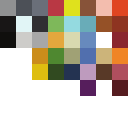

### Baked in shadows

By coloring parts of the mesh with a darker shade of the same color you
give the impression that it's casting a shadow on itself.
Old games did this a lot, but it should be used very sparingly— it can look
very wrong when light shines directly on the darkened part. The disposals bin can’t
rotate, so it’s safe to assume light will be hitting it from above.

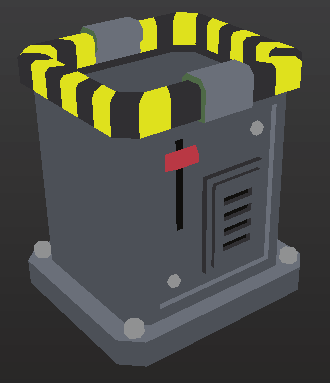

### Using the palette

At this point the
model has no UV
mapping. Select all
faces and press U >
Reset which is the
most unwrapping
you’ll need for most
things.

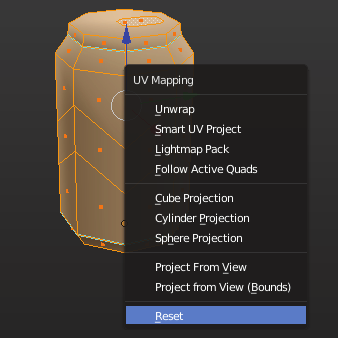

Select the faces you want to color, then
drag the corresponding points in the UV editor
to a swatch in the palette.

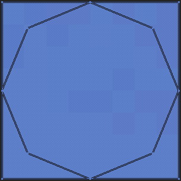

This toggle in the UV editor can help.

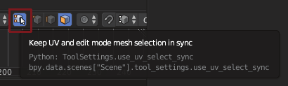

To speed up selection,
you can make use of
sharp edges to flood-fill
select by hovering over
a face and pressing L.
Make sure everything
is selected in the UV
editor then scale it all
down into a single
point (S 0)

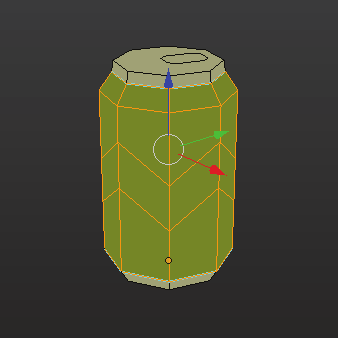


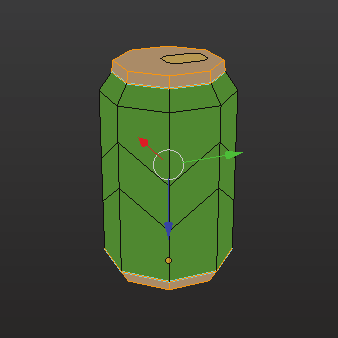


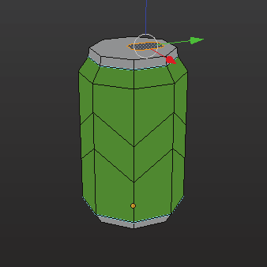
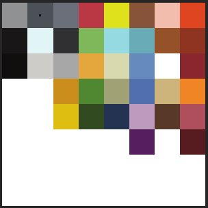

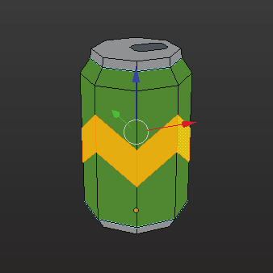


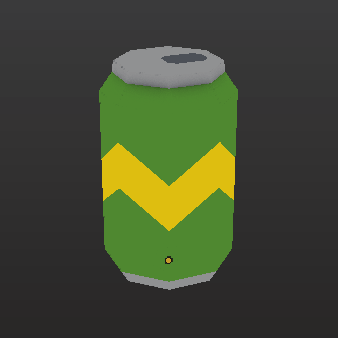


## Textures

Textures may be used for repeating patterns, or where cutting up the model to add
colors may cause problems. Complex text or symbols can use a transparent texture, and of
course posters and pictures are alright. For simpler things consider just using flat polygons.

```
These simple decorations are floating just above the object’s surface.
This also includes the “fake” grates on the lockers. They’re too small and
the camera too far for the player to ever notice.
```
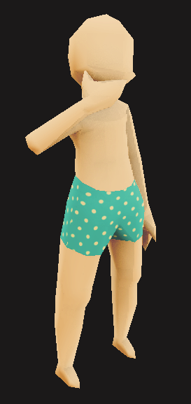
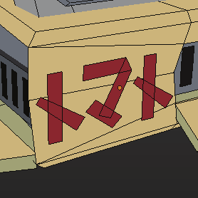
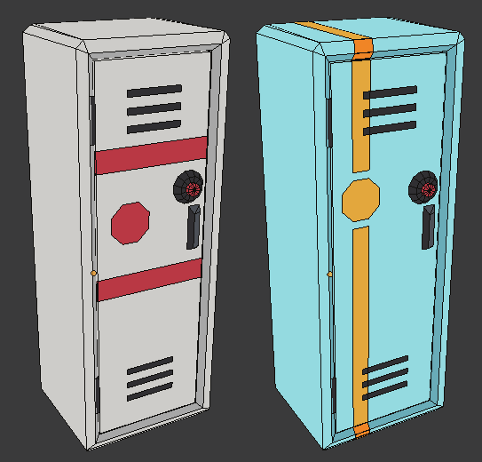

Example textures.

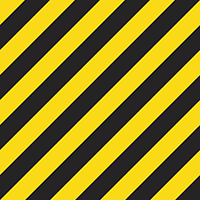


## Theme

I've seen it called retrofuturistic, but that would imply that tech is fixed and has an unique inspiration.
I think SS13 is closer to reality, where technology moves forward but machines that grow old and obsolete aren't
always replaced or upgraded. The result is a station where sentient positronics coexist with brain-in-a-jar cyborgs, and the crew
uses dot-matrix PDAs to send messages to each other.
This happens in reality, even now the military is carrying literal nuke disks, while the navy organizes their documents on computers running MSDOS. In the end it's both funny and good
since it gives creators the liberty to add almost whatever they want, present or future. I fully expect the HoP’s account database
to be stored in tape drives.

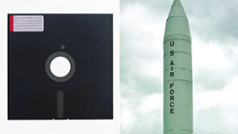

```
Published 3:52 PM ET Wed, 25 May 2016 Updated 9:51 AM ET Thu, 26 May 2016

The U.S. Defense Department is still using — after several decades — 8-inch floppy disks in a computer system that coordinates the operational functions of the nation's
nuclear forces, a jaw-dropping new report reveals.
```

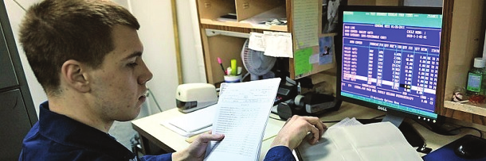

## Geometry

Most of this should be elaborated on at some point.

**N-gons:**
They’re fine as long as they’re flat and won’t be animated.

**Triangulating:**
Don’t triangulate your models.

**Inverted normals:**
By inverting the normals of a model you can achieve an interesting pseudotransparency effect. It’s not realistic but we’re not aiming for realism.

**Double sided:**
Many thin objects such as paper, leaves or cloth don’t need to have proper thickness, but for performance the
engine does backface culling, where faces that are “backwards” aren’t rendered. This can be avoided by selecting the mesh,
duplicating and then inverting the normals.

**Pivot:**
Always at the center (XZ) and base (Y) of the object.

**Modeling with NURBS:**
Cables and wires, but also some round but geometric objects like the plastic “cup” chair.

**Cell fracture:**
To shatter objects for ingame destruction. Takes some setup.
